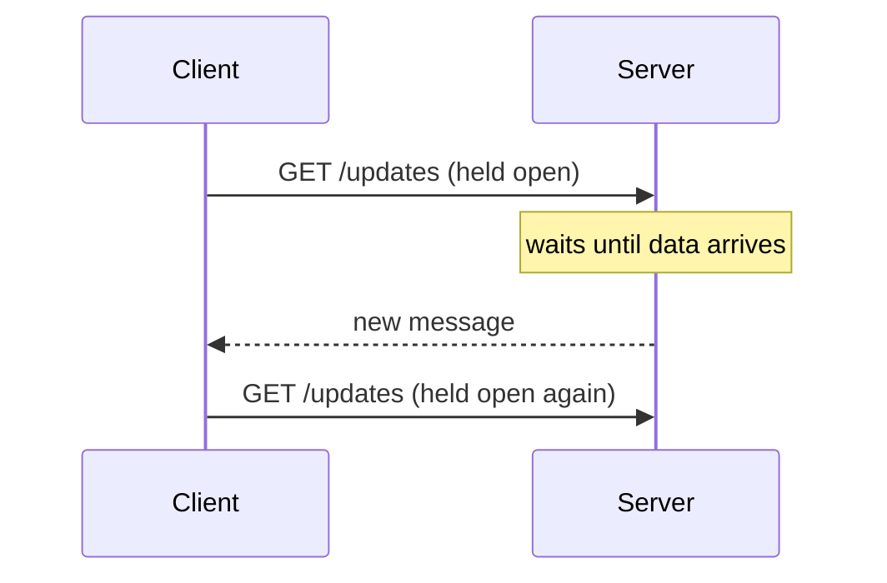

HTTP was designed for clients to ask and servers to answer. Many features, such as chat, notifications, live scores, collaborative editing and streaming AI responses, need the server to send data as soon as it is available. This lesson compares the main techniques for real-time communication and when to use each.

## Short polling

The client asks "anything new?" at a fixed interval, say every five seconds.

- **Pros:** trivial to implement, works everywhere.
- **Cons:** updates are delayed by up to one interval, and most requests return nothing, wasting bandwidth, battery and server capacity.

## Long polling

The client sends a request, and the server **holds it open** until new data is available or a timeout expires, then responds. The client immediately sends another request.

- **Pros:** near-real-time delivery using plain HTTP; works through most proxies and firewalls.
- **Cons:** a new request per message adds overhead; servers hold many open requests; ordering and duplicates must be handled across reconnects.

## WebSockets

The client opens an HTTP connection and **upgrades** it to a persistent, full-duplex WebSocket connection. Either side can send messages at any time with minimal framing overhead.

- **Pros:** true bidirectional, low-latency messaging; efficient for frequent small messages.
- **Cons:** stateful connections complicate load balancing and deployments; some proxies need configuration; the application must implement reconnection, heartbeats and resynchronization.

**Used for:** chat, multiplayer games, collaborative editing and live dashboards with user interaction.

## Server-sent events (SSE)

The client opens an HTTP request, and the server responds with a stream of text events that it keeps open, sending events as they happen. Communication is **one-directional**, from server to client; the client uses normal HTTP requests to send data.

- **Pros:** simple, plain HTTP, built-in automatic reconnection with a last-event ID in browsers, works well with HTTP/2 multiplexing.
- **Cons:** server-to-client only; text-based; limits on concurrent connections per domain over HTTP/1.1.

**Used for:** notifications, live feeds, progress updates and streaming LLM responses.

## Comparison

| Technique | Direction | Latency | Overhead | Complexity |
| --- | --- | --- | --- | --- |
| Short polling | Client pulls | Up to one interval | High (many empty responses) | Very low |
| Long polling | Client pulls, server holds | Near real time | Medium (request per message) | Low |
| SSE | Server to client | Real time | Low | Low |
| WebSockets | Both ways | Real time | Very low | Higher |

## Operating persistent connections at scale

- **Connection gateways** hold connections and are separate from business logic services, so each can scale independently.
- **Session directories** map users to the gateway holding their connection, so messages can be routed.
- **Heartbeats** detect dead connections, especially on mobile networks where connections silently drop.
- **Graceful draining** during deployments asks clients to reconnect elsewhere gradually, avoiding reconnection storms.
- **Resynchronization** after reconnecting fetches missed events using a cursor or last-event ID.

## Choosing, by feature

| Feature | Best fit | Why |
| --- | --- | --- |
| Chat and typing indicators | WebSockets | Frequent messages in both directions |
| Streaming an LLM answer | Server-sent events | One-way stream over plain HTTP |
| Live sports scores on a web page | Server-sent events | Server-to-client updates, auto-reconnect |
| Notifications in an app with occasional updates | Long polling or push notifications | Simple, low frequency |
| Collaborative editing | WebSockets | Bidirectional operations and presence |
| Dashboard refreshed every minute | Short polling | Simplicity outweighs delay |

<Ponder question="A team uses WebSockets for a live dashboard that only receives updates from the server once every few seconds. Is that a mistake?">
Not necessarily a mistake, but probably more complexity than needed: WebSockets need connection-aware load balancing, heartbeats and custom reconnection logic. Server-sent events deliver one-way updates over plain HTTP with built-in reconnection and resumption by event ID, and work well through proxies. If the client never needs to send messages over the same channel, SSE is usually the simpler choice.
</Ponder>

<KeyTakeaways>
- Short polling is simple but wasteful; long polling achieves near-real-time delivery over plain HTTP.
- WebSockets provide full-duplex, low-overhead messaging for interactive features.
- Server-sent events suit one-way streams such as notifications and LLM token streaming.
- Persistent connections need gateways, session directories, heartbeats, graceful draining and resynchronization.
</KeyTakeaways>
