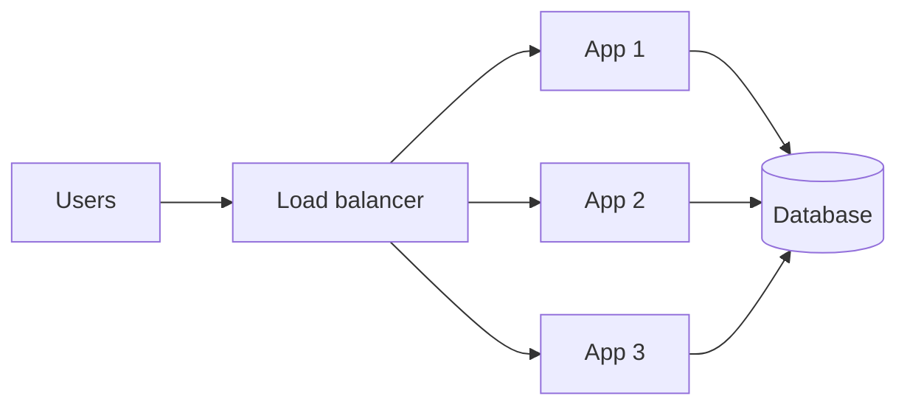
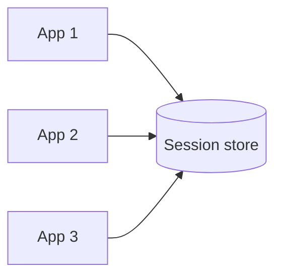
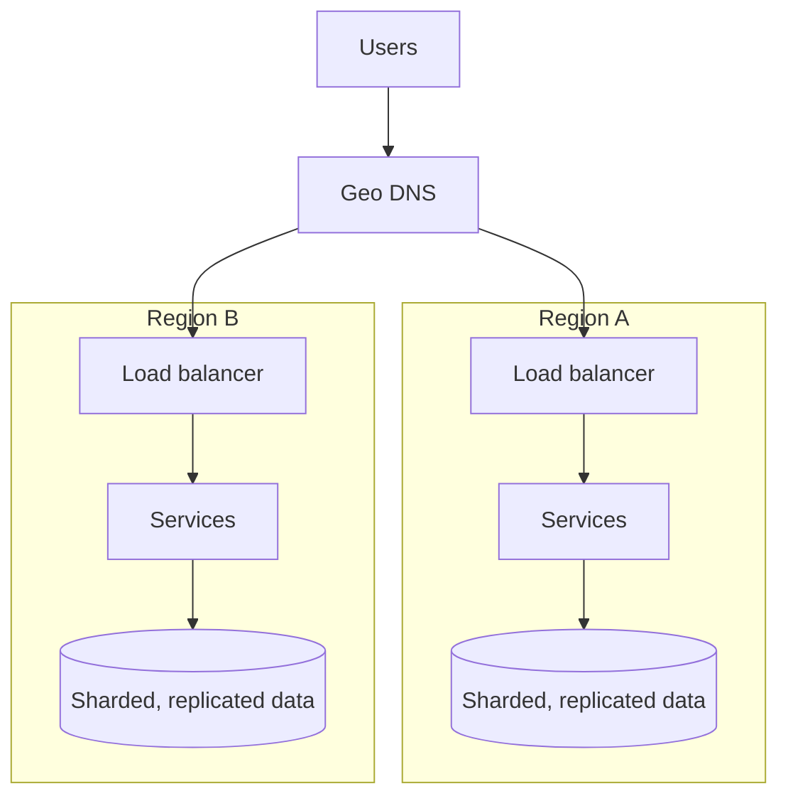

This lesson walks through how a typical web application scales from a single server to millions of users. Each stage fixes the bottleneck of the previous one. Knowing this progression helps you explain why a component exists, rather than just adding it to a diagram.

## Stage 1: one server

The web application, database and file storage all run on one machine. It is cheap and simple, and it works for a prototype. The machine is a single point of failure, and it runs out of CPU, memory or disk as usage grows.

## Stage 2: separate the database

Move the database to its own server. The application and database can now be scaled and tuned independently. The application server is still a single point of failure.

## Stage 3: multiple application servers behind a load balancer

<Slides title="Scaling out the web tier">
<Slide caption="1. A load balancer distributes requests across several identical application servers.">

</Slide>
<Slide caption="2. Session state moves to a shared store, so any server can handle any request and servers can be added or removed freely.">

</Slide>
</Slides>

Making application servers **stateless** is the key step. With state in shared stores, the web tier scales horizontally and survives server failures.

## Stage 4: cache and CDN

Reads grow faster than writes. A **cache** in front of the database serves repeated reads from memory, and a **CDN** serves static assets and cacheable pages from edge locations near users. Database load drops dramatically, and latency improves for users far from the data center.

## Stage 5: database replication

Add **read replicas** to spread read traffic and a standby for failover. Writes still go to the primary. Applications must tolerate replication lag, for example by reading their own writes from the primary.

## Stage 6: asynchronous work

Slow tasks such as sending email, processing images and generating reports move to **background workers** fed by a **message queue**. Requests return quickly, bursts are absorbed by the queue and workers scale independently.

## Stage 7: sharding

When the primary can no longer handle the write volume or data size, **partition** the data across several databases by a shard key such as user ID. Each shard holds part of the data and handles part of the writes. Cross-shard queries and transactions become harder, which is why the choice of shard key is important.

## Stage 8: services and multiple regions

As teams and features grow, split the monolith into **services** with clear ownership, communicating through APIs and events. Deploy to **multiple regions** for lower latency worldwide and resilience to regional failures, routing users with DNS or anycast.

## Across all stages

- **Measure before scaling:** add components to fix observed bottlenecks, not imagined ones.
- **Automate:** deployments, scaling and failover.
- **Observe:** metrics, logs and traces grow more important as the system grows more distributed.

<KeyTakeaways>
- Systems evolve from one server to separate databases, load-balanced stateless servers, caches and CDNs.
- Replication scales reads and provides failover; queues move slow work off the request path.
- Sharding scales writes and data size, making shard key choice critical.
- Services and multi-region deployments follow organizational growth and global users.
- Each stage fixes a measured bottleneck; add complexity only when needed.
</KeyTakeaways>
