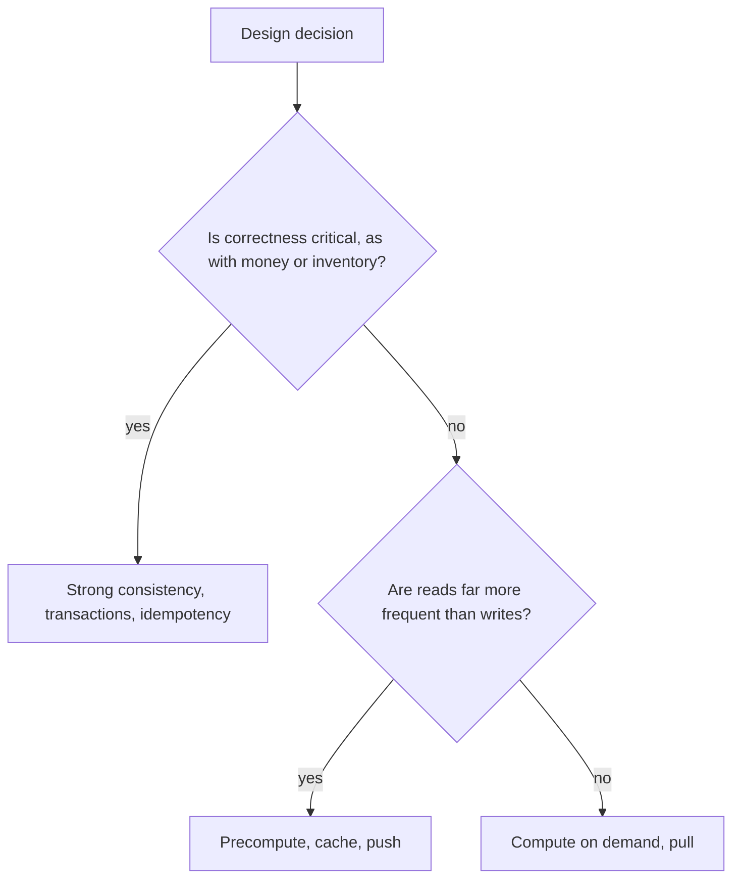

Every design decision trades one good property for another. Interviewers listen for whether you recognize these trade-offs and choose deliberately. This lesson collects the most common ones, each with a rule of thumb and an example from the course.

## Consistency versus availability

During a network partition, a system must either reject some requests to stay consistent or serve possibly stale data to stay available (the CAP theorem). Even without partitions, stronger consistency usually costs latency (PACELC).

- **Choose consistency** for money, inventory and uniqueness: payments, ticket booking, username registration.
- **Choose availability** for social and content features: likes, feeds, view counts, search results.

## Latency versus throughput

Batching improves throughput but adds waiting time. GPU inference, log ingestion and database writes all batch for efficiency.

- Batch aggressively for background work; keep batches small or dynamic for interactive requests.
- Example: continuous batching in LLM serving balances both.

## Push versus pull

- **Push** (fan-out on write, server push) makes reads fast but costs work for every write, even if nobody reads.
- **Pull** (fan-out on read, polling) is cheap until reads are frequent.
- Example: the hybrid timeline pushes for ordinary users and pulls for celebrities.

## Precompute versus compute on demand

- Precomputation (materialized views, top-k lists, year-in-review summaries) makes reads fast but uses storage and can be stale.
- On-demand computation is always fresh but slower and more expensive per request.
- Choose based on read frequency and how fresh results must be.

## Normalization versus denormalization

- Normalized data avoids duplication and anomalies; joins make reads costlier.
- Denormalized data (a score stored on an answer row, counts on a post) makes reads cheap but requires keeping copies in sync.

## Strong versus weak isolation

- Serializable transactions prevent anomalies but reduce concurrency.
- Weaker isolation levels are faster but allow anomalies such as lost updates; use them with care, or combine them with explicit constraints and conditional writes.

## Synchronous versus asynchronous

- Synchronous calls are simple and give immediate results, but couple availability: if a dependency is down, so are you.
- Asynchronous processing through queues decouples components and absorbs bursts, at the cost of eventual consistency and more moving parts.

## Storage versus bandwidth versus compute

- Video renditions trade storage for bandwidth.
- Compression trades CPU for storage and bandwidth.
- Caching trades memory for latency and backend load.

## Simplicity versus flexibility

The simplest design that meets the requirements is usually best. Microservices, multi-region active-active and custom infrastructure add power and complexity. Start simple, as in the Q&A platform's initial design, and evolve when estimates or growth demand it.

<Callout type="interview">
A strong way to present a trade-off: "We could do A, which gives X but costs Y, or B, which gives Y but costs X. For this product, X matters more because…, so I'll choose A."
</Callout>

## Trade-offs by design problem

| Problem | Main trade-off | Choice made in the course |
| --- | --- | --- |
| News feed | Push versus pull fan-out | Hybrid by audience size |
| Payments | Consistency versus availability | Consistency, with idempotency and reconciliation |
| Video platform | Storage versus bandwidth | Store many renditions to save bandwidth |
| Typeahead | Freshness versus cost | Scheduled rebuilds plus a small trending trie |
| Key-value store | Consistency versus latency | Tunable quorums per request |
| Ride-hailing | Greedy versus batched matching | Batch when busy, greedy when quiet |

<Ponder question="An interviewer asks, 'Why not strong consistency everywhere, to be safe?' How would you answer?">
Strong consistency costs latency (coordination on every write, often across zones or regions) and availability (requests fail during partitions), and it limits scalability. For likes, feeds and view counts, slightly stale data harms no one, so paying those costs buys nothing. Reserve strong consistency for the data where staleness causes real harm — money, inventory, uniqueness — and choose per data type.
</Ponder>

<KeyTakeaways>
- Choose consistency for money, inventory and uniqueness, and availability for social and content features.
- Batching trades latency for throughput; push trades write cost for read speed.
- Precomputation and denormalization speed reads at the cost of storage and staleness.
- Asynchronous processing decouples and absorbs bursts at the cost of eventual consistency.
- Start with the simplest design that meets requirements, and justify each trade-off by product needs.
</KeyTakeaways>
