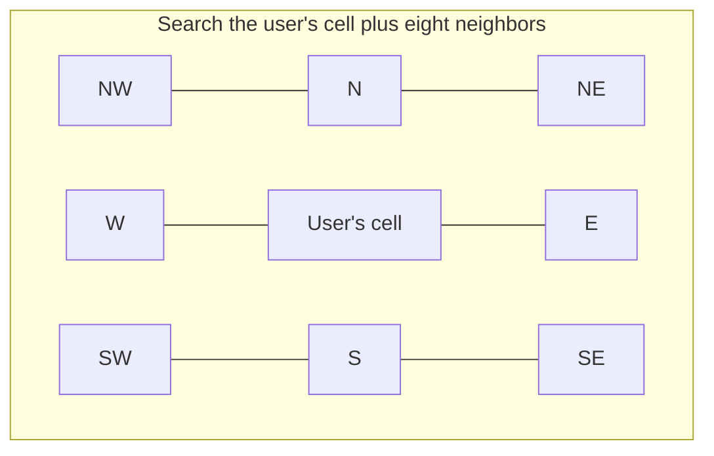
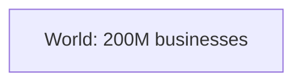
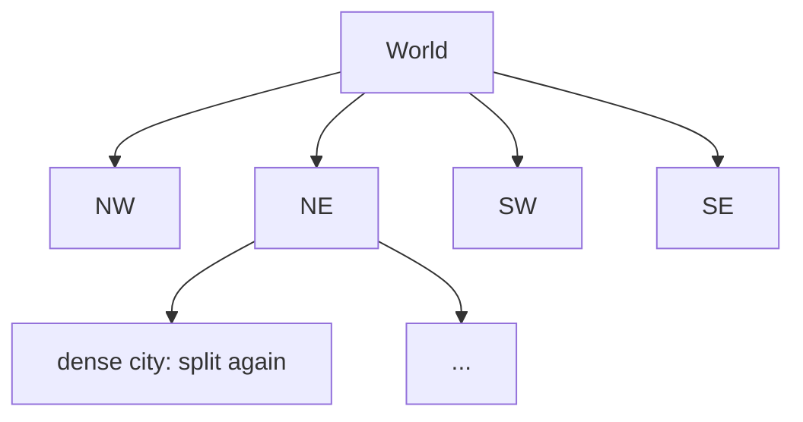
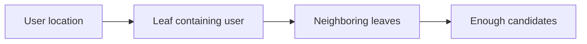

The spatial index is the heart of the proximity service. This lesson compares the two most common choices, **geohashes** and **quadtrees**, and mentions cell systems used in production such as S2 and H3.

## Geohash

A geohash recursively divides the world into a grid. At each step, it halves the longitude range and records a bit for which half the point falls in, then does the same for latitude, alternating. The bits are grouped into base-32 characters. Each additional character narrows the cell by a factor of 32.

| Geohash length | Approximate cell size |
| --- | --- |
| 4 | 39 km × 20 km |
| 5 | 4.9 km × 4.9 km |
| 6 | 1.2 km × 0.6 km |
| 7 | 153 m × 153 m |

The key property is that **points sharing a longer prefix are usually close together**. A nearby search picks a precision whose cell size roughly matches the search radius, computes the user's geohash at that precision and looks up businesses whose geohash starts with that prefix. Because geohashes are strings, they can be stored in an ordinary indexed column and queried with a prefix match.

### The boundary problem

Two points can be a meter apart but on opposite sides of a cell boundary, with completely different geohashes. The fix is to always search the user's cell **and its eight neighbors**, which can be computed directly from the geohash.

If the nine cells contain too few results, the service drops a character from the precision, searching larger cells, until it finds enough.

**Strengths:** simple, stored in any database, easy to update since a business's geohash is computed from its coordinates. **Weakness:** fixed-size cells at a given precision, so dense city cells may hold thousands of businesses while rural cells are empty.

## Quadtree

A quadtree is an in-memory tree in which each node represents a rectangle. A node splits into four children when it holds more than a threshold, say 100 businesses. Dense areas are subdivided deeply and sparse areas remain as large leaves, so **the tree adapts to density**.

<Slides title="Building and querying a quadtree">
<Slide caption="1. Start with the whole world as one node.">

</Slide>
<Slide caption="2. Any node over the threshold splits into four quadrants, recursively.">

</Slide>
<Slide caption="3. A query walks down to the leaf containing the user, then collects neighboring leaves until it has enough results.">

</Slide>
</Slides>

With 200 million businesses and 100 per leaf, there are about 2 million leaves and roughly 2.7 million nodes in total. At a few dozen bytes per node plus the business IDs, the tree fits in a couple of gigabytes, matching our earlier estimate. Building it from scratch takes a few minutes, so servers build or load it at start-up while out of the load balancer's rotation.

**Strengths:** adapts to density, supports "find the k nearest" naturally. **Weaknesses:** lives in memory and must be rebuilt or carefully updated; updates that split or merge nodes are more complex than updating a geohash column.

## Comparison and production systems

| Aspect | Geohash | Quadtree |
| --- | --- | --- |
| Storage | Column in any database | In-memory tree |
| Density adaptation | No, fixed cells per precision | Yes |
| Updates | Trivial, recompute the string | Rebuild or complex node updates |
| k-nearest queries | Expand precision until enough | Natural |

Production systems often use **S2** (a hierarchy of cells on a sphere, mapped onto a space-filling curve) or **H3** (a hierarchy of hexagons, whose neighbors are all equidistant). Both give integer cell IDs that can be stored in any index and cover a search circle with a small set of cells at mixed levels, combining the strengths of both approaches.

<Callout type="interview">
A strong answer picks one approach and justifies it: "Businesses change rarely and density varies a lot, so I'd use an in-memory quadtree replicated on every search server, rebuilt from the database every few minutes."
</Callout>

<KeyTakeaways>
- Geohashes encode locations as strings where a longer shared prefix usually means closer points.
- Always search the user's geohash cell and its eight neighbors to avoid boundary misses.
- Quadtrees split dense areas recursively, adapting to density and supporting k-nearest queries.
- Geohashes are simple to store and update; quadtrees adapt better but must be held in memory and rebuilt.
- S2 and H3 offer hierarchical cell IDs that combine easy storage with flexible coverage.
</KeyTakeaways>
