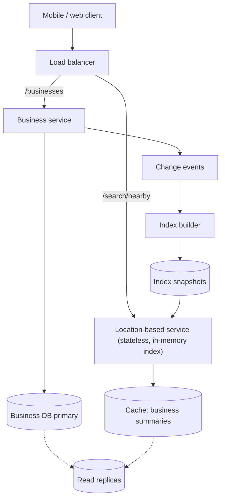
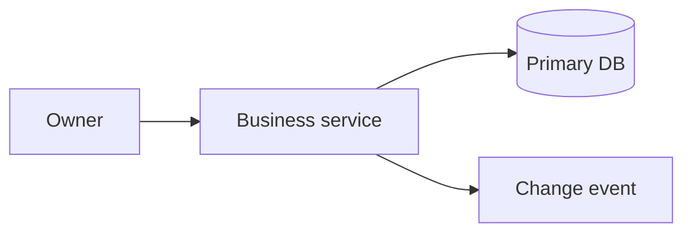
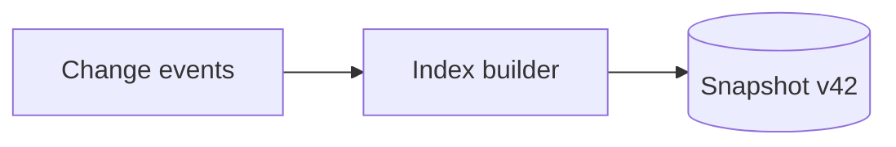
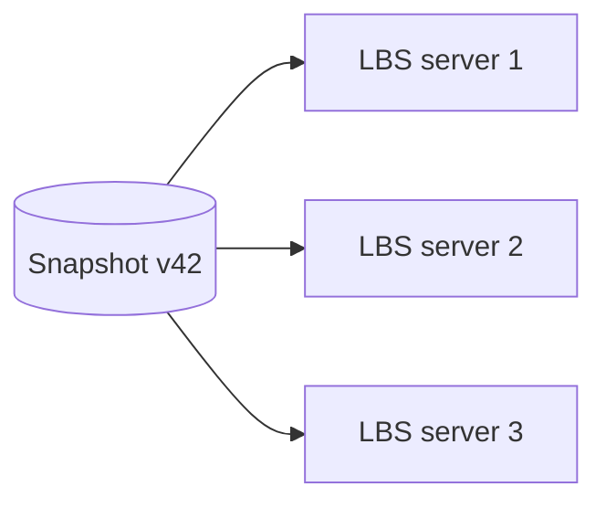
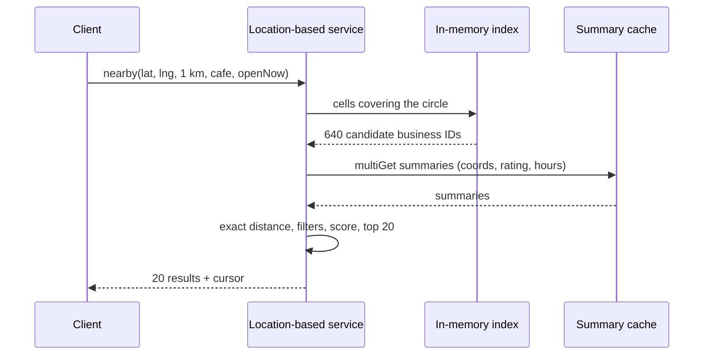

This lesson presents the API, data model and high-level architecture. The key architectural decision is to split the system into a **location-based service**, which answers nearby searches from an in-memory spatial index, and a **business service**, which owns business data and handles its reads and writes.

## API

```http
GET    /v1/search/nearby?lat=..&lng=..&radius=1000&category=cafe&openNow=true&cursor=..
       -> { businesses: [ { id, name, lat, lng, distance, rating } ], nextCursor }
GET    /v1/businesses/{id}
POST   /v1/businesses                 { name, address, lat, lng, category, hours, ... }
PUT    /v1/businesses/{id}
DELETE /v1/businesses/{id}
POST   /v1/businesses/{id}/reviews    { rating, text }
```

The search response contains just enough to render a result list and map pins. The client fetches full details only when the user opens a business.

## Data model

- **Business table** (sharded by business ID): ID, owner, name, address, latitude, longitude, category, hours, price level and aggregated rating and review count.
- **Reviews table** (sharded by business ID): review ID, business ID, user ID, rating, text and timestamp.
- **Spatial index**: a mapping from spatial cells to lists of business IDs. It could be a table of (geohash, business ID) rows in the database, used as the source of truth for rebuilding in-memory indexes.

## High-level architecture



### Location-based service

Each server holds a complete in-memory spatial index. A search request goes through these steps:

1. Convert the user's location and radius into the set of spatial cells that overlap the search circle.
2. Look up the business IDs in those cells.
3. Fetch summaries for the candidates, such as coordinates, rating and hours, from a cache backed by read replicas.
4. Compute exact distances, drop businesses outside the radius, apply filters, rank and return one page.

Because the index is read-only between refreshes, servers need no locking and scale horizontally by adding replicas.

### Business service

Owners' updates go to the business service, which writes to the primary database and publishes a change event. The index builder consumes events and periodically produces a new index snapshot, perhaps every few minutes. Location-based servers load the new snapshot in the background and swap it in atomically. This gives us the eventual consistency we accepted in the requirements, without slowing down searches.

<Slides title="How a business update reaches search">
<Slide caption="1. The owner updates the business location. The business service writes to the primary and emits a change event.">



</Slide>
<Slide caption="2. The index builder applies batched changes and publishes a new snapshot.">



</Slide>
<Slide caption="3. Each location-based server loads the snapshot in the background and swaps it in atomically.">



</Slide>
</Slides>

### Caching

Business summaries needed for ranking are cached by business ID. Popular areas such as city centers produce the same cell lookups repeatedly, so results for common (cell set, filters) combinations can also be cached briefly. Detail pages for popular businesses are cached at the business service or even at the CDN.

### Multi-region deployment

The service is deployed in several regions, and users are routed to the nearest one. Each region holds the full index, which is small, and read replicas of the business database. Writes go to the primary region. Regional deployment also helps with data residency rules, since a region might only need to store businesses in its own jurisdiction.

## Ranking nearby results

Distance alone makes poor rankings — the closest café may be closed or poorly rated. A simple, explainable scoring function combines several signals:

```text
score = w1 × (1 − distance / radius)
      + w2 × (rating / 5) × confidence(review_count)
      + w3 × open_now
      + w4 × personal_affinity(user, category)
```

Weights are tuned with experiments on click-through and visits. Because ranking runs only on the few hundred candidates from the cells, it can afford richer features than the spatial lookup itself.



<Ponder question="Why does the location-based service store only IDs in its spatial index and fetch summaries from a cache, instead of keeping full business records in the index?">
Keeping only IDs and coordinates keeps the index tiny (a few gigabytes), so every server can hold all of it and snapshots are quick to build and ship. Fields that change more often — ratings, hours, review counts — live in a cache fed by the business service, so they can be updated without rebuilding the index. The cost is an extra batched cache lookup per search, which is cheap.
</Ponder>

<KeyTakeaways>
- The location-based service answers nearby searches from a complete, read-only in-memory index and scales by adding replicas.
- The business service owns business data, writes to a sharded primary and emits change events.
- An index builder turns change events into periodic snapshots that servers swap in atomically.
- Search works in four steps: find overlapping cells, look up IDs, fetch cached summaries, then filter and rank.
- Multi-region deployment keeps latency low and replicates the small index everywhere.
- Ranking blends distance, rating confidence, opening hours and personal affinity over the candidates from the cells.
</KeyTakeaways>
