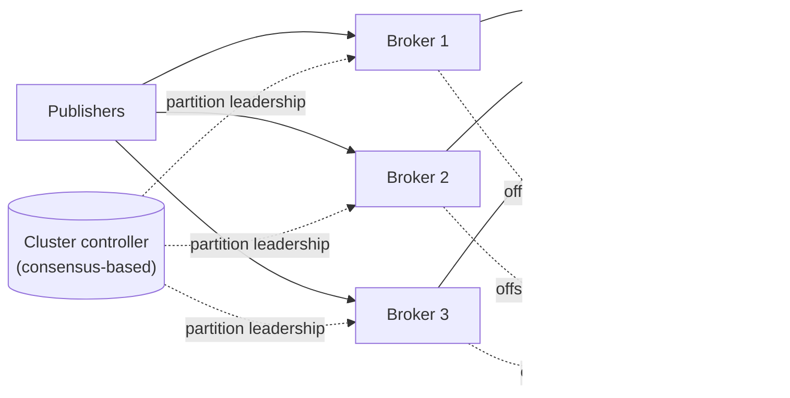
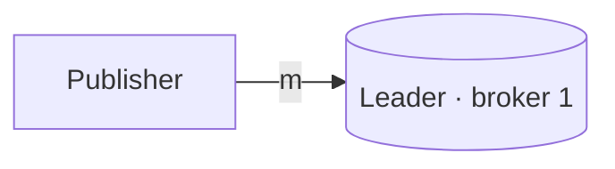
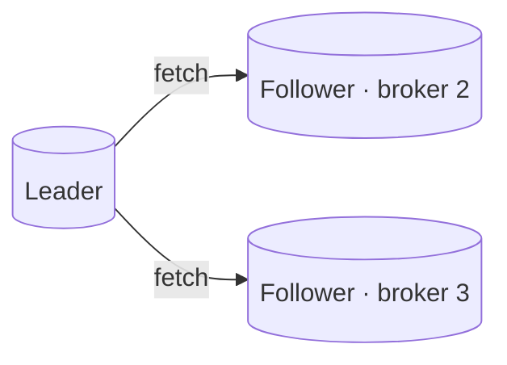
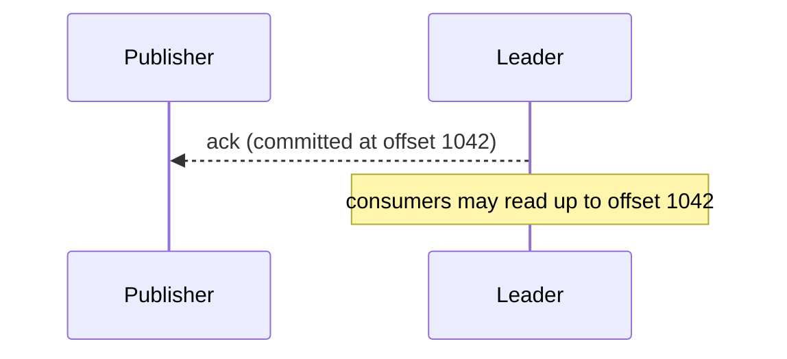
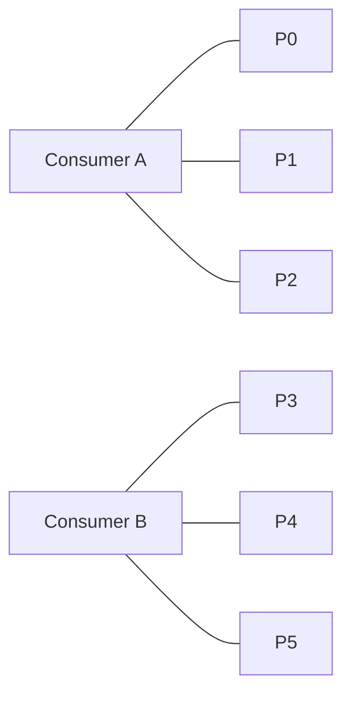
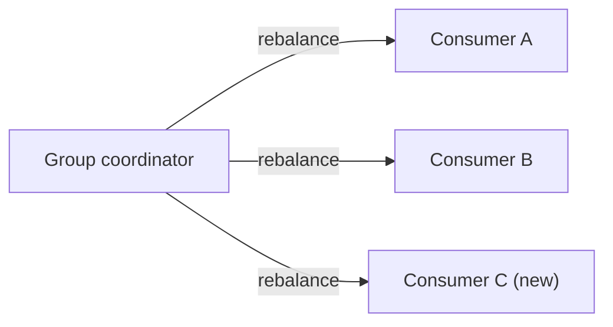
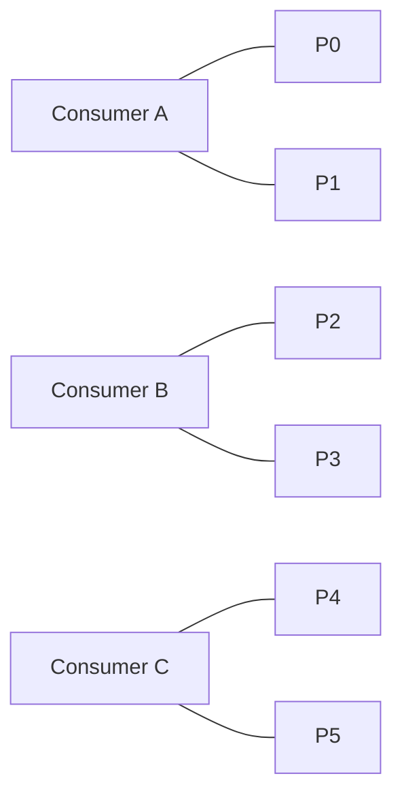
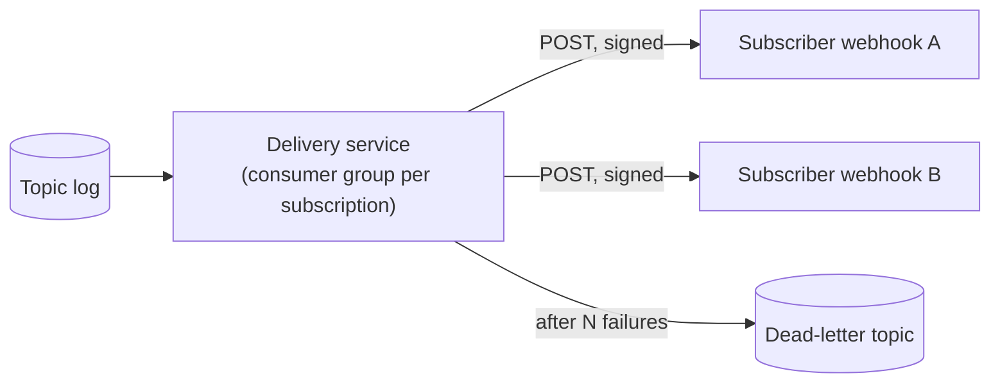

Let's design a distributed, log-based pub-sub system that meets our requirements for scale, durability and availability.

## Components

- **Brokers** store partition logs on disk and serve publish and read requests.
- A **cluster controller**, backed by a consensus system, tracks brokers, assigns partition leaders and handles failover.
- An **offset store** records each consumer group's committed position per partition (it can itself be an internal topic).
- **Client libraries** discover which broker leads each partition and talk to it directly.

Partition leaders are spread evenly across brokers, so every broker is the leader for some partitions and a follower for others; load and failure impact are balanced.

## Replication

Each partition has a **leader** and several **followers** on different brokers (for example, replication factor 3). Publishers write to the leader, which appends to its log; followers fetch new entries and append them to their own logs.

The leader tracks the set of **in-sync replicas (ISR)** — followers that are caught up. A publisher can choose its durability level:

- `acks=0` — fire and forget (fastest, may lose data).
- `acks=1` — acknowledged once the leader has written it.
- `acks=all` — acknowledged once all in-sync replicas have it (safest).

<Slides title="Publishing with acks=all">
<Slide caption="1. The publisher sends a message to the partition leader.">

</Slide>
<Slide caption="2. Followers fetch the new entry and append it to their logs.">

</Slide>
<Slide caption="3. Once all in-sync replicas have the entry, it is committed and the publisher is acknowledged. Consumers can now read it.">

</Slide>
</Slides>

The highest committed offset is called the **high watermark**. Consumers only see messages up to it, so they never read a message that could disappear if the leader failed.

A follower that falls too far behind — because it is slow or partitioned — is removed from the ISR, so it cannot hold up acknowledgments. A **minimum in-sync replicas** setting (for example, 2) makes `acks=all` publishes fail rather than succeed with only the leader holding the data, trading availability for durability when too many replicas are unhealthy.

If the leader fails, the controller elects a new leader from the in-sync replicas, so no committed message is lost.

## Consumption

Consumers in a group coordinate so that each partition is assigned to exactly one member. When members join or leave, partitions are **rebalanced**. Each consumer reads sequentially from its partitions and periodically **commits** its offset.

<Slides title="Rebalancing a consumer group">
<Slide caption="1. Two consumers share six partitions, three each.">

</Slide>
<Slide caption="2. Consumer C joins. The group coordinator triggers a rebalance; A and B commit their offsets and release some partitions.">

</Slide>
<Slide caption="3. Each consumer now owns two partitions and resumes from the committed offsets.">

</Slide>
</Slides>

Modern protocols move only the partitions that must change owner (**incremental rebalancing**), so the rest of the group keeps consuming during the rebalance.

The timing of the commit determines delivery semantics:

- Commit **before** processing → at-most-once.
- Commit **after** processing → at-least-once (the common choice), with idempotent consumers handling duplicates after a crash.

**Consumer lag** — the difference between the partition's latest offset and the group's committed offset — is the key health metric, equivalent to queue depth.

## Exactly-once within the log

Two features let a pipeline that reads from topics and writes to topics avoid duplicates:

- **Idempotent producers.** Each producer has an ID and numbers its messages per partition; the leader discards a retried message whose sequence number it has already written.
- **Transactions.** A consumer-producer can write its output messages and commit its input offsets in one atomic transaction. Downstream consumers configured to read only committed data never see output from an aborted attempt.

This gives exactly-once processing for read-process-write pipelines within the log. Side effects outside the log — sending an email, charging a card — still need idempotency keys.

## Performance techniques

- **Sequential I/O:** appending and reading logs sequentially is fast on any storage.
- **Batching and compression:** publishers batch many messages into one request and compress them together.
- **Zero-copy transfer:** brokers send log data directly from the file system cache to the network socket without copying through application memory.
- **Page cache:** recently written data is usually read by consumers straight from memory.

## Tiered storage

Keeping weeks of data on broker disks is expensive and makes adding brokers slow, because partitions must be copied. With **tiered storage**, brokers keep recent segments locally and move older segments to a blob store. Consumers reading recent data are served from local disk; replays of old data are fetched from the blob store transparently.

## Replicating across regions

For disaster recovery or to serve consumers in other regions, a **mirroring** service consumes topics in one cluster and republishes them to a cluster in another region. It is asynchronous: during a regional failure, the latest few seconds of messages may not have been mirrored, and offsets differ between clusters, so consumers switching regions need an offset translation step or must tolerate some reprocessing.

## Push-based delivery for lightweight subscribers

For webhook-style subscribers, a **delivery service** reads from the log on their behalf and pushes each message via HTTP, retrying with backoff and moving persistently failing messages to a dead-letter topic.

<Ponder question="With acks=all and replication factor 3, two followers fall behind and drop out of the ISR. What happens to publishes, and what does min in-sync replicas = 2 change?">
With only the leader in the ISR, `acks=all` would be satisfied by the leader alone — a publish is acknowledged while a single copy exists, and a leader failure would lose it. Setting minimum in-sync replicas to 2 makes such publishes fail with an error instead, so producers know durability is not guaranteed and can retry or alert. It chooses durability (and correctness) over availability while the cluster is degraded.
</Ponder>

<KeyTakeaways>
- Brokers store partitioned logs; a consensus-backed controller manages leadership and failover, spreading leaders across brokers.
- Each partition is replicated; the leader tracks in-sync replicas, consumers read only up to the high watermark, and min-ISR prevents single-copy acknowledgments.
- A new leader is elected from in-sync replicas, preserving committed messages.
- Consumer groups assign partitions to members, rebalance incrementally and commit offsets; lag is the key health metric.
- Idempotent producers and transactions give exactly-once processing within the log.
- Sequential I/O, batching, compression, zero-copy and tiered storage make log-based pub-sub fast and affordable; mirroring replicates across regions.
</KeyTakeaways>
