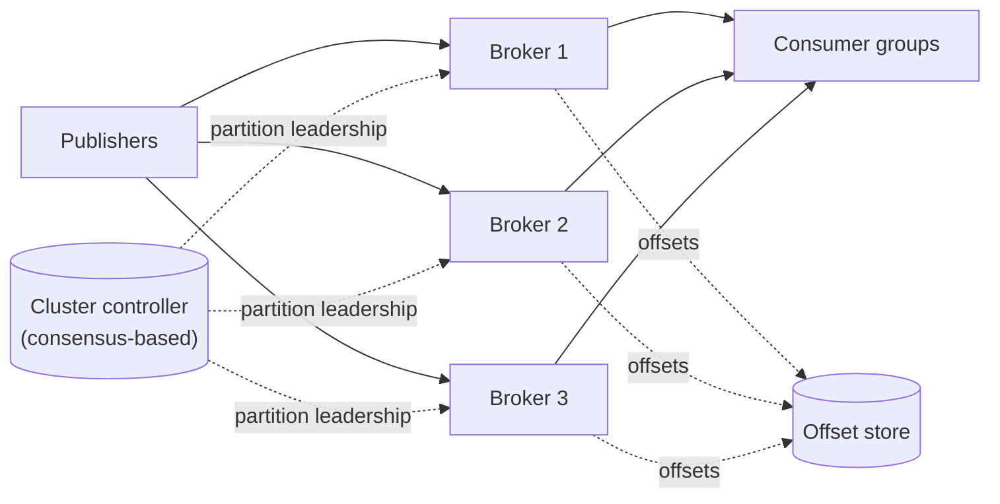
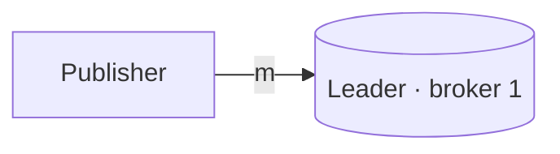
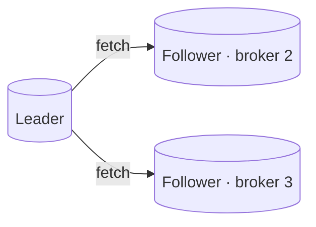
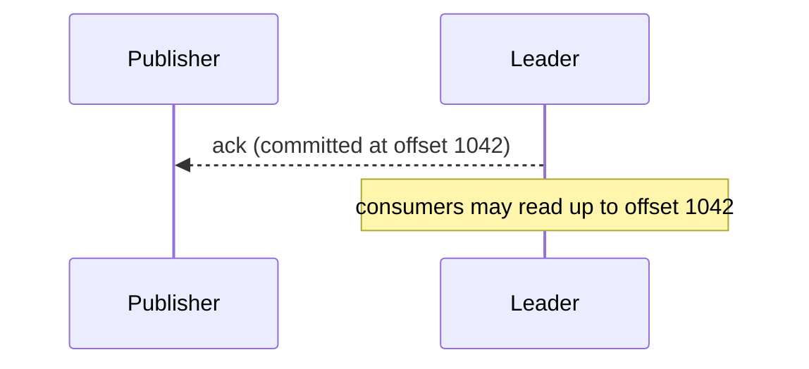

Let's design a distributed, log-based pub-sub system that meets our requirements for scale, durability and availability.

## Components

- **Brokers** store partition logs on disk and serve publish and read requests.
- A **cluster controller**, backed by a consensus system, tracks brokers, assigns partition leaders and handles failover.
- An **offset store** records each consumer group's committed position per partition (it can itself be an internal topic).
- **Client libraries** discover which broker leads each partition and talk to it directly.

## Replication

Each partition has a **leader** and several **followers** on different brokers (for example, replication factor 3). Publishers write to the leader, which appends to its log; followers fetch new entries and append them to their own logs.

The leader tracks the set of **in-sync replicas (ISR)** — followers that are caught up. A publisher can choose its durability level:

- `acks=0` — fire and forget (fastest, may lose data).
- `acks=1` — acknowledged once the leader has written it.
- `acks=all` — acknowledged once all in-sync replicas have it (safest).

<Slides title="Publishing with acks=all">
<Slide caption="1. The publisher sends a message to the partition leader.">

</Slide>
<Slide caption="2. Followers fetch the new entry and append it to their logs.">

</Slide>
<Slide caption="3. Once all in-sync replicas have the entry, it is committed and the publisher is acknowledged. Consumers can now read it.">

</Slide>
</Slides>

If the leader fails, the controller elects a new leader from the in-sync replicas, so no committed message is lost.

## Consumption

Consumers in a group coordinate so that each partition is assigned to exactly one member. When members join or leave, partitions are **rebalanced**. Each consumer reads sequentially from its partitions and periodically **commits** its offset.

The timing of the commit determines delivery semantics:

- Commit **before** processing → at-most-once.
- Commit **after** processing → at-least-once (the common choice), with idempotent consumers handling duplicates after a crash.

## Performance techniques

- **Sequential I/O:** appending and reading logs sequentially is fast on any storage.
- **Batching and compression:** publishers batch many messages into one request and compress them together.
- **Zero-copy transfer:** brokers send log data directly from the file system cache to the network socket without copying through application memory.
- **Page cache:** recently written data is usually read by consumers straight from memory.

## Push-based delivery for lightweight subscribers

For webhook-style subscribers, a **delivery service** reads from the log on their behalf and pushes each message via HTTP, retrying with backoff and moving persistently failing messages to a dead-letter topic.

<KeyTakeaways>
- Brokers store partitioned logs; a consensus-backed controller manages leadership and failover.
- Each partition is replicated; the leader tracks in-sync replicas and publishers choose acks levels.
- A new leader is elected from in-sync replicas, preserving committed messages.
- Consumer groups assign partitions to members and commit offsets; commit timing sets delivery semantics.
- Sequential I/O, batching, compression and zero-copy make log-based pub-sub fast.
</KeyTakeaways>
