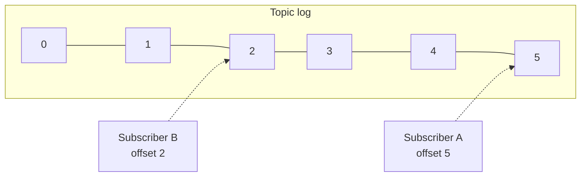
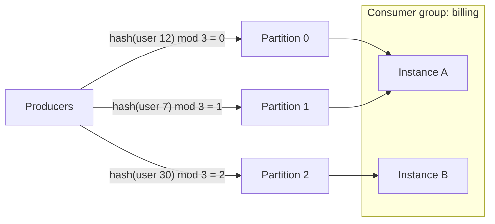

Let's define the requirements for a scalable pub-sub system and look at the log-based model that most modern systems use.

## Requirements

### Functional

- **Create and delete topics.**
- **Publish** messages to a topic.
- **Subscribe** to a topic and **read** messages from it.
- **Retain** messages for a configurable period, so subscribers that were offline can catch up.
- Allow subscribers to **replay** messages from an earlier point, for example to rebuild a derived data store.

### Non-functional

- **Scalability** — millions of messages per second across many topics and subscribers.
- **Durability** — published messages are not lost.
- **Availability** — publishing and consuming continue through server failures.
- **Low latency** — messages reach subscribers within milliseconds.
- **Ordering** — messages are delivered in order, at least within a partition or key.

## API

```text
createTopic(name, partitions, retention, replicationFactor)
publish(topic, key?, value, headers?)            -> { partition, offset }
subscribe(topic, groupId)                        // join a consumer group
poll(maxRecords, timeout)                        -> [{ partition, offset, key, value }]
commit({ partition: offset, ... })               // record progress
seek(partition, offset | timestamp)              // replay from a point
```

## The log as the core abstraction

Instead of deleting messages once delivered, many pub-sub systems store each topic as an **append-only log**. Messages are appended at the end and assigned a sequential **offset**. Each subscriber (or group of consumers) simply remembers the offset it has read up to.



This model has powerful properties:

- **Independent subscribers.** Each tracks its own offset; a slow subscriber does not affect others.
- **Cheap fan-out.** Messages are stored once, no matter how many subscribers read them.
- **Replay.** A subscriber can reset its offset to reprocess history — invaluable for fixing bugs in consumers or bootstrapping new services.
- **Efficient storage.** Sequential appends and reads are fast on both SSDs and spinning disks.

Retention is based on time or size: messages older than, say, seven days are deleted by dropping old log **segments**.

### Compacted topics

A second retention mode, **log compaction**, keeps only the **latest message for each key**. A topic of user profile updates compacted by user ID always contains the current profile of every user, no matter how old, while older versions are discarded in the background. New services can bootstrap a complete local copy by reading a compacted topic from the beginning.

| Retention mode | Keeps | Good for |
| --- | --- | --- |
| Time or size based | Everything within the window | Event streams, activity logs |
| Compacted | Latest value per key | Changelogs, current state of entities |

## Partitions for scale

A single log on one server has limited throughput. Topics are therefore split into **partitions**, each an independent log. Producers choose a partition by hashing a **key** (for example, user ID), which keeps all events for one key in order within a partition, or spread keyless messages round-robin.



Within a **consumer group**, each partition is read by exactly one consumer instance, so a group can scale out up to the number of partitions while preserving per-partition order. Different consumer groups — different services — each read every partition independently.

## Sizing a topic

Suppose a clickstream topic receives 200,000 events per second at 1 KB each, retained for 7 days with replication factor 3:

```text
Ingest:     200,000 × 1 KB           = 200 MB/s
Stored:     200 MB/s × 604,800 s     ≈ 121 TB, × 3 replicas ≈ 363 TB
Partitions: if one partition handles ~10 MB/s writes and one consumer handles ~5 MB/s,
            need ≥ 20 for producers and ≥ 40 for a single consumer group → choose ~64
```

Choosing a partition count a little above today's need leaves room for growth without repartitioning.

<Callout type="tip">
Choose the partition count with future growth in mind. Partitions are the unit of parallelism for consumers; adding partitions later can change which partition a key maps to, disturbing per-key ordering.
</Callout>

## Choosing the key

The key determines both ordering and load balance:

- **Order-sensitive entities** (an account's transactions, a document's edits) should use the entity ID as the key.
- **Skewed keys** (one celebrity generating 20% of events) overload one partition; add a suffix to spread a hot key, accepting that its events are no longer strictly ordered, or give very hot entities special handling.
- **No key** gives the best balance when order does not matter.

<Ponder question="A team keys its 'page-viewed' topic by country code. Throughput is uneven and one consumer is always behind. Why, and what would you change?">
There are few countries and traffic is heavily skewed, so a handful of partitions (large countries) receive most events while others sit idle; the consumers for those partitions fall behind. Page views probably do not need per-country ordering, so publish without a key (or keyed by session or user ID if per-user order matters), which spreads events evenly across all partitions.
</Ponder>

<KeyTakeaways>
- A pub-sub system must support topics, publishing, subscribing, retention and replay at scale.
- Modern pub-sub systems store topics as append-only logs with offsets; compacted topics keep the latest value per key.
- Subscribers track their own offsets, enabling independent consumption and replay.
- Topics are split into partitions; keys keep related messages ordered within a partition and determine load balance.
- Within a consumer group, each partition is read by one consumer, so size partition counts for future consumer parallelism.
</KeyTakeaways>
