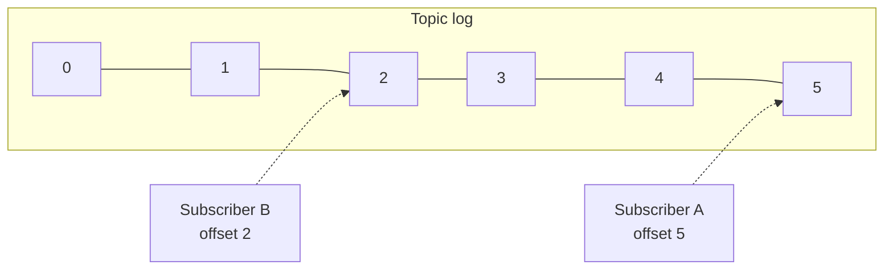

Let's define the requirements for a scalable pub-sub system and look at the log-based model that most modern systems use.

## Requirements

### Functional

- **Create and delete topics.**
- **Publish** messages to a topic.
- **Subscribe** to a topic and **read** messages from it.
- **Retain** messages for a configurable period, so subscribers that were offline can catch up.
- Allow subscribers to **replay** messages from an earlier point, for example to rebuild a derived data store.

### Non-functional

- **Scalability** — millions of messages per second across many topics and subscribers.
- **Durability** — published messages are not lost.
- **Availability** — publishing and consuming continue through server failures.
- **Low latency** — messages reach subscribers within milliseconds.
- **Ordering** — messages are delivered in order, at least within a partition or key.

## The log as the core abstraction

Instead of deleting messages once delivered, many pub-sub systems store each topic as an **append-only log**. Messages are appended at the end and assigned a sequential **offset**. Each subscriber (or group of consumers) simply remembers the offset it has read up to.

This model has powerful properties:

- **Independent subscribers.** Each tracks its own offset; a slow subscriber does not affect others.
- **Cheap fan-out.** Messages are stored once, no matter how many subscribers read them.
- **Replay.** A subscriber can reset its offset to reprocess history — invaluable for fixing bugs in consumers or bootstrapping new services.
- **Efficient storage.** Sequential appends and reads are fast on both SSDs and spinning disks.

Retention is based on time or size: messages older than, say, seven days are deleted by dropping old log **segments**.

## Partitions for scale

A single log on one server has limited throughput. Topics are therefore split into **partitions**, each an independent log. Producers choose a partition by hashing a **key** (for example, user ID), which keeps all events for one key in order within a partition, or spread keyless messages round-robin.

Within a **consumer group**, each partition is read by exactly one consumer instance, so a group can scale out up to the number of partitions while preserving per-partition order. Different consumer groups — different services — each read every partition independently.

<Callout type="tip">
Choose the partition count with future growth in mind. Partitions are the unit of parallelism for consumers; adding partitions later can change which partition a key maps to, disturbing per-key ordering.
</Callout>

<KeyTakeaways>
- A pub-sub system must support topics, publishing, subscribing, retention and replay at scale.
- Modern pub-sub systems store topics as append-only logs with offsets.
- Subscribers track their own offsets, enabling independent consumption and replay.
- Topics are split into partitions; keys keep related messages ordered within a partition.
- Within a consumer group, each partition is read by one consumer, bounding parallelism by partition count.
</KeyTakeaways>
