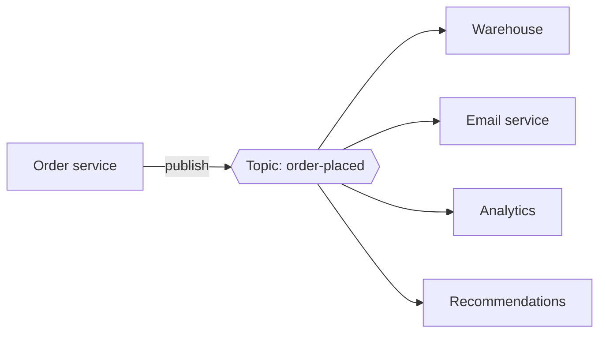

When an order is placed, many parts of a business care: the warehouse must pick items, the email service must send a confirmation, the analytics pipeline must record the sale, and the recommendation engine must update the customer's profile. If the order service called each of them directly, it would need to know about every consumer and would break whenever one was slow or down. **Publish–subscribe (pub-sub)** solves this by broadcasting events to any number of independent subscribers.

## The model

- **Publishers** send messages to a named **topic**, such as `order-placed`.
- **Subscribers** register interest in a topic.
- The pub-sub system delivers **every** message published to a topic to **every** subscription on that topic.

Publishers do not know who the subscribers are, and subscribers can be added or removed without changing publishers. This is the key difference from a point-to-point queue, where each message is consumed by only one consumer.

## Benefits

- **Loose coupling.** New consumers subscribe without changes to the publisher.
- **Fan-out.** One event reaches many services.
- **Independent pace.** Each subscriber consumes at its own speed; a slow analytics job does not delay warehouse picking.
- **Event-driven architecture.** Systems react to facts (“an order was placed”) rather than commands, enabling extensibility.

## Common use cases

- Propagating domain events between microservices.
- Streaming data into analytics and data warehouses.
- Real-time notifications and live updates.
- Invalidating caches across many servers.
- Replicating changes from a database to search indexes (change data capture).

## Push versus pull delivery

- **Push:** the system sends messages to subscriber endpoints (for example, HTTP webhooks), retrying on failure.
- **Pull:** subscribers fetch messages at their own pace and track their position.

Pull delivery gives subscribers control over their consumption rate and simplifies back-pressure, while push is convenient for lightweight consumers such as serverless functions.

<Callout type="note">
In many systems, each subscription behaves like its own queue: messages are fanned out to every subscription, and within a subscription multiple consumer instances share the work. This combines broadcast between services with load balancing within a service.
</Callout>

<KeyTakeaways>
- Pub-sub delivers every message published to a topic to every subscription on that topic.
- Publishers and subscribers are decoupled; subscribers can be added without changing publishers.
- Pub-sub enables fan-out, independent consumption rates and event-driven architectures.
- Delivery can be push-based (webhooks) or pull-based (subscribers fetch).
</KeyTakeaways>
