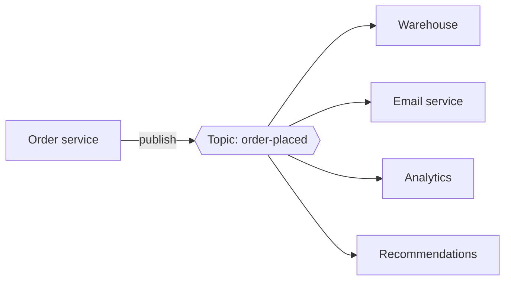
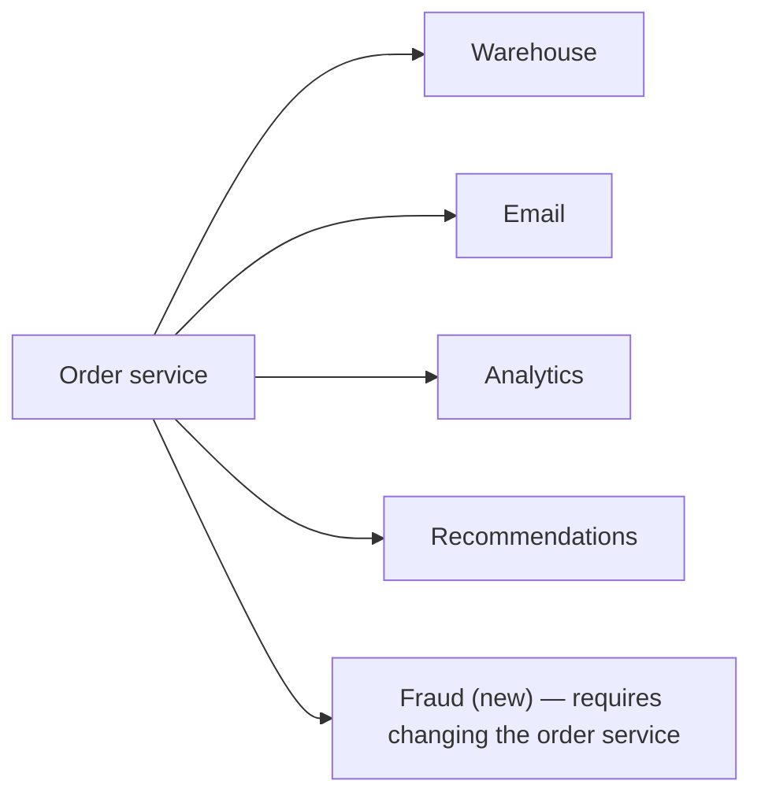
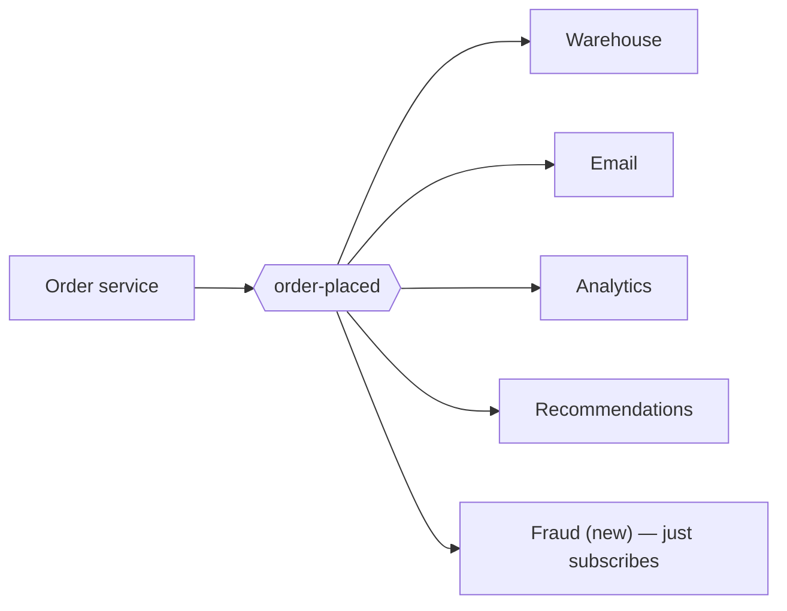
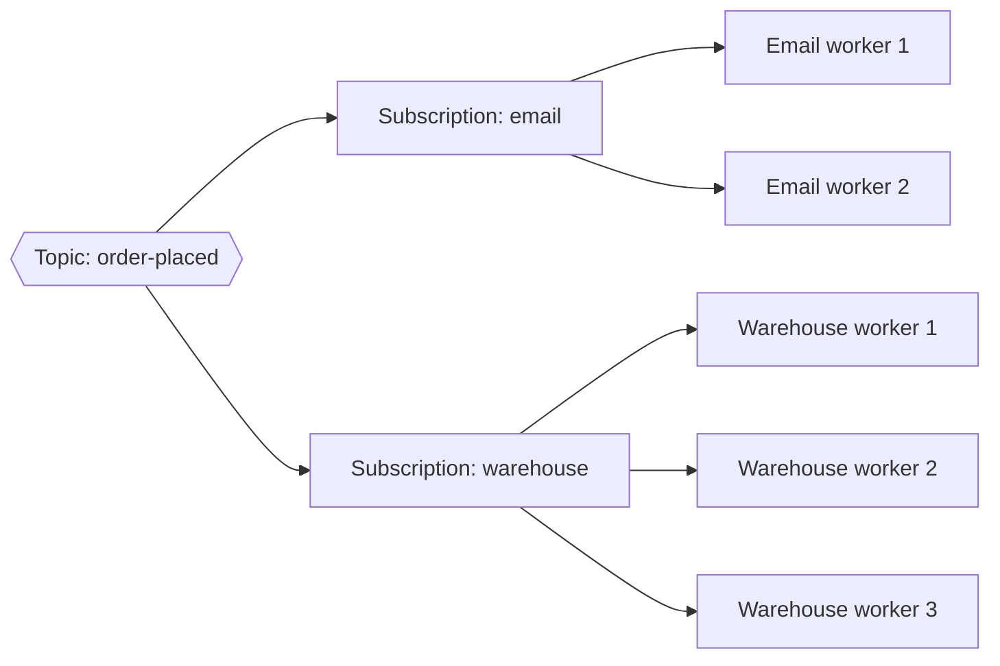

When an order is placed, many parts of a business care: the warehouse must pick items, the email service must send a confirmation, the analytics pipeline must record the sale, and the recommendation engine must update the customer's profile. If the order service called each of them directly, it would need to know about every consumer and would break whenever one was slow or down. **Publish–subscribe (pub-sub)** solves this by broadcasting events to any number of independent subscribers.

## The model

- **Publishers** send messages to a named **topic**, such as `order-placed`.
- **Subscribers** register interest in a topic.
- The pub-sub system delivers **every** message published to a topic to **every** subscription on that topic.

Publishers do not know who the subscribers are, and subscribers can be added or removed without changing publishers. This is the key difference from a point-to-point queue, where each message is consumed by only one consumer.

<TabGroup>
<Tab label="Direct calls">

The order service must know every consumer, wait for each, and handle each one's failures. Adding fraud checks means changing and redeploying it.

</Tab>
<Tab label="Pub-sub">

The order service publishes one event and moves on. New consumers subscribe without any change to the publisher.

</Tab>
</TabGroup>

## Benefits

- **Loose coupling.** New consumers subscribe without changes to the publisher.
- **Fan-out.** One event reaches many services.
- **Independent pace.** Each subscriber consumes at its own speed; a slow analytics job does not delay warehouse picking.
- **Fault isolation.** A subscriber that is down simply catches up later; the publisher and other subscribers are unaffected.
- **Event-driven architecture.** Systems react to facts ("an order was placed") rather than commands, enabling extensibility.

## Costs

Pub-sub is not free. Flows become harder to follow because there is no single call chain to read; debugging requires tracing events across services. Consumers must cope with duplicates and, sometimes, out-of-order events. And because publishers no longer know their consumers, changing an event's format requires care: a field removed from `order-placed` may break a subscriber the publisher's team has never heard of. Teams manage this with **schemas** registered centrally and rules for backward-compatible evolution.

## What goes in an event?

| Style | Example payload | Pros | Cons |
| --- | --- | --- | --- |
| **Event notification** | `{ "orderId": 881 }` | Small; consumers fetch current data | Every consumer calls back to the order service |
| **Event-carried state** | Full order: items, totals, address | Consumers need no callback; can build local copies | Larger messages; schema changes affect more consumers |

Many systems choose event-carried state for core domain events, so subscribers are fully decoupled from the publisher's availability.

## Common use cases

- Propagating domain events between microservices.
- Streaming data into analytics and data warehouses.
- Real-time notifications and live updates.
- Invalidating caches across many servers.
- Replicating changes from a database to search indexes (change data capture).

## Push versus pull delivery

- **Push:** the system sends messages to subscriber endpoints (for example, HTTP webhooks), retrying on failure.
- **Pull:** subscribers fetch messages at their own pace and track their position.

Pull delivery gives subscribers control over their consumption rate and simplifies back-pressure, while push is convenient for lightweight consumers such as serverless functions.

<Callout type="note">
In many systems, each subscription behaves like its own queue: messages are fanned out to every subscription, and within a subscription multiple consumer instances share the work. This combines broadcast between services with load balancing within a service.
</Callout>

<Ponder question="The email service subscribes to order-placed and is down for two hours. What should happen to the confirmation emails, and what property of the pub-sub system makes that possible?">
The emails should be sent late rather than lost: when the email service returns, it resumes from where it stopped and works through the backlog. That requires the pub-sub system to **retain** messages per subscription (or in a log with per-subscriber offsets) for longer than typical outages, and to track each subscription's progress independently so the other subscribers were never affected.
</Ponder>

<KeyTakeaways>
- Pub-sub delivers every message published to a topic to every subscription on that topic.
- Publishers and subscribers are decoupled; subscribers can be added without changing publishers.
- Pub-sub enables fan-out, independent consumption rates, fault isolation and event-driven architectures, at the cost of harder tracing and schema discipline.
- Events can carry just identifiers (notifications) or the full state.
- Delivery can be push-based (webhooks) or pull-based; each subscription can itself be load-balanced across workers.
</KeyTakeaways>
