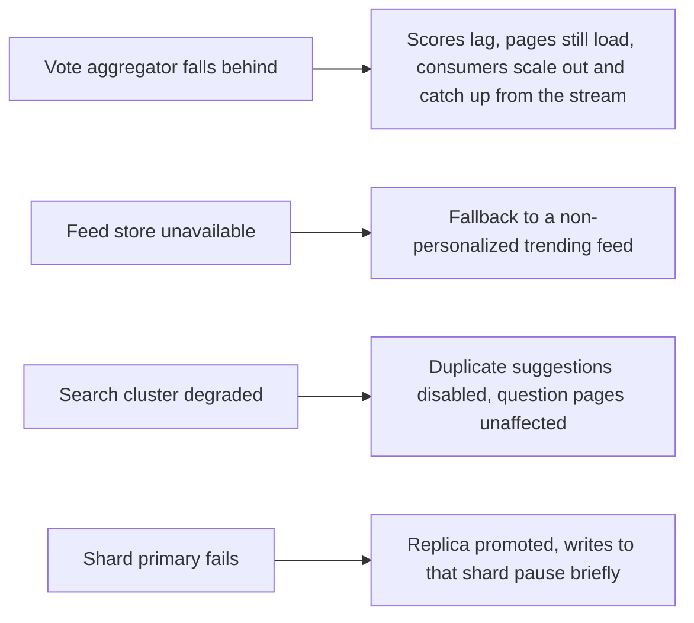

We now **Defend** the final design: check it against the non-functional requirements, examine the trade-offs and walk through failure scenarios.

## Requirements check

| Requirement | How the final design meets it |
| --- | --- |
| Availability | Stateless services in several regions; replicated shards with automatic failover; cached pages keep serving readers even if the backend is degraded. |
| Low latency | Anonymous pages are served from CDN edges; question data and ranked answers are cached; feeds are precomputed. |
| Scalability | Question and user data are sharded; votes and side effects flow through a partitioned event stream; each consumer group scales independently. |
| Consistency | Authors see their own posts immediately through primary reads or session markers; counts, feeds and search are eventually consistent. |
| Durability | Shards are replicated across zones; the event stream is replicated and retained, so consumers can replay after bugs or outages. |

## Trade-offs

**Freshness versus cost of cached pages.** Caching rendered pages at the edge for anonymous readers dramatically cuts origin load, but new answers can take up to the cache time-to-live to appear for those readers. Targeted purges on new answers shrink the window, at the cost of purge traffic for very active questions. For popular questions receiving answers every few seconds, a short time-to-live without purges is simpler.

**Fan-out on write versus read.** Precomputing feeds makes reads fast but multiplies writes by the number of followers. The hybrid approach limits the damage from very popular authors and topics but adds complexity to the feed service, which must merge two sources at read time.

**Eventual consistency of votes.** Batching votes means a user who upvotes may see the count lag for a few seconds. The client hides this by updating the displayed count optimistically.

**Cross-shard queries.** Sharding by question makes per-user views, such as "all my answers", harder. Maintaining secondary, user-keyed indexes asynchronously solves it, with a small delay.

## Failure scenarios

A useful principle is **graceful degradation**: the core experience, reading a question and its answers, depends on as few components as possible. Personalization, suggestions and counts are enhancements that can fail without taking the page down.

## Abuse and quality

A Q&A platform lives or dies on content quality. Several mechanisms plug into the event stream without touching the core write path:

- **Rate limiting** on posting and voting per user and per IP address, using the rate limiter building block.
- **Vote-ring detection**, which looks for clusters of accounts that consistently vote for each other and discounts their votes.
- **Spam and toxicity classifiers**, which score new content asynchronously and hide or queue it for review.
- **Duplicate merging**, where near-duplicate questions are detected with embeddings and merged so answers accumulate on one canonical page.

## What would break next

At another order of magnitude, the hottest risks are the feed service's storage and fan-out cost, and the ranking pipeline's feature computation. Both would likely move to more specialized infrastructure, such as a dedicated feed store and an online feature store shared with other recommendation systems.

## Latency budget for a question page

| Reader | Path | Typical latency |
| --- | --- | --- |
| Anonymous, popular question | CDN edge cache hit | 20–50 ms |
| Anonymous, long-tail question | Edge miss → page renderer → question cache or shard | 150–300 ms |
| Signed-in member | Cached page + personalized fragment (votes, follow state) | 100–200 ms |

The long tail is the slowest path, so the renderer caches question data in memory, and old pages can be pre-rendered in the background when a search engine starts sending traffic to them.

<Ponder question="The feed service is down for 20 minutes. What should signed-in users see, and why does the design make that possible?">
They should still get a useful home page — for example, a trending or topic-based feed from a cache — and every question page should work normally. That is possible because the feed is an enhancement built from the event stream into its own store, not a dependency of the question page. When the feed service recovers, the feed builder catches up from the retained event stream.
</Ponder>

<KeyTakeaways>
- The final design meets availability and latency needs through multi-region stateless services, edge-cached pages and precomputed feeds.
- Key trade-offs are page freshness versus cache efficiency, fan-out cost versus read speed, and lagging vote counts.
- Graceful degradation keeps the core question page working when personalization, search or counts fail.
- Abuse controls such as rate limiting, vote-ring detection and classifiers consume the event stream asynchronously.
- The long-tail question page is the slowest path and benefits from background pre-rendering.
</KeyTakeaways>
