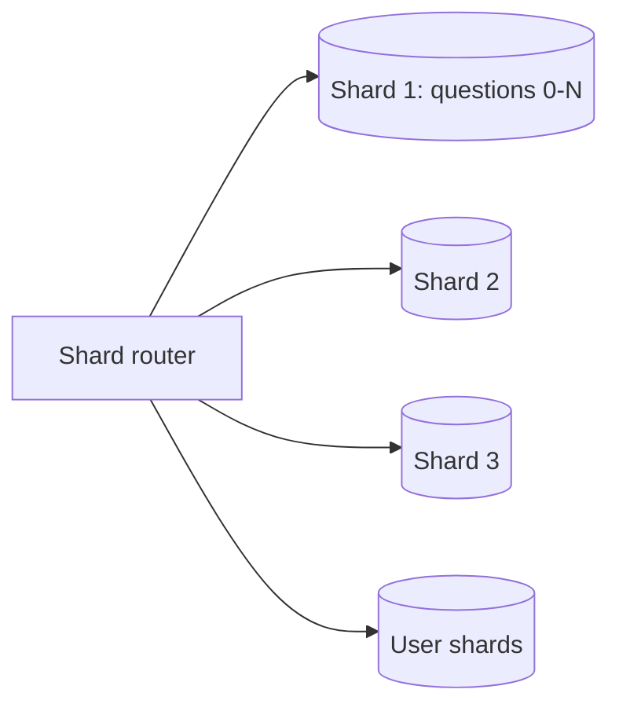
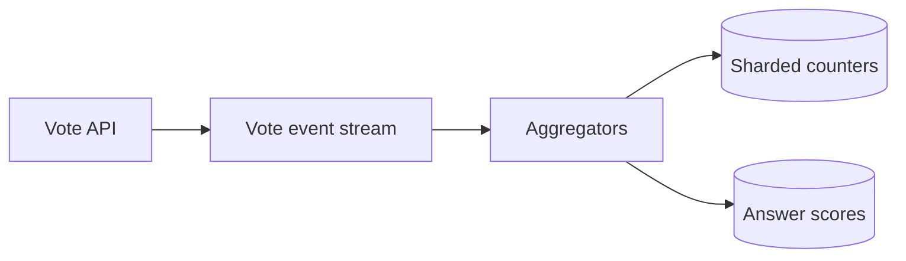
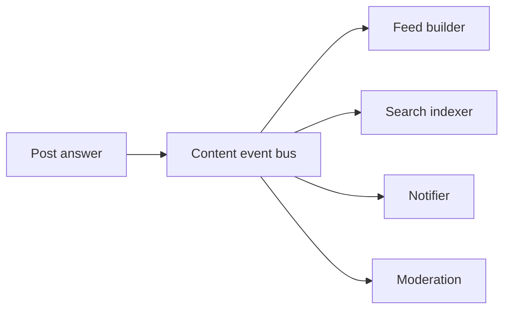
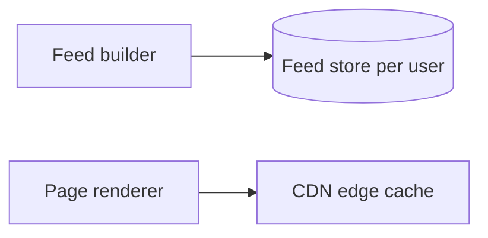
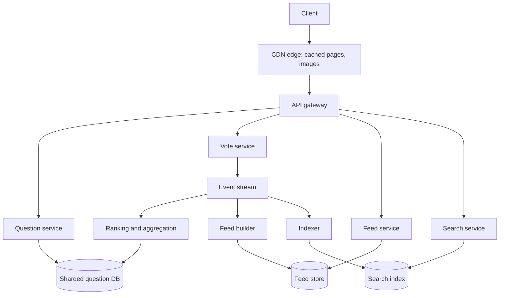

The initial design works until traffic and content grow by an order of magnitude or two. This lesson identifies where it strains and evolves it, which is the **Evolve** step of SCALED.

## Bottlenecks of the initial design

1. **The single primary database.** Every question, answer, vote and follow is written to one machine. Votes are the largest write stream, and viral answers create hot rows as thousands of users vote at once.
2. **Synchronous work in the request path.** Updating scores, notifying followers and moderation checks slow down writes and fail together with them.
3. **Feed computed at request time.** For a user following hundreds of topics, the feed query scans and ranks lots of content on every visit.
4. **Cache misses in the long tail.** Old questions reached from search engines miss the cache and land on replicas.
5. **One region.** Readers far away pay high latency, and a regional failure takes the site down.

## Evolving the design

<Slides title="Evolving the Q&A architecture">
<Slide caption="1. Shard the database by question ID so a question, its answers and their scores live together. User data is sharded separately by user ID.">

</Slide>
<Slide caption="2. Move votes onto an event stream. Consumers aggregate them with sharded counters and update answer scores in batches.">

</Slide>
<Slide caption="3. Publish content events so feeds, search, notifications and moderation update asynchronously.">

</Slide>
<Slide caption="4. Precompute feeds into a per-user store, and cache rendered pages at the edge for anonymous readers.">

</Slide>
</Slides>

### Sharding

Sharding by question ID keeps the most common read, a question page with its answers, on a single shard. Queries that cut across questions, such as all answers by one user, are served from secondary indexes maintained asynchronously, or from a separate store keyed by user.

### Votes as events

Instead of updating a row per vote, the vote API validates the request, records the vote in a store keyed by (user, answer) for de-duplication and publishes an event. Aggregators batch events and apply score deltas every few seconds. A viral answer's score now updates a few times per second instead of thousands, eliminating hot-row contention.

### Answer ranking

With events flowing, a ranking service can compute a richer score than raw votes. It combines upvotes and downvotes with a confidence adjustment, so an answer with 5 of 5 upvotes does not outrank one with 480 of 500. It also weights the voter's and the author's credibility on the topic, and engagement signals such as time spent reading. Ranked answer lists are cached per question.

### Precomputed feeds

The feed builder consumes content events and pushes candidate items into the feeds of followers, a fan-out-on-write approach. For very popular topics or authors with millions of followers, fan-out-on-read is used instead: their content is merged in at request time. A ranking step then orders candidates by predicted interest. The newsfeed chapter explores this hybrid in depth.

### Caching and multi-region

Anonymous readers see identical pages, so fully rendered question pages are cached at CDN edges with short time-to-live values and purged when an answer is added. Signed-in users get the same page with a small personalized fragment loaded separately. The service is deployed in several regions; reads are served locally and writes go to each shard's leader region.

<KeyTakeaways>
- The initial design strains at the single primary, synchronous side effects, request-time feeds, long-tail misses and single-region deployment.
- Sharding by question ID keeps a question page on one shard.
- Votes become events aggregated in batches, removing hot-row contention on viral answers.
- Answer ranking uses confidence-adjusted votes, credibility and engagement, and is cached per question.
- Feeds are precomputed with a hybrid fan-out, and anonymous pages are cached at the edge.
</KeyTakeaways>
