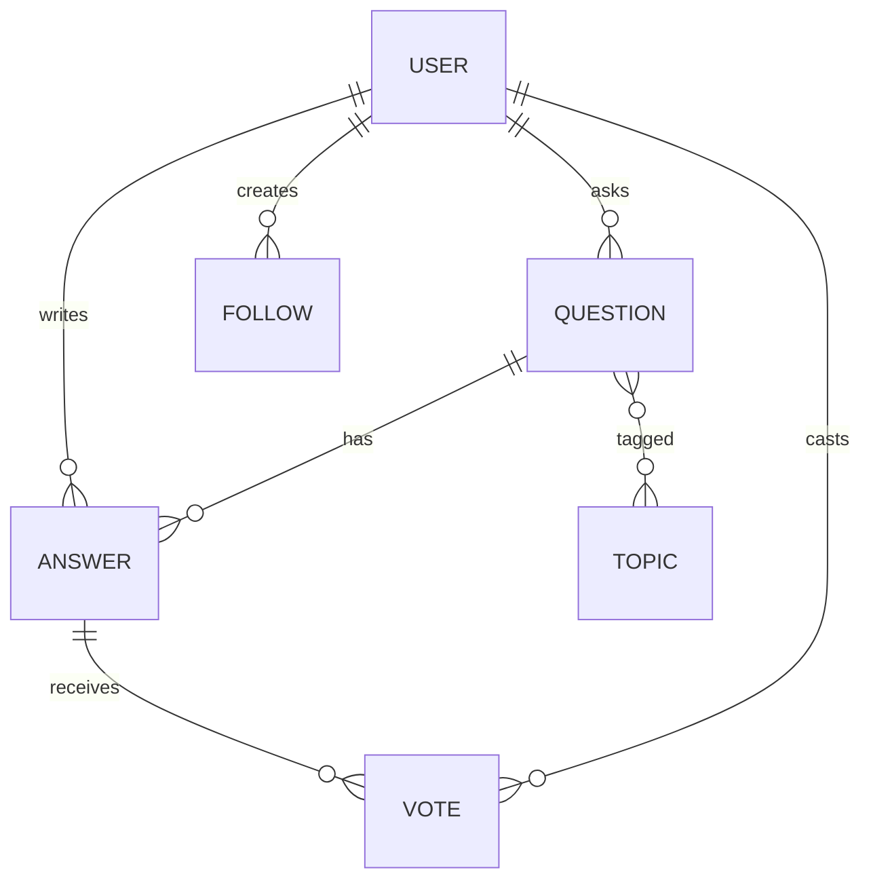
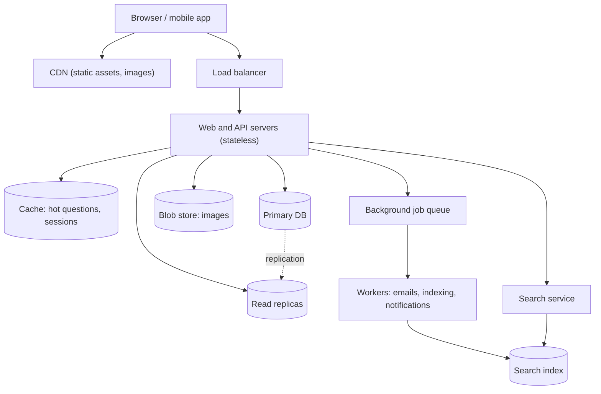

We begin with a design that a small team could build and run: a set of stateless web servers, a primary relational database with replicas, a cache, a blob store for images and a few supporting services. This is how many real Q&A sites started, and it can carry a surprising amount of traffic. In the next lesson we will find where it breaks.

## API

```http
POST /v1/questions                        { title, body, topics }        -> { questionId }
GET  /v1/questions/{id}                   -> question + top answers
POST /v1/questions/{id}/answers           { body }                       -> { answerId }
POST /v1/answers/{id}/votes               { direction: up | down }
POST /v1/{type}/{id}/comments             { text }
POST /v1/follows                          { targetType, targetId }
GET  /v1/feed?cursor=...
GET  /v1/search?q=...&cursor=...
```

Cursor-based pagination keeps feed and search results stable as new content arrives.

## Data model



The relational model fits naturally: questions have many answers, answers have many votes, and questions belong to many topics. Each answer row stores a denormalized `score` so pages can sort answers without counting votes on every read.

## Architecture



**Reads.** A question page is assembled from the cache when possible. On a miss, the web server reads the question and its top answers from a read replica, then populates the cache. Because most page views are for a relatively small set of popular questions, the cache hit rate is high.

**Writes.** Posting an answer writes to the primary, invalidates the question's cache entry and enqueues background jobs to update the search index and notify followers. To guarantee read-your-writes, the author's next page view is routed to the primary, or the server keeps a short-lived marker in the user's session so it bypasses stale replicas.

**Votes.** A vote inserts a row in the votes table and increments the answer's `score` in the same transaction. The unique constraint on (user, answer) prevents double voting.

**Feed.** The home feed is computed on request: find the topics and people the user follows, query recent questions and answers from them, rank them and return a page. This is simple, and it works while the number of follows and the volume of content are modest.

**Search.** Workers index questions and answers into a search engine. When a user types a new question, the search service suggests similar existing questions to reduce duplicates.

## Why start here

This design has few moving parts, which makes it easy to reason about, operate and change. Its components are all standard building blocks, and the application servers are stateless, so the web tier scales horizontally just by adding servers. For many products, this is the right architecture for the first years of their life.

<Callout type="tip">
In an interview, say explicitly that this is a starting point and name the parts you expect to break first, for example the single primary database and the feed computed at request time. That frames the next part of the discussion.
</Callout>

<KeyTakeaways>
- The initial design uses stateless web servers, a primary database with read replicas, a cache, a blob store and background workers.
- The relational model fits questions, answers, votes, topics and follows, with a denormalized score for sorting.
- Question pages are served mostly from cache; writes invalidate cache entries and enqueue background work.
- Read-your-writes is provided by routing an author's reads to the primary for a short time.
- The home feed is computed at request time, which is simple but will not scale indefinitely.
</KeyTakeaways>
