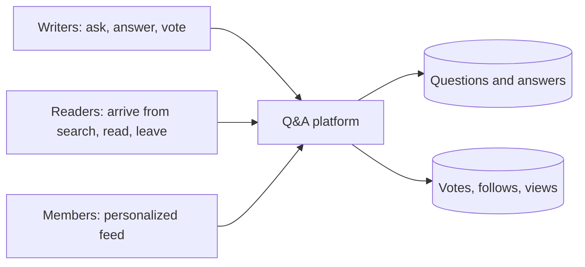

A question-and-answer platform lets people ask questions, write long-form answers, vote on the best ones and follow topics that interest them. The largest such platforms host hundreds of millions of questions and serve a huge audience that mostly arrives from search engines, reads a page and leaves. A smaller, highly engaged community writes the content and returns daily to a personalized feed.

## Why it is an interesting problem

At first a Q&A site looks like a simple web application backed by a relational database. The challenges come from its mix of workloads:

- **Read-heavy with a long tail.** A handful of popular questions receive enormous traffic, but most traffic is spread across millions of older questions reached through search engines. Caching the hot set is easy; serving the long tail cheaply is harder.
- **Rich, ranked content.** Answers are sorted by quality, not by time. Ranking uses votes, the author's credibility on the topic and engagement signals.
- **Personalization.** Signed-in users get a home feed of questions and answers from followed topics and people, which is a fan-out problem similar to a newsfeed.
- **Search and recommendations.** Related questions, duplicate detection and search are central to keeping the content useful.
- **Mixed consistency.** A user's own answer must appear immediately to them, but vote counts can lag.

## How this chapter evolves the design

Instead of presenting a finished architecture, this chapter mirrors how designs grow in practice and in interviews:

1. **Requirements** define the features and estimate the load.
2. **Initial design** builds a straightforward architecture of web servers, a database, caches and a few background services. It works for a while.
3. **Final design** identifies the bottlenecks of the initial design at scale, such as a monolithic database, synchronous work in the request path and expensive feed generation, and evolves it with sharding, asynchronous processing and precomputed feeds.
4. **Evaluation** checks the final design against the requirements and discusses trade-offs.

<Callout type="interview">
Evolving a simple design into a scalable one is a strong interview strategy. It shows you can reason about bottlenecks rather than recite an architecture, and it gives the interviewer natural points to steer the discussion.
</Callout>

## Relationship to other problems

Many ideas carry over from other chapters. The home feed borrows from the **newsfeed** design. Search uses the **distributed search** building block. Vote counts use **sharded counters**. Media in answers, such as images, lives in a **blob store** behind a **CDN**. Recognizing these reusable pieces lets you move quickly to the parts unique to a Q&A platform: ranking answers and recommending questions to the right experts.

## Three audiences, three workloads

| Audience | Share of traffic | What they need | Design implication |
| --- | --- | --- | --- |
| Anonymous readers from search engines | Most page views | A fast question page | Cache rendered pages at the edge; fast time to first byte |
| Signed-in members | A minority of users, most sessions | Personalized feed, notifications | Precomputed feeds, per-user state |
| Writers and experts | A small fraction | Posting, editing, seeing their impact | Strongly consistent writes, read-your-writes, notifications |

<Ponder question="Why does page speed for anonymous readers matter so much to a Q&A platform's business?">
Most visitors arrive from search engines, which take page speed into account when ranking results, and impatient visitors leave slow pages. Faster question pages mean better search placement, more visitors and more of them converting into members and writers. That is why edge caching of rendered pages for anonymous readers is one of the highest-value decisions in this design.
</Ponder>

<KeyTakeaways>
- A Q&A platform is read-heavy, with a hot set of popular questions and a long tail reached from search engines.
- Answers are ranked by quality using votes, author credibility and engagement, not by time.
- Signed-in members expect a personalized feed, which introduces a newsfeed-style fan-out problem.
- The chapter starts with a simple design and evolves it by fixing bottlenecks, a useful interview technique.
- Many components reuse building blocks: search, sharded counters, blob store, CDN and newsfeed ideas.
- Anonymous readers, members and writers form three distinct workloads with different design needs.
</KeyTakeaways>
