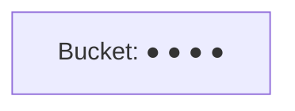
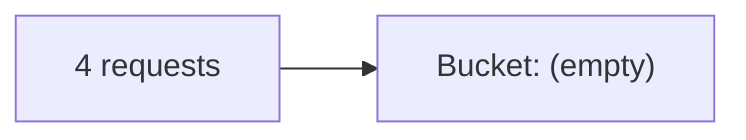
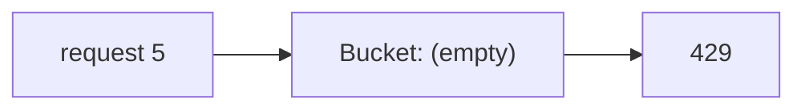
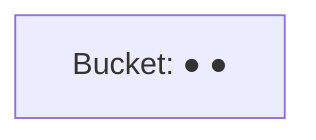

The algorithm determines how accurately limits are enforced, how bursts are handled and how much memory each key needs. Let's compare the five classic approaches.

## Token bucket

Each key has a bucket holding up to `capacity` tokens, refilled at a steady `rate`. Each request takes one token; if the bucket is empty, the request is rejected.

<Slides title="Token bucket (capacity 4, refill 1 token/s)">
<Slide caption="1. The bucket starts full with 4 tokens.">



</Slide>
<Slide caption="2. A burst of 4 requests arrives instantly; all are allowed and the bucket empties.">



</Slide>
<Slide caption="3. A 5th request arrives immediately and is rejected.">



</Slide>
<Slide caption="4. Two seconds later, 2 tokens have refilled and 2 more requests can pass.">



</Slide>
</Slides>

Implementation needs only two values per key: the token count and the last refill timestamp. Tokens are refilled lazily on each request based on elapsed time.

- ✅ Allows short **bursts** up to capacity while enforcing an average rate. Memory-efficient.
- ❌ Two parameters to tune.

## Leaky bucket

Requests enter a FIFO queue (the bucket) and are processed at a **constant rate**, like water leaking from a hole. If the queue is full, new requests are dropped.

- ✅ Produces a perfectly smooth outflow — useful when the downstream system needs a steady rate.
- ❌ Bursts fill the queue and add latency; recent requests may be dropped while old ones wait.

## Fixed window counter

Divide time into fixed windows (for example, each calendar minute) and count requests per key per window. Reject once the count exceeds the limit.

- ✅ Very simple: one counter per key with a TTL.
- ❌ **Boundary bursts:** a client can send the full limit at 12:00:59 and again at 12:01:00, doubling the rate briefly.

## Sliding window log

Store the timestamp of every request in a sorted set. On each request, remove timestamps older than the window and count the rest.

- ✅ Precise: the limit holds over any window.
- ❌ Memory grows with the limit — storing 1,000 timestamps per key for a 1,000-per-hour limit is expensive at scale.

## Sliding window counter

A hybrid: keep counters for the current and previous fixed windows, and estimate the count over the sliding window by weighting the previous window by its overlap:

```text
estimate = current_count + previous_count × (1 − elapsed_fraction_of_current_window)
```

- ✅ Smooths boundary bursts with only two counters per key.
- ❌ An approximation (it assumes requests in the previous window were evenly spread), but accurate enough in practice.

## Comparison

| Algorithm | Memory per key | Bursts | Accuracy | Typical use |
| --- | --- | --- | --- | --- |
| Token bucket | 2 values | Allowed up to capacity | Good | General API limits |
| Leaky bucket | Queue | Smoothed | Good | Shaping traffic to a steady rate |
| Fixed window | 1 counter | Boundary spikes | Fair | Simple quotas |
| Sliding log | Many timestamps | Precise | Exact | Low-volume, strict limits |
| Sliding counter | 2 counters | Smoothed | Very good | High-scale precise limits |

<Callout type="tip">
The **token bucket** is a strong default in interviews: it is memory-efficient, easy to implement atomically, and its burst behavior matches how real clients send traffic.
</Callout>

<KeyTakeaways>
- Token bucket allows bursts up to capacity while enforcing an average rate, using two values per key.
- Leaky bucket smooths output to a constant rate using a queue.
- Fixed window is simple but allows double bursts at window boundaries.
- Sliding window log is exact but memory-hungry; sliding window counter approximates it cheaply.
- Choose based on burst tolerance, accuracy needs and memory at scale.
</KeyTakeaways>
