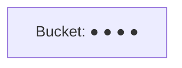
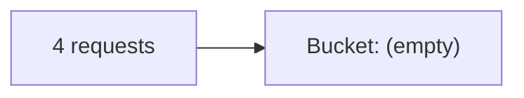
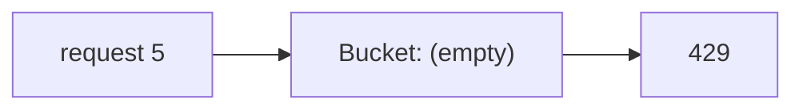
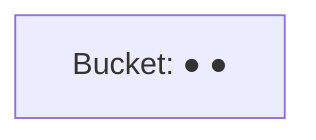
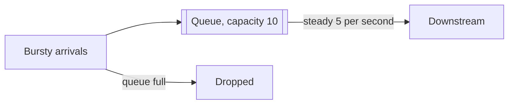
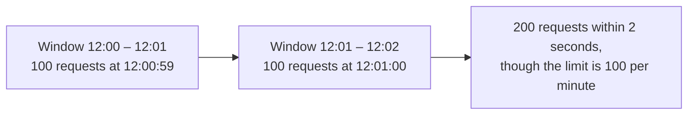

The algorithm determines how accurately limits are enforced, how bursts are handled and how much memory each key needs. Let's compare the five classic approaches.

## Token bucket

Each key has a bucket holding up to `capacity` tokens, refilled at a steady `rate`. Each request takes one token; if the bucket is empty, the request is rejected.

<Slides title="Token bucket (capacity 4, refill 1 token/s)">
<Slide caption="1. The bucket starts full with 4 tokens.">



</Slide>
<Slide caption="2. A burst of 4 requests arrives instantly; all are allowed and the bucket empties.">



</Slide>
<Slide caption="3. A 5th request arrives immediately and is rejected.">



</Slide>
<Slide caption="4. Two seconds later, 2 tokens have refilled and 2 more requests can pass.">



</Slide>
</Slides>

Implementation needs only two values per key: the token count and the last refill timestamp. Tokens are refilled lazily on each request based on elapsed time:

```python
def allow(bucket, capacity, rate, now, cost=1):
    elapsed = now - bucket.last
    bucket.tokens = min(capacity, bucket.tokens + elapsed * rate)
    bucket.last = now
    if bucket.tokens >= cost:
        bucket.tokens -= cost
        return True
    return False
```

The two parameters map directly onto policy: `rate` is the sustained requests per second, and `capacity` is the largest burst tolerated. "100 requests per minute with bursts of up to 20" becomes `rate = 100/60 ≈ 1.67`, `capacity = 20`.

- ✅ Allows short **bursts** up to capacity while enforcing an average rate. Memory-efficient.
- ❌ Two parameters to tune.

## Leaky bucket

Requests enter a FIFO queue (the bucket) and are processed at a **constant rate**, like water leaking from a hole. If the queue is full, new requests are dropped.



- ✅ Produces a perfectly smooth outflow — useful when the downstream system needs a steady rate, such as a payment provider or an SMS gateway with a strict per-second limit.
- ❌ Bursts fill the queue and add latency; recent requests may be dropped while old ones wait.

A variant without a real queue — sometimes called the **generic cell rate algorithm** — stores only the "theoretical arrival time" of the next allowed request, giving leaky-bucket behavior with a single timestamp per key.

## Fixed window counter

Divide time into fixed windows (for example, each calendar minute) and count requests per key per window. Reject once the count exceeds the limit.

```text
key = "rl:{api_key}:{floor(now / 60)}"
count = INCR key; if count == 1: EXPIRE key 60
allow if count <= limit
```

- ✅ Very simple: one counter per key with a TTL.
- ❌ **Boundary bursts:** a client can send the full limit at 12:00:59 and again at 12:01:00, doubling the rate briefly.



## Sliding window log

Store the timestamp of every request in a sorted set. On each request, remove timestamps older than the window and count the rest.

- ✅ Precise: the limit holds over any window.
- ❌ Memory grows with the limit — storing 1,000 timestamps per key for a 1,000-per-hour limit is expensive at scale. For a million keys at 8 bytes per timestamp, that is 8 GB for one rule.

## Sliding window counter

A hybrid: keep counters for the current and previous fixed windows, and estimate the count over the sliding window by weighting the previous window by its overlap:

```text
estimate = current_count + previous_count × (1 − elapsed_fraction_of_current_window)
```

**Worked example.** Limit: 100 per minute. The previous minute had 80 requests; the current minute has 30 so far, and we are 25% of the way into it.

```text
estimate = 30 + 80 × (1 − 0.25) = 30 + 60 = 90   →  allowed (90 < 100)
```

Ten seconds later (about 42% into the window) with 45 requests in the current window:

```text
estimate = 45 + 80 × (1 − 0.42) ≈ 45 + 46 = 91   →  allowed
```

- ✅ Smooths boundary bursts with only two counters per key.
- ❌ An approximation (it assumes requests in the previous window were evenly spread), but accurate enough in practice — measured errors in real traffic are typically well under 1%.

## Comparison

| Algorithm | Memory per key | Bursts | Accuracy | Typical use |
| --- | --- | --- | --- | --- |
| Token bucket | 2 values | Allowed up to capacity | Good | General API limits |
| Leaky bucket | Queue (or 1 timestamp) | Smoothed | Good | Shaping traffic to a steady rate |
| Fixed window | 1 counter | Boundary spikes | Fair | Simple quotas |
| Sliding log | Many timestamps | Precise | Exact | Low-volume, strict limits |
| Sliding counter | 2 counters | Smoothed | Very good | High-scale precise limits |

## Choosing for a scenario

| Scenario | Good choice | Why |
| --- | --- | --- |
| Public API with bursty but legitimate clients | Token bucket | Tolerates bursts, enforces an average |
| Calling a partner API limited to 50 requests per second | Leaky bucket | Guarantees a smooth outflow within the partner's limit |
| Daily quota on a free plan | Fixed window per day | Simple; boundary effects matter little at that scale |
| Login attempts, 5 per 15 minutes | Sliding log | Low volume, exactness matters for security |
| High-volume per-user limits across a large fleet | Sliding window counter | Accurate with tiny state |

<Callout type="tip">
The **token bucket** is a strong default in interviews: it is memory-efficient, easy to implement atomically, and its burst behavior matches how real clients send traffic.
</Callout>

<Ponder question="With a token bucket of capacity 10 and a refill rate of 1 token per second, what is the maximum number of requests a client can make in any 60-second period?">
Up to **70**: the full bucket of 10 at the start, plus 60 tokens refilled over the 60 seconds (one per second). The capacity sets the burst size, and the refill rate sets the long-run average; a limit stated as "requests per minute" must account for both when you choose the parameters.
</Ponder>

<KeyTakeaways>
- Token bucket allows bursts up to capacity while enforcing an average rate, using two values per key; its parameters map directly to rate and burst size.
- Leaky bucket smooths output to a constant rate using a queue or a single timestamp.
- Fixed window is simple but allows double bursts at window boundaries.
- Sliding window log is exact but memory-hungry; sliding window counter approximates it cheaply and accurately.
- Choose based on burst tolerance, accuracy needs and memory at scale.
</KeyTakeaways>
