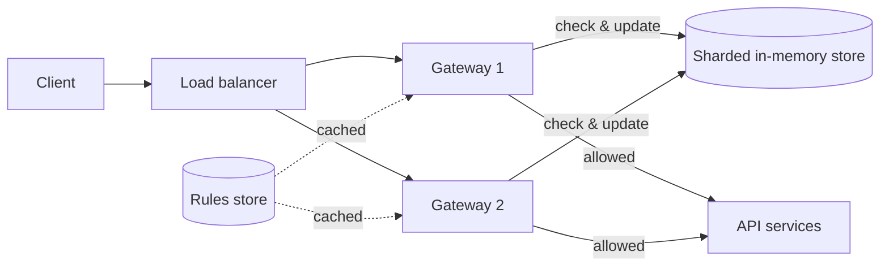
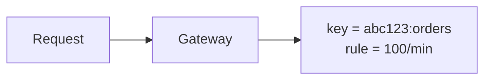
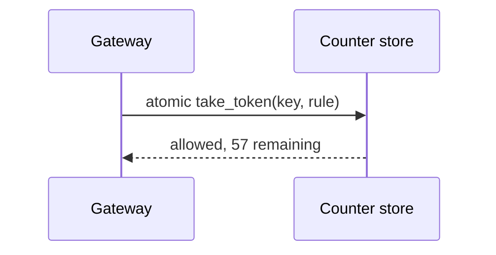
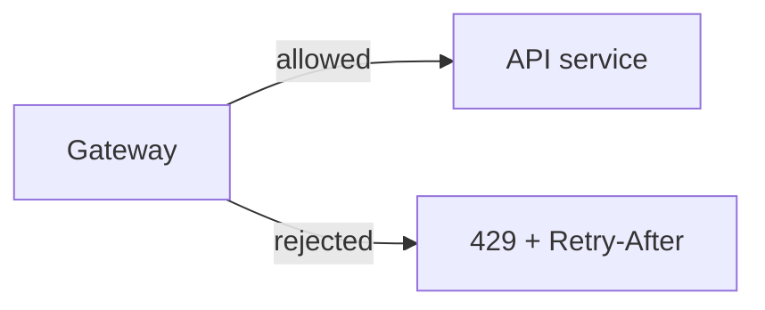

Now let's design the rate limiter: where it runs, where it stores counters, and how it stays fast and accurate across many servers.

## Placement

There are three common options:

- **Library in each API server.** Lowest latency, but each server needs access to shared state and every service must embed the library.
- **API gateway or reverse proxy.** A central place to enforce limits for all services, before requests consume backend resources.
- **Dedicated rate-limiting service.** API servers or gateways call it for each decision. Flexible, but adds a network hop.

A common design enforces limits in the **gateway**, which consults a **shared in-memory store** for counters.

## Components

- **Rules store** — defines limits per tier, endpoint and key type. Rules change rarely, so gateways cache them locally and refresh periodically.
- **Counter store** — a sharded in-memory key-value store (for example, Redis) holding the current state for each rate-limit key, with TTLs so idle keys disappear.
- **Decision logic** — computes the key, loads the rule, performs an **atomic** check-and-update and returns allow or reject.
- **Throttled request handling** — rejected requests get 429 responses; optionally, some requests are queued for later.

## Request flow

<Slides title="Checking a request">
<Slide caption="1. The gateway builds the limit key, e.g. api_key:abc123:POST /orders, and looks up the rule.">

</Slide>
<Slide caption="2. It performs an atomic check-and-update in the counter store, e.g. a script that refills and takes a token.">

</Slide>
<Slide caption="3. Allowed requests proceed; rejected ones receive 429 with Retry-After.">

</Slide>
</Slides>

## Atomicity and race conditions

If two gateways read a counter of 99 simultaneously, both may allow a request, pushing the client to 101 against a limit of 100. To prevent this, the check-and-update must be **atomic** in the store — using atomic increment operations or server-side scripts that read, decide and write in one step.

## Reducing latency and load

A network call to the store on every request adds latency. Techniques to reduce it:

- **Local pre-aggregation:** each gateway counts locally and syncs with the shared store every few hundred milliseconds. This is much cheaper but allows small overshoots.
- **Local token allocation:** gateways lease small batches of tokens from the central store and spend them locally.
- **Sharding** the counter store by key, so load spreads across many nodes.

These trade a little accuracy for much lower latency — usually a good trade.

## Multi-region deployments

Keeping a single global counter per key would require cross-region round trips. Instead, each region usually enforces limits independently (possibly with the limit split among regions) and asynchronously shares usage. Exact global limits are rarely worth the latency.

<Callout type="interview">
Mention the race condition and how atomic operations fix it, and the latency trade-off between exact central counting and approximate local counting. These are the typical follow-ups on rate limiter designs.
</Callout>

<KeyTakeaways>
- Rate limiters commonly run in the API gateway and consult a shared, sharded in-memory counter store.
- Rules are cached locally; counters carry TTLs so idle keys expire.
- Check-and-update must be atomic to prevent races between servers.
- Local counting or token leasing reduces latency at the cost of small overshoots.
- Multi-region systems usually enforce limits per region and share usage asynchronously.
</KeyTakeaways>
