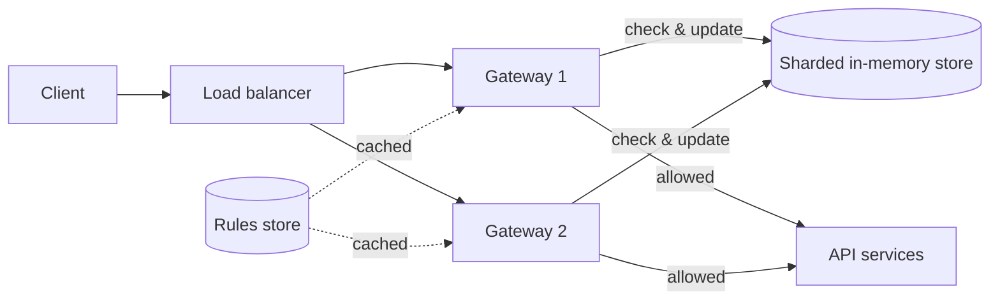
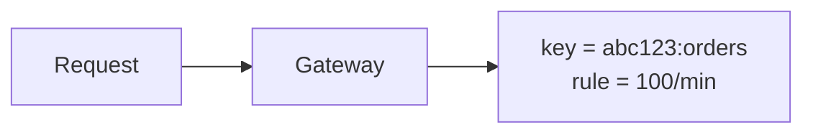
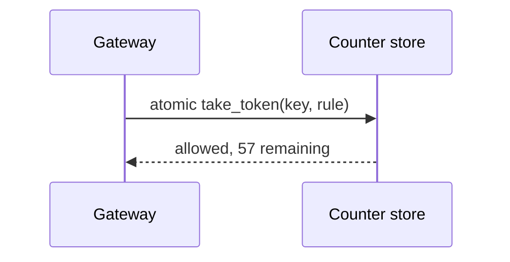
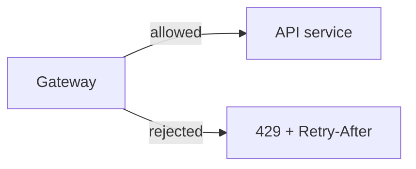
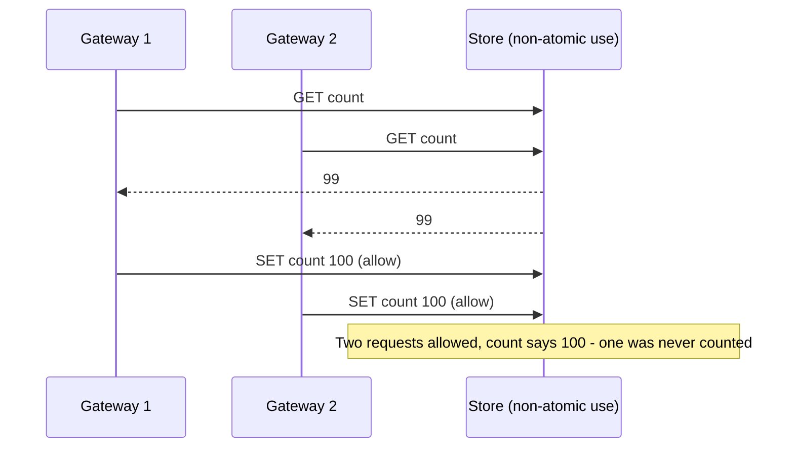
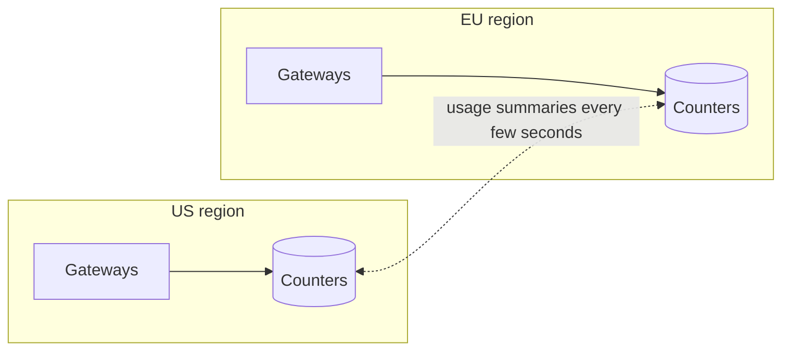

Now let's design the rate limiter: where it runs, where it stores counters, and how it stays fast and accurate across many servers.

## Placement

There are three common options:

- **Library in each API server.** Lowest latency, but each server needs access to shared state and every service must embed the library.
- **API gateway or reverse proxy.** A central place to enforce limits for all services, before requests consume backend resources.
- **Dedicated rate-limiting service.** API servers or gateways call it for each decision. Flexible, but adds a network hop.

| Placement | Latency | Coverage | Operational cost |
| --- | --- | --- | --- |
| Library | Lowest | Only services that embed it | Every team upgrades the library |
| Gateway | Low | Everything behind the gateway | One component to run |
| Separate service | One extra hop | Anything that calls it | Another service to scale and keep available |

A common design enforces limits in the **gateway**, which consults a **shared in-memory store** for counters.



## Components

- **Rules store** — defines limits per tier, endpoint and key type. Rules change rarely, so gateways cache them locally and refresh periodically.
- **Counter store** — a sharded in-memory key-value store (for example, Redis) holding the current state for each rate-limit key, with TTLs so idle keys disappear.
- **Decision logic** — computes the key, loads the rule, performs an **atomic** check-and-update and returns allow or reject.
- **Throttled request handling** — rejected requests get 429 responses; optionally, some requests are queued for later.
- **Metrics and logs** — counts of allowed and throttled requests per rule and key, so operators can tune rules and detect attacks.

## Request flow

<Slides title="Checking a request">
<Slide caption="1. The gateway builds the limit key, e.g. api_key:abc123:POST /orders, and looks up the rule.">



</Slide>
<Slide caption="2. It performs an atomic check-and-update in the counter store, e.g. a script that refills and takes a token.">



</Slide>
<Slide caption="3. Allowed requests proceed; rejected ones receive 429 with Retry-After.">



</Slide>
</Slides>

## Atomicity and race conditions

If two gateways read a counter of 99 simultaneously, both may allow a request, pushing the client to 101 against a limit of 100. To prevent this, the check-and-update must be **atomic** in the store — using atomic increment operations or server-side scripts that read, decide and write in one step.



A token bucket implemented as a server-side script runs as one indivisible step:

```lua
-- KEYS[1] = bucket key; ARGV = capacity, refill_per_sec, now_ms, cost
local b = redis.call('HMGET', KEYS[1], 'tokens', 'ts')
local capacity, rate = tonumber(ARGV[1]), tonumber(ARGV[2])
local now, cost = tonumber(ARGV[3]), tonumber(ARGV[4])
local tokens = tonumber(b[1]) or capacity
local ts = tonumber(b[2]) or now
tokens = math.min(capacity, tokens + (now - ts) / 1000 * rate)   -- lazy refill
local allowed = tokens >= cost
if allowed then tokens = tokens - cost end
redis.call('HSET', KEYS[1], 'tokens', tokens, 'ts', now)
redis.call('PEXPIRE', KEYS[1], math.ceil(capacity / rate * 1000))  -- idle keys vanish
return { allowed and 1 or 0, tokens }
```

## Reducing latency and load

A network call to the store on every request adds latency. Techniques to reduce it:

- **Local pre-aggregation:** each gateway counts locally and syncs with the shared store every few hundred milliseconds. This is much cheaper but allows small overshoots.
- **Local token allocation:** gateways lease small batches of tokens from the central store and spend them locally.
- **Sharding** the counter store by key, so load spreads across many nodes.
- **Sticky routing:** if the load balancer routes all requests of one key to the same gateway (by hashing the key), that gateway can count locally and exactly; the shared store is needed only when routing changes.

These trade a little accuracy for much lower latency — usually a good trade.

### How much can local counting overshoot?

With 20 gateways syncing every 200 ms, a client sending requests to all of them could exceed its limit by what those gateways allow before they learn the global count — at most about 200 ms of traffic per gateway. For a limit of 100 per second, that is a worst case of roughly 20 extra requests in a burst, usually acceptable for fairness limits but not for security-sensitive ones, which use exact central counting.

## Handling failures

- **Counter store unavailable:** gateways time out quickly (a few milliseconds) and apply the rule's fail mode — usually allowing the request, optionally falling back to approximate local limits so a runaway client is still somewhat contained.
- **Counter shard lost:** its keys restart from empty. Clients briefly get fresh quotas — a minor, temporary overshoot.
- **Rules store unavailable:** gateways keep using their cached rules.

## Multi-region deployments

Keeping a single global counter per key would require cross-region round trips. Instead, each region usually enforces limits independently (possibly with the limit split among regions) and asynchronously shares usage. Exact global limits are rarely worth the latency.



## Telling clients what happened

Responses include the limit, remaining quota and reset time so clients can self-throttle; throttled responses include `Retry-After`. Throttling decisions are logged with the rule name, which lets support staff answer "why was I blocked?" and lets security teams spot keys that are hammering sensitive endpoints.

<Callout type="interview">
Mention the race condition and how atomic operations fix it, and the latency trade-off between exact central counting and approximate local counting. These are the typical follow-ups on rate limiter designs.
</Callout>

<Ponder question="Why should the counter keys have a TTL, and how long should it be for a token bucket?">
Without a TTL, the store accumulates state for every key ever seen — millions of idle API keys and IPs — wasting memory indefinitely. For a token bucket, once a key has been idle long enough for the bucket to refill completely (capacity ÷ refill rate), its state is identical to a brand-new full bucket, so it can safely expire after that time.
</Ponder>

<KeyTakeaways>
- Rate limiters commonly run in the API gateway and consult a shared, sharded in-memory counter store; rules are cached locally.
- Check-and-update must be atomic — for example, a server-side script — to prevent races between servers.
- Local counting, token leasing and sticky routing reduce latency at the cost of small, bounded overshoots.
- On store failure, apply the rule's fail mode quickly; counters carry TTLs so idle keys expire.
- Multi-region systems usually enforce limits per region and share usage asynchronously.
- Informative headers and logged decisions help clients and operators.
</KeyTakeaways>
