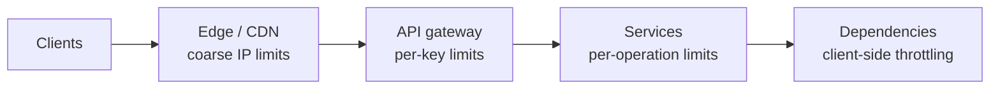

A public API receives a sudden flood of requests — maybe a buggy client stuck in a retry loop, a scraper harvesting data, or an attacker attempting to guess passwords. Without protection, the flood consumes server capacity and degrades service for everyone. A **rate limiter** controls how many requests a client can make in a given period, rejecting or delaying the excess.

## Why rate limit?

- **Prevent resource starvation.** Stop any one client from monopolizing shared capacity, whether by accident or maliciously (denial of service).
- **Security.** Slow down brute-force attacks on login, password reset and payment endpoints.
- **Cost control.** Limit usage of expensive operations or paid third-party APIs.
- **Fairness and business tiers.** Enforce plan quotas — free users get 100 requests per minute, paid users 10,000.
- **Protect downstream systems.** Keep traffic within what databases and dependencies can handle.

## How limits are expressed

A rate limit usually combines:

- **Who:** the key to count by — user ID, API key, IP address, or a combination such as user plus endpoint.
- **What:** which requests count — all requests, one endpoint, or weighted by cost.
- **How many per how long:** such as 100 requests per minute, or 5 login attempts per 15 minutes.

When a client exceeds its limit, the service typically responds with HTTP **429 Too Many Requests** and headers telling the client when to retry:

```text
HTTP/1.1 429 Too Many Requests
Retry-After: 30
X-RateLimit-Limit: 100
X-RateLimit-Remaining: 0
X-RateLimit-Reset: 1735689600
```

## Where rate limiting happens



Rate limiting is often layered: coarse limits at the edge to stop floods cheaply, precise per-client limits at the API gateway, and fine-grained limits inside services for expensive operations. Clients can also throttle themselves to respect known limits.

## Chapter roadmap

1. **Requirements** for a distributed rate limiter.
2. **Design** — where it sits and how it shares state across servers.
3. **Algorithms** — token bucket, leaky bucket, fixed window and sliding window variants.

<KeyTakeaways>
- Rate limiters cap how many requests a client can make in a period, protecting capacity, security, cost and fairness.
- Limits specify who is counted, what counts and how many per time window.
- Exceeding a limit typically returns HTTP 429 with retry information.
- Rate limiting is layered across the edge, API gateway, services and clients.
</KeyTakeaways>
