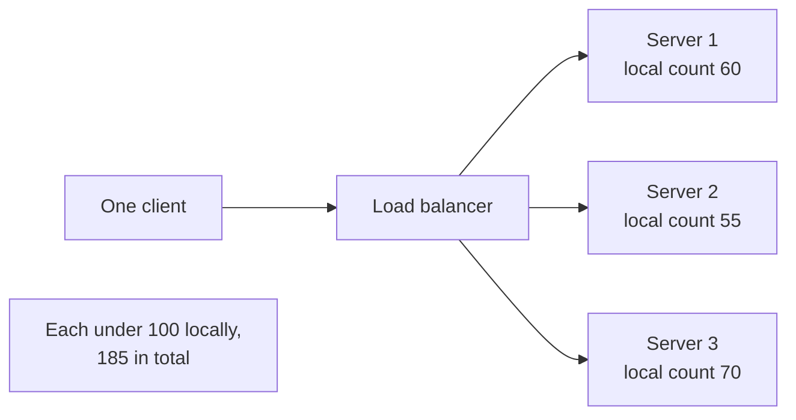
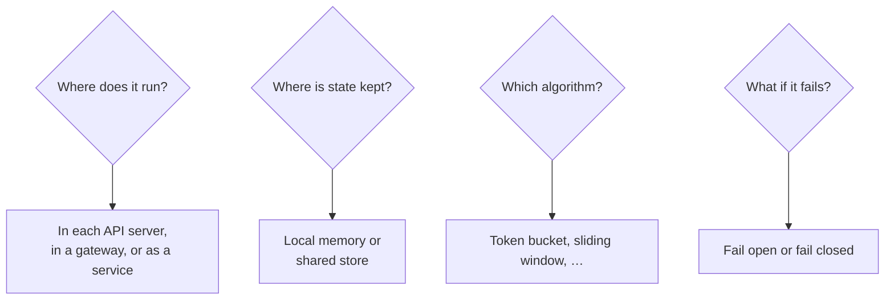

Let's define what our distributed rate limiter must do. It will protect an API served by hundreds of stateless servers across several regions.

## Functional requirements

- **Limit requests** per client key (API key, user ID or IP) according to configurable rules.
- **Support multiple rules** per key, such as 10 requests per second **and** 1,000 per hour.
- **Different rules per endpoint or tier**, for example stricter limits on `/login` and higher limits for paid plans.
- **Inform clients** when they are throttled, with a 429 response and retry information.
- **Configurable behavior** when over the limit: reject, queue briefly or degrade (for example, serve cached data).

## Rules as configuration

Rules should be data, not code, so they can change without deployments:

```yaml
rules:
  - name: free-tier-default
    match: { tier: free }
    key: api_key
    limits:
      - { requests: 10,     per: 1s }
      - { requests: 10000,  per: 1d }
  - name: login-per-account
    match: { endpoint: "POST /v1/login" }
    key: account_id
    limits:
      - { requests: 5, per: 15m }
    on_exceed: reject
    fail_mode: closed        # security-sensitive
  - name: search-cost
    match: { endpoint: "GET /v1/search" }
    key: user_id
    cost: 5                  # each search consumes 5 units
    limits:
      - { units: 50, per: 1s }
```

A request can match several rules; it is allowed only if every matching rule allows it.

## Non-functional requirements

- **Low latency.** The limiter is on the path of every request, so its check must add at most about a millisecond.
- **Accuracy.** Limits should be enforced closely. Small overshoots may be acceptable; large ones defeat the purpose.
- **Scalability.** Handle millions of requests per second and millions of distinct keys.
- **Availability and fault tolerance.** If the limiter's storage fails, the API must keep working — usually by **failing open** (allowing requests) rather than failing closed.
- **Consistency across servers.** A client sending requests to many servers should not get `N` times its limit.
- **Observability.** Operators must see which keys are throttled and why, to tune rules and spot attacks.

<Callout type="warning">
Failing closed — rejecting all requests when the limiter is unavailable — turns a limiter outage into a full API outage. Most systems fail open for general limits, but may fail closed for security-sensitive limits such as login attempts.
</Callout>

## Why local counting is not enough

If each of 100 API servers enforced "100 requests per minute" independently, a client whose requests are spread by the load balancer could make up to 100 × 100 = 10,000 requests per minute. Dividing the limit by the number of servers (1 per server) fails too: the load balancer rarely spreads one client's requests perfectly evenly, and the server count changes with autoscaling. A distributed limiter therefore needs **shared state** — or at least coordinated local state.



## Key design questions



These questions drive the design in the next lesson.

## Capacity snapshot

Assume 5 million active API keys, each tracked with a counter or token bucket of about 50 bytes including overhead:

```text
5,000,000 keys × 50 bytes ≈ 250 MB of state
With several rules per key (×4) ≈ 1 GB
```

The state fits comfortably in an in-memory store, but the **request rate** — every API request performs at least one read-modify-write — is the real challenge: at 1 million requests per second, the limiter's store must sustain 1 million atomic updates per second, which requires sharding.

```text
One in-memory store node:   ~100,000 atomic operations/s
Nodes for 1M req/s:         10, plus replicas → ~20
Added latency per request:  ~0.5 ms round trip within the data center
```

<Ponder question="An API allows 1,000 requests per hour per key. A client sends all 1,000 in the first second of the hour. Is that acceptable, and how would you express a better policy?">
It satisfies the hourly limit but may still overload the backend with a burst. Combine limits at different time scales — for example, 1,000 per hour **and** 20 per second — or use a token bucket whose capacity (burst size) is small and whose refill rate matches the long-term average. Multiple rules per key exist precisely to control both total usage and burstiness.
</Ponder>

<KeyTakeaways>
- Functional needs: per-key limits, multiple rules, endpoint and tier variations, cost weighting and informative 429 responses.
- Rules should be configuration that can change without deployments; a request must satisfy every matching rule.
- Non-functional needs: sub-millisecond overhead, accuracy, scalability, availability and observability.
- Independent per-server counting multiplies the effective limit, so state must be shared or coordinated.
- Decide whether to fail open or closed; most general limits fail open, security limits may fail closed.
- State is small but update rates are high, requiring a fast, sharded store.
</KeyTakeaways>
