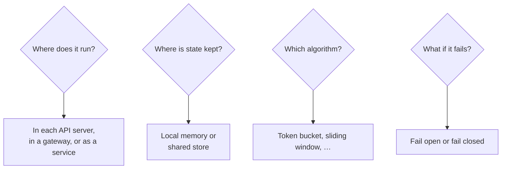

Let's define what our distributed rate limiter must do. It will protect an API served by hundreds of stateless servers across several regions.

## Functional requirements

- **Limit requests** per client key (API key, user ID or IP) according to configurable rules.
- **Support multiple rules** per key, such as 10 requests per second **and** 1,000 per hour.
- **Different rules per endpoint or tier**, for example stricter limits on `/login` and higher limits for paid plans.
- **Inform clients** when they are throttled, with a 429 response and retry information.
- **Configurable behavior** when over the limit: reject, queue briefly or degrade (for example, serve cached data).

## Non-functional requirements

- **Low latency.** The limiter is on the path of every request, so its check must add at most about a millisecond.
- **Accuracy.** Limits should be enforced closely. Small overshoots may be acceptable; large ones defeat the purpose.
- **Scalability.** Handle millions of requests per second and millions of distinct keys.
- **Availability and fault tolerance.** If the limiter's storage fails, the API must keep working — usually by **failing open** (allowing requests) rather than failing closed.
- **Consistency across servers.** A client sending requests to many servers should not get `N` times its limit.

<Callout type="warning">
Failing closed — rejecting all requests when the limiter is unavailable — turns a limiter outage into a full API outage. Most systems fail open for general limits, but may fail closed for security-sensitive limits such as login attempts.
</Callout>

## Key design questions



These questions drive the design in the next lesson.

## Capacity snapshot

Assume 5 million active API keys, each tracked with a counter or token bucket of about 50 bytes including overhead:

```text
5,000,000 keys × 50 bytes ≈ 250 MB of state
With several rules per key (×4) ≈ 1 GB
```

The state fits comfortably in an in-memory store, but the **request rate** — every API request performs at least one read-modify-write — is the real challenge: at 1 million requests per second, the limiter's store must sustain 1 million atomic updates per second, which requires sharding.

<KeyTakeaways>
- Functional needs: per-key limits, multiple rules, endpoint and tier variations, informative 429 responses.
- Non-functional needs: sub-millisecond overhead, accuracy, scalability and availability.
- Decide whether to fail open or closed; most general limits fail open.
- State is small but update rates are high, requiring a fast, sharded store.
</KeyTakeaways>
