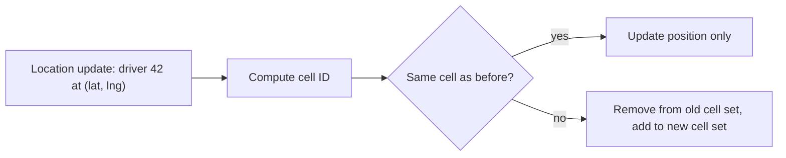
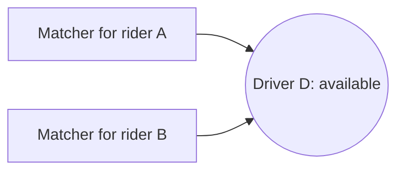
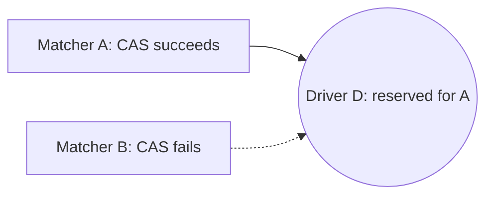
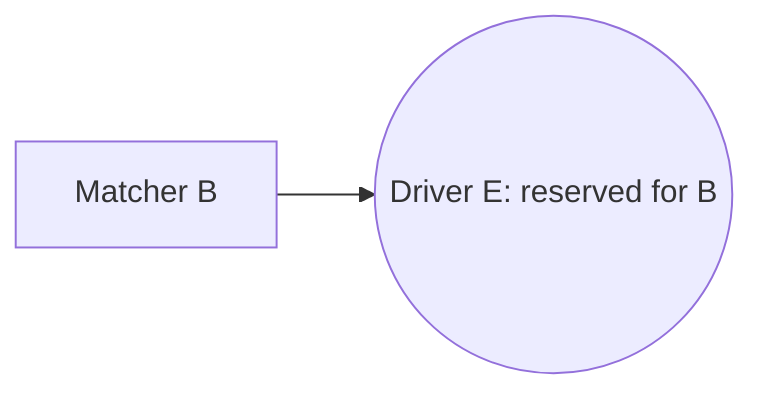

This lesson dives into the three hardest parts: indexing moving drivers, matching without double assignment and delivering real-time updates.

## Indexing moving drivers

The proximity service used a read-only index rebuilt every few minutes. That will not work for drivers who move every few seconds. Instead, the location service keeps a **mutable in-memory index per city**, keyed by spatial cell.

We divide each city into cells, for example hexagonal H3 cells about 200 to 500 meters across. The index is a hash map from cell ID to the set of available drivers in that cell, plus a map from driver ID to their latest position and cell.

Most updates only change the stored position; a driver crosses into a new cell only every minute or so. Both operations are constant time, so a single server can absorb tens of thousands of updates per second. Cities are partitioned across location servers, and very large cities are split further by area. Each partition is replicated to a standby so a crash loses at most a few seconds of positions, which the next round of updates restores anyway.

Location updates are **ephemeral**: we do not need durable storage for the live index. It can be rebuilt within seconds from the stream of incoming updates. For trip history, updates from drivers on a trip are also written, sampled, to durable storage.

**Finding nearby drivers** means computing the rider's cell, then the rings of neighboring cells around it, and collecting available drivers until there are enough candidates. Straight-line distance is only a first filter; matching ranks candidates by **estimated time to pickup** from the routing service, because a driver across a river may be close in distance but far in time.

## Matching without double assignment

Two riders near each other may request at the same instant, and both searches may return the same best driver. We must guarantee only one wins. The standard approach is a **reservation with a lease**:

1. Matching tries to reserve the driver with an atomic compare-and-set on the driver's status: from `available` to `reserved(tripId)`, with an expiry of about 15 seconds.
2. If the operation fails because the driver is already reserved, matching moves on to the next candidate.
3. If it succeeds, the offer is sent. On acceptance, status becomes `on_trip(tripId)` and the trip moves to `driver_assigned` in one transaction or via an idempotent, ordered pair of writes.
4. On decline or timeout, the lease expires or is released, and the driver becomes available again.

<Slides title="Two riders, one driver">
<Slide caption="1. Both matchers pick driver D as the best candidate.">

</Slide>
<Slide caption="2. Both attempt an atomic compare-and-set from available to reserved. Only one succeeds.">

</Slide>
<Slide caption="3. Matcher B moves on to its next candidate. No driver ever holds two trips.">

</Slide>
</Slides>

Because each city's drivers live in one partition, the compare-and-set is a local operation with no distributed locking. Some systems go further and **batch** matching: they collect requests for a second or two and solve a small assignment problem that minimizes total pickup time across all riders, which beats greedy matching during busy periods.

## Real-time updates

Connection gateways maintain persistent connections and register each connection in a **session directory** mapping user ID to gateway server. To push an event, the notification service looks up the gateway and forwards the message. If the user is disconnected, critical events such as `driver_assigned` are also sent as mobile push notifications, and the app fetches the current trip state when it reconnects.

During a trip, the location service forwards the assigned driver's updates to the rider's gateway. The rider app smooths positions between updates by animating along the route, so the car moves continuously even though updates arrive every few seconds.

<KeyTakeaways>
- A mutable in-memory index per city maps cells to available drivers, with constant-time updates.
- The live index is ephemeral and rebuilt from incoming updates; only on-trip locations are stored durably.
- Candidates are found in rings of cells around the rider and ranked by estimated time to pickup.
- An atomic compare-and-set reservation with a lease guarantees a driver is offered only one trip at a time.
- Connection gateways and a session directory push events; critical events fall back to mobile push notifications.
</KeyTakeaways>
