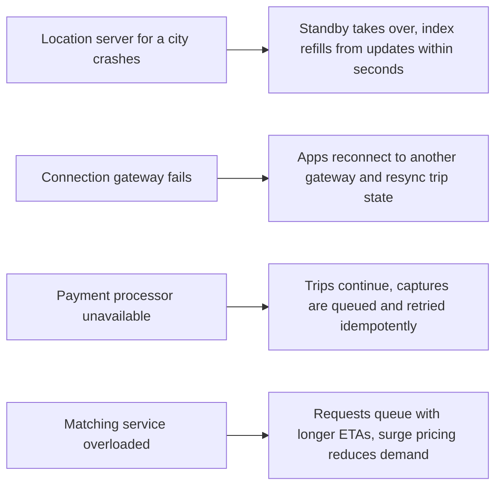

This lesson checks the ride-hailing design against its requirements and examines how it behaves at peak load and under failure.

## Requirements check

| Requirement | How the design meets it |
| --- | --- |
| Fast matching | In-memory cell index per city answers nearby-driver queries in milliseconds; ETAs come from the routing service; offers are pushed instantly. |
| Real-time tracking | Location updates flow through the location service to the rider's connection gateway within a second or two. |
| No double assignment | Atomic compare-and-set reservations with leases inside the city partition. |
| Correct payments | Idempotency keys, a persisted payment state machine, a double-entry ledger and daily reconciliation. |
| Availability | Cities are independent partitions with standbys; stateless services scale out; connection gateways are replicated. |
| Scalability | Location ingestion is partitioned by city and area; nearby-car views for idle riders are served from an approximate cached view. |

## Handling demand spikes

When a concert ends, thousands of riders request trips from one small area within minutes. Several mechanisms work together:

- **Dynamic pricing** raises prices in the affected cells, which both reduces demand and attracts drivers from nearby areas. Surge multipliers are computed every minute or so from requests and available drivers per cell.
- **Batched matching** collects requests for a second or two and assigns drivers to minimize total pickup time, which works better than greedy matching when demand exceeds supply.
- **Queueing requests** in an orderly way, with honest ETAs, is better than rejecting riders outright.
- **Hot partition protection**: a very dense area can be split into a finer partition so one location server does not become the bottleneck.

## Failure scenarios

A crucial principle: **trips in progress must continue**, even if parts of the system fail. The driver and rider apps hold the current trip, route and destination locally, and they report events when connectivity returns. The trip service reconciles late events using timestamps and the state machine's rules.

## Trade-offs

**Freshness versus cost of location updates.** Sending updates every second would make maps smoother but multiply ingestion load and battery drain. Every four seconds with client-side animation is a reasonable compromise, and the interval can be longer for idle drivers far from demand.

**Greedy versus batched matching.** Greedy matching gives the fastest response to each rider; batching adds a second or two of delay but improves total efficiency. Many systems switch between them based on load.

**Regional isolation versus global features.** Partitioning by city keeps failures contained and matching local, but features that span cities, such as airport trips between metro areas or a rider traveling abroad, need care. Rider and payment data is global, while live locations and matching remain regional.

**Consistency scope.** Strong consistency is used only where it matters, driver reservations and payments, while locations, surge prices and nearby-car views are eventually consistent. This keeps the system fast and highly available.

<Callout type="interview">
When defending your design, walk through a failure during an active trip. Interviewers want to see that you have thought about the rider stuck in a car when a service goes down.
</Callout>

## Latency budget for matching

| Step | Budget |
| --- | --- |
| Trip request through gateway to trip service, persist trip | 50 ms |
| Nearby-driver lookup in the city's in-memory index | 5 ms |
| ETA to pickup for top 10 candidates (routing service, batched) | 80 ms |
| Reserve best driver (compare-and-set) and push offer | 50 ms |
| Driver sees offer and decides | 3–15 s (human) |
| Assignment pushed to rider | 100 ms |

Almost all of the time to match is the driver's decision. The system's own work takes a few hundred milliseconds, which is why offers must expire quickly and fall through to the next candidate.

<Ponder question="The payment processor is down for 30 minutes. Should riders still be able to request trips?">
Usually yes, for riders with an established history and a previously verified payment method: trips continue, authorizations and captures are queued and retried idempotently when the processor returns, and the business accepts a small risk of failed payments. For new accounts or high-risk signals, the platform may require a successful authorization first. Blocking all trips would turn a payment outage into a total outage for riders and drivers.
</Ponder>

<KeyTakeaways>
- The design meets latency, correctness and availability requirements with per-city in-memory indexes, leased reservations and idempotent payments.
- Demand spikes are handled with surge pricing, batched matching, orderly queuing and finer partitions for hot areas.
- Trips in progress must survive failures; apps hold trip state locally and resync later.
- Strong consistency is limited to reservations and payments; everything else is eventually consistent.
- The system's own matching work takes hundreds of milliseconds; the driver's decision dominates time to match.
</KeyTakeaways>
