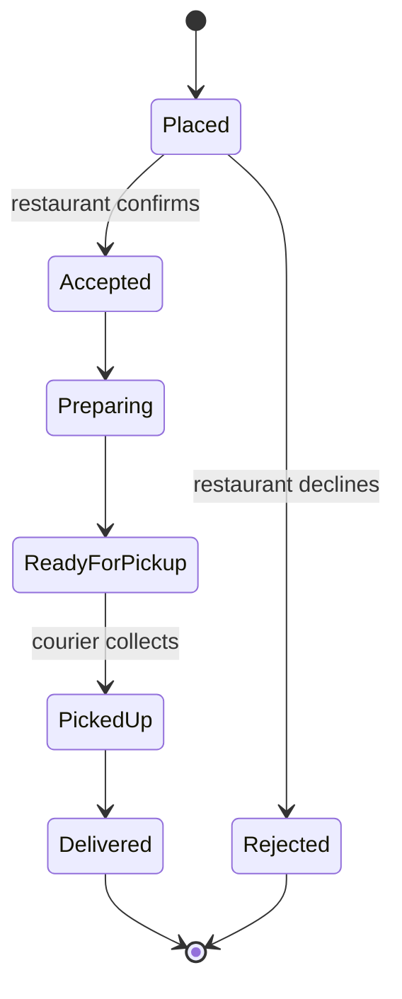

Food delivery looks like ride-hailing with food instead of passengers: a customer orders, a courier picks up and drops off, and everyone tracks progress on a map. The differences, however, reshape several parts of the design. Try this exercise yourself before reading the discussion.

## The prompt

Design a food delivery platform where customers browse nearby restaurants, place an order, pay, and track a courier who picks up the food and delivers it. Restaurants receive and confirm orders on a tablet, and couriers use a mobile app.

Work through SCALED for 25 to 30 minutes, then compare with the notes below.

## What is new compared with ride-hailing

| Aspect | Ride-hailing | Food delivery |
| --- | --- | --- |
| Parties | Rider and driver | Customer, restaurant and courier |
| Timing | Pickup as soon as possible | Pickup when food is ready, which depends on the kitchen |
| Discovery | Not needed, riders know where they are going | Browsing and searching restaurants and menus is central |
| Batching | Rare, except pooled rides | Couriers often carry several orders from the same area |
| Catalog | None | Menus, prices, availability and opening hours |

## Discussion: key design decisions

**Restaurant discovery is a proximity search.** Browsing restaurants that deliver to your address reuses the proximity service. Each restaurant has a delivery zone, often a polygon or a set of cells, and the query returns restaurants whose zone contains the customer's location, ranked by relevance, estimated delivery time and promotions. Menus are read-heavy and change occasionally, so they are cached aggressively and served from a search index for dish-level search.

**The order is a three-party state machine.** An order moves through states such as `placed`, `accepted_by_restaurant`, `preparing`, `ready_for_pickup`, `picked_up` and `delivered`, with each party triggering different transitions. Payment is authorized when the order is placed and captured on delivery, with partial refunds for missing items.

**Dispatch timing matters more than distance.** Sending a courier immediately wastes their time waiting at the restaurant; sending them too late leaves food getting cold. The dispatch service predicts **food preparation time** per restaurant and order size, using historical data and the restaurant's current load, and schedules courier assignment so the courier arrives just as the food is ready.

**Order batching.** A courier can pick up two orders from the same restaurant, or from restaurants close together, heading in similar directions. The assignment problem becomes a routing optimization, solved every few seconds per zone using the same batched-matching idea from ride-hailing, with constraints on maximum delay for each order.

**Estimated delivery time** combines preparation time, courier travel to the restaurant and travel to the customer. It is shown before ordering and updated throughout, and its accuracy strongly affects customer trust.

**Restaurant integration.** Restaurants may use the platform's tablet app or integrate their own point-of-sale systems through an API. The platform must handle restaurants that fail to confirm, with reminders, phone calls and eventually automatic cancellation and refund.

<Callout type="interview">
In a food-delivery variant, spend your deep dive on dispatch timing and batching: predicting preparation time and deciding when and to whom to assign orders. These are the parts that do not exist in ride-hailing.
</Callout>

<KeyTakeaways>
- Food delivery adds a third party, the restaurant, and a catalog of menus that must be searchable and cached.
- Restaurant discovery reuses the proximity service with delivery zones.
- The order is a three-party state machine, with payment authorized at order time and captured on delivery.
- Dispatch is timed using predicted preparation time so couriers arrive when the food is ready.
- Batching several orders per courier turns assignment into a constrained routing optimization.
</KeyTakeaways>
