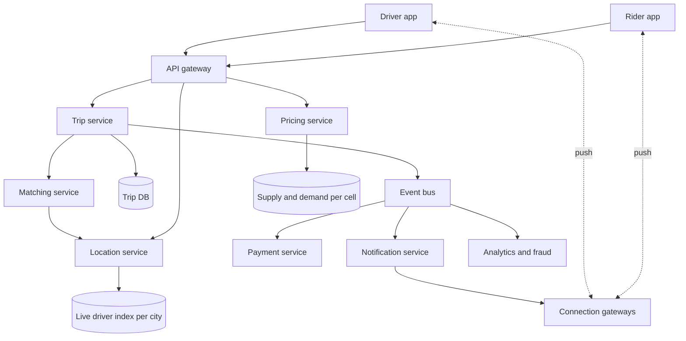
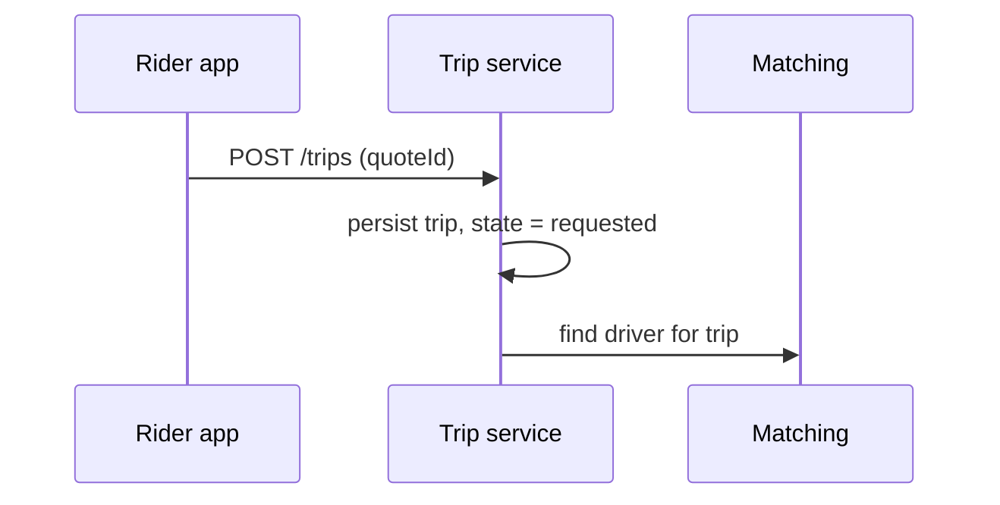
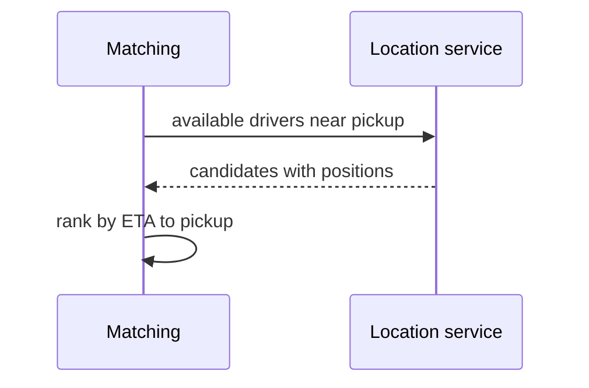
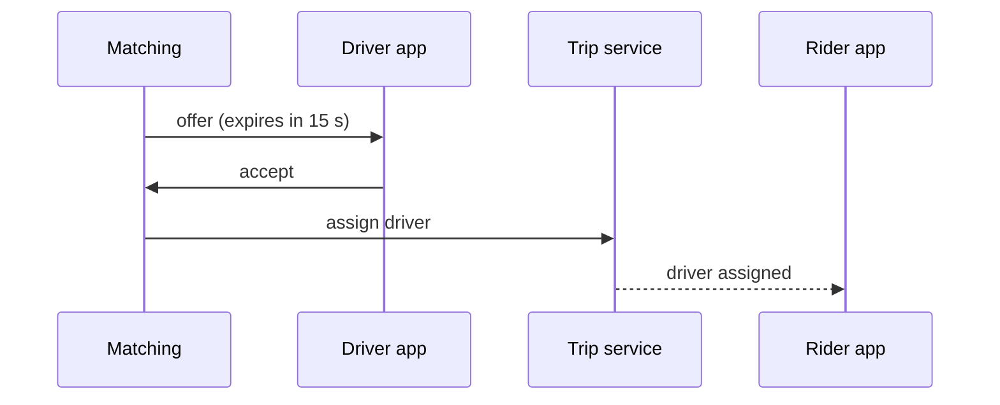

This lesson defines the API and data model and assembles the services that carry a trip from request to payment.

## API

Rider and driver apps talk to the backend over HTTPS for commands and over a persistent connection for pushed events.

```http
POST /v1/trips/estimate        { pickup, dropoff }            -> { priceEstimate, etaToPickup, quoteId }
POST /v1/trips                 { quoteId, paymentMethodId }   -> { tripId, status: requested }
POST /v1/trips/{id}/cancel
POST /v1/drivers/me/status     { online: true | false }
POST /v1/drivers/me/locations  [ { lat, lng, heading, ts }, ... ]
POST /v1/offers/{id}/accept
POST /v1/offers/{id}/decline
POST /v1/trips/{id}/events     { type: arrived | started | completed }
```

Pushed events include `offer.created` (to a driver), `trip.driver_assigned`, `driver.location` (to the rider during the trip) and `trip.completed`.

A **quote ID** from the estimate endpoint locks in the price shown to the rider for a few minutes, so the rider pays what they agreed to even if surge pricing changes.

## Data model

| Entity | Key fields | Store |
| --- | --- | --- |
| Rider, driver | ID, profile, rating, payment methods, vehicle | Relational DB, sharded by user ID |
| Trip | ID, rider, driver, state, pickup, dropoff, quote, timestamps | Relational DB, sharded by trip ID or city |
| Driver location (live) | driver ID, cell, position, status, updated at | In-memory geospatial store per city |
| Location history | trip ID, sampled points | Time-series or wide-column store, then cold storage |
| Payment | trip ID, amount, status, idempotency key | Relational DB with strict transactions |

## Services



- **Location service** ingests driver locations and maintains a live index of available drivers per city.
- **Pricing service** estimates prices using route distance and time, and applies surge multipliers from real-time supply and demand per area.
- **Trip service** owns the trip state machine and persists every transition.
- **Matching service** selects candidate drivers and offers them the trip, guaranteeing a driver holds at most one trip.
- **Connection gateways** hold persistent connections to apps and deliver pushed events.
- **Payment service** authorizes a hold at request time and captures payment after the trip.

## A request, end to end

<Slides title="From request to pickup">
<Slide caption="1. The rider requests a trip with a quote. The trip service creates the trip in the requested state and asks matching for a driver.">



</Slide>
<Slide caption="2. Matching queries the location service for nearby available drivers and ranks them by ETA to pickup.">



</Slide>
<Slide caption="3. Matching reserves the best driver and sends an offer. If the driver accepts, the trip moves to driver assigned and the rider is notified.">



</Slide>
</Slides>

If the driver declines or the offer expires, matching releases the reservation and offers the trip to the next candidate. If no driver accepts within a time limit, the trip is cancelled and the rider is told no cars are available.

During the trip, the driver app keeps sending locations. The location service forwards the assigned driver's updates to the rider's connection so the rider sees the car move.

<KeyTakeaways>
- Commands use HTTPS; offers, assignments and live locations are pushed over persistent connections.
- A quote ID locks the displayed price for a few minutes.
- Separate services own locations, pricing, trips, matching, connections and payments.
- The trip service persists every state transition and publishes events that drive notifications, payments and analytics.
- Matching ranks nearby drivers by ETA, reserves one, offers the trip and falls back to the next candidate on decline or timeout.
</KeyTakeaways>
