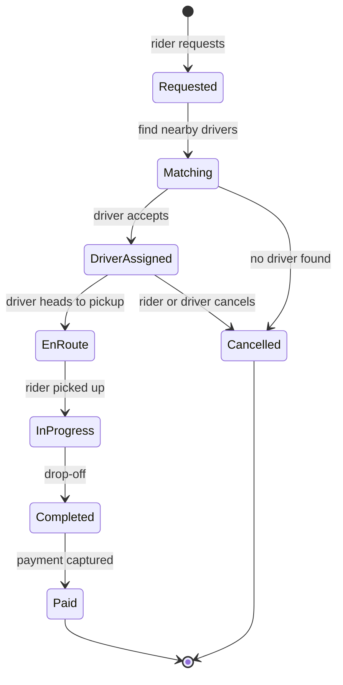

A ride-hailing service connects riders who need a trip with drivers who are nearby and available. Within a few seconds of a request, the system must find suitable drivers, offer the trip, confirm a match and then track both parties in real time until the trip ends and payment completes. The largest services run in hundreds of cities with millions of drivers online at peak.

## What makes it hard

Ride-hailing combines several hard problems from earlier chapters, with a twist: **everything moves**.

- **Moving objects.** Unlike the businesses in the proximity service, drivers change position every few seconds. The spatial index must absorb millions of location updates per second while answering "which available drivers are near this rider?" with fresh data.
- **Matching under contention.** Two riders might want the same nearby driver at the same moment. A driver must never be assigned to two trips, which requires careful coordination even though the rest of the system is eventually consistent.
- **Real-time communication.** Riders watch their driver's car approach on the map; drivers receive trip offers that expire in seconds. Both need low-latency push channels to mobile devices on unreliable networks.
- **Money.** Every trip ends in a payment, which must be correct, idempotent and resistant to fraud.
- **Marketplace dynamics.** Supply and demand vary by neighborhood and minute. Dynamic pricing and driver positioning try to balance them.

## The trip lifecycle

The trip is a **state machine**, and designing it explicitly helps with correctness. Each transition is triggered by an event from the rider app, the driver app or an internal service, and each must be valid from the current state. Persisting transitions durably means the system can recover a trip's state after any failure.

## What this chapter covers

1. **Requirements:** features, scale and estimates for location updates and trip requests.
2. **High-level design:** services for riders, drivers, location, matching, trips and payments.
3. **Detailed design:** the location index for moving drivers, matching without double assignment, and real-time updates.
4. **Payments and fraud detection:** how money moves and how abuse is caught.
5. **Evaluation:** how the design meets its requirements and survives failures.
6. **Exercise:** adapting the design for food delivery, which adds restaurants and preparation time.

<Callout type="interview">
Ride-hailing interviews usually focus on two deep dives: how to find nearby drivers when locations change constantly, and how to guarantee a driver is matched to only one rider. Prepare a crisp answer for both.
</Callout>

<KeyTakeaways>
- Ride-hailing connects riders and nearby available drivers within seconds and tracks both in real time.
- Moving drivers generate millions of location updates, so the spatial index must support frequent writes.
- Matching must never assign one driver to two trips, even under concurrent requests.
- Modeling the trip as an explicit, persisted state machine makes the system correct and recoverable.
- Payments, fraud detection and marketplace balancing are major concerns beyond matching.
</KeyTakeaways>
