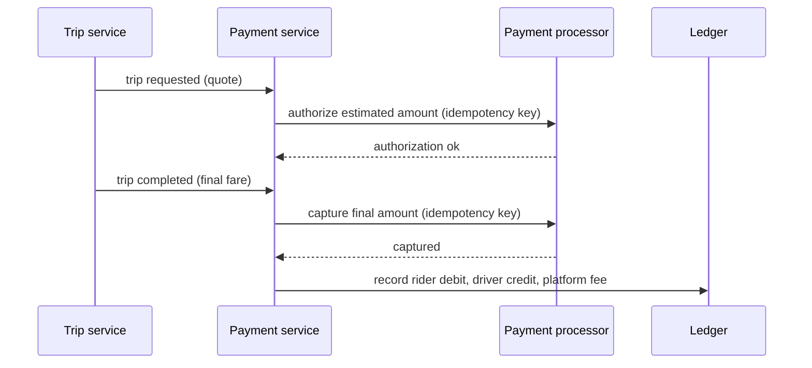

Every completed trip moves money from a rider to a driver, with the platform keeping a fee. Payments must be exactly right, even when networks fail and requests are retried. And because money is involved, fraudsters will attack every part of the flow. This lesson covers both.

## The payment flow

Card payments usually happen in two steps: an **authorization**, which places a hold on the rider's card for an estimated amount, and a **capture**, which charges the final amount after the trip.

Authorizing up front catches invalid cards before a driver is dispatched. Capturing after the trip allows the final fare to reflect the actual route, tolls and tips.

## Correctness under retries

Payment requests can time out even though the processor succeeded. If the payment service simply retried, the rider might be charged twice. The defenses are:

- **Idempotency keys.** Each payment operation carries a unique key derived from the trip and operation, such as `trip-123-capture`. The processor and our payment service remember keys they have processed and return the original result for duplicates.
- **A payment state machine.** Each payment moves through states such as `authorized`, `capture_pending`, `captured` and `refunded`, with every transition persisted before and after external calls. After a crash, a recovery job finds payments stuck in pending states and queries the processor to resolve them.
- **A double-entry ledger.** Every movement of money is recorded as balanced debits and credits across accounts: rider, driver, platform fees, taxes. The ledger is append-only, so mistakes are corrected with new entries, never by editing history. Balanced entries make errors detectable.
- **Reconciliation.** A daily job compares the ledger with the processor's settlement reports and flags mismatches.

## Driver payouts

Drivers accumulate earnings in their ledger account and are paid out on a schedule or on demand. Payouts are batched and use the same idempotency and state-machine patterns, since sending money twice is as bad as charging twice.

## Fraud detection

Common fraud patterns include:

- **Stolen cards** used to pay for rides, leading to chargebacks.
- **Fake trips**, where a driver and colluding rider, or one person with two accounts, create trips to collect incentives.
- **GPS spoofing**, where a driver fakes location to appear in surge areas or inflate distances.
- **Account takeover** through credential stuffing.

Detection runs in two modes:

| Mode | When | Examples |
| --- | --- | --- |
| Real-time scoring | At signup, payment method addition and trip request | Device fingerprint, card BIN country versus location, velocity of new accounts from one device |
| Offline analysis | After trips and in daily batches | Graphs linking accounts by device, card and phone, impossible speeds between pings, route anomalies |

Real-time scoring uses rules plus a model to return **allow**, **challenge** (such as verifying the card or requiring an ID check) or **block**, within tens of milliseconds so it does not slow the request. Offline analysis finds rings of related accounts through shared devices or payment methods, and suspends them or withholds incentives.

<Callout type="warning">
Never let fraud checks block the core flow for the majority of legitimate users. Keep the synchronous model fast, fail open for low-risk cases if the fraud service is down, and move deeper analysis offline.
</Callout>

## A ledger entry, concretely

A $20.00 trip with a 25% platform fee and $1.20 of tax produces one balanced journal entry:

| Account | Debit | Credit |
| --- | --- | --- |
| Rider card receivable | $21.20 | |
| Driver earnings payable | | $15.00 |
| Platform fee revenue | | $5.00 |
| Tax payable | | $1.20 |
| **Total** | **$21.20** | **$21.20** |

Debits always equal credits. If a bug records the driver's credit twice, the entry no longer balances and the write is rejected — which is why double-entry ledgers catch errors that a single `balance` column never would. A later $3.00 refund is a new entry reversing part of the original, never an edit to it.

<Ponder question="The capture call to the payment processor times out. The payment service does not know whether the rider was charged. What should it do?">
Keep the payment in a `capture_pending` state and retry the capture with the **same idempotency key**; if the first attempt succeeded, the processor returns the original result instead of charging again. If retries keep failing, a recovery job queries the processor for the status of that key and resolves the state. What it must never do is issue a new capture with a new key, which could charge the rider twice.
</Ponder>

<KeyTakeaways>
- Payments authorize at request time and capture the final fare after the trip.
- Idempotency keys, a persisted payment state machine and recovery jobs prevent double charges and lost payments.
- A double-entry, append-only ledger records every money movement and is reconciled against processor reports.
- Fraud detection combines fast real-time scoring with offline graph and anomaly analysis.
- Fraud checks must not slow legitimate users; deep analysis runs asynchronously.
- Balanced double-entry journal entries make accounting errors detectable, and corrections are new entries.
</KeyTakeaways>
