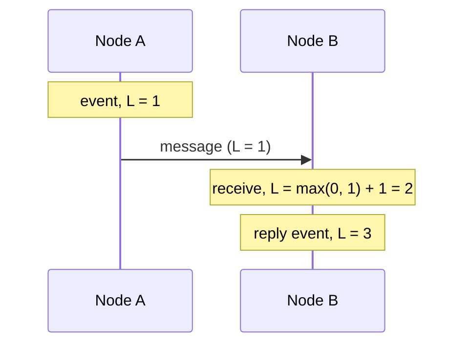

Time-based IDs are *roughly* ordered, but “roughly” hides an important subtlety. Physical clocks on different machines never agree perfectly. If a message is sent from machine A and a reply is generated on machine B whose clock is 50 ms behind, the reply can receive a **smaller** timestamp — and therefore a smaller ID — than the message it replies to. For many features this is harmless; for others, such as ordering events in a distributed database, it is a correctness problem.

This lesson looks at ways to generate identifiers that respect **causality**: if event X could have influenced event Y, then X's ID should be smaller than Y's.

## Why physical clocks are insufficient

Servers synchronize clocks with the Network Time Protocol (NTP), but typical skew between machines is still milliseconds or more, and clocks can jump when corrected. Relying on wall-clock time alone cannot guarantee that causally related events are ordered correctly.

## Lamport clocks

A **Lamport clock** is a logical counter kept by each process:

1. Before each local event, increment the counter.
2. When sending a message, attach the counter.
3. On receiving a message, set the counter to `max(local, received) + 1`.

If X causally precedes Y, then `L(X) < L(Y)`. Combining the counter with a node ID (`counter.nodeId`) produces unique, causally consistent IDs. The limitation: the converse does not hold. `L(X) < L(Y)` does not tell you whether X actually caused Y or they were concurrent.

## Vector clocks

A **vector clock** keeps a counter for every node. Comparing two vectors reveals whether one event happened before another or whether they are concurrent. As we saw in the key-value store chapter, this is powerful for conflict detection, but vectors grow with the number of nodes and do not fit in a compact 64-bit ID.

## Hybrid logical clocks

A **hybrid logical clock (HLC)** combines physical time with a logical counter. Its timestamp stays close to wall-clock time — useful for humans and time-range queries — while the logical component preserves causality when clocks disagree. HLCs fit in 64 bits and are used by several distributed databases to order transactions.

## Bounded-uncertainty clocks

Some systems go further by measuring clock uncertainty explicitly. With GPS receivers and atomic clocks in each data center, a clock API can return an interval `[earliest, latest]` guaranteed to contain the true time. To assign a commit timestamp, the database picks a time and then **waits out the uncertainty** before making the write visible. This guarantees that if transaction T1 commits before T2 starts, T1's timestamp is smaller — enabling globally consistent snapshots. The cost is specialized hardware and a small commit-wait delay, typically a few milliseconds.

## Causality in practice

Consider a group chat. Alice posts “Who wants lunch?” and Bob, whose phone is connected to a different server, replies “Me!”. If message IDs came only from each server's wall clock, and Bob's server clock runs slightly behind, other members could see Bob's reply *above* Alice's question. Two practical fixes are common:

- **Per-conversation sequence numbers.** A single owner for each conversation (for example, the shard that stores it) assigns increasing sequence numbers. Ordering within the conversation is then exact, and global ordering across conversations rarely matters.
- **Causal metadata from clients.** A reply carries the ID of the message it responds to, and the server guarantees the reply's ID is larger — the Lamport rule applied to application data.

The same reasoning applies to comments and their replies, edits to a document, or events in an audit log: identify which events can influence each other and make sure their identifiers respect that order.

## Choosing an approach

| Approach | Captures causality | Size | Close to real time | Notes |
| --- | --- | --- | --- | --- |
| Physical timestamp IDs | Approximately | 64-bit | Yes | Simple; skew can misorder events |
| Lamport clock | Yes (one direction) | Small | No | Cannot detect concurrency |
| Vector clock | Yes (both directions) | Grows with nodes | No | Great for conflict detection |
| Hybrid logical clock | Yes | 64-bit | Yes | Good general-purpose choice |
| Bounded-uncertainty time | Yes, globally | 64-bit | Yes | Needs special hardware, commit wait |

<Callout type="tip">
In most product designs, Snowflake-style IDs plus per-entity ordering (for example, sequence numbers within a chat conversation assigned by that conversation's owner) are sufficient. Reach for logical or hybrid clocks when you need system-wide causal ordering.
</Callout>

<KeyTakeaways>
- Clock skew means physical-time IDs can misorder causally related events.
- Lamport clocks guarantee that causes get smaller timestamps but cannot detect concurrency.
- Vector clocks capture full causality but grow with the number of nodes.
- Hybrid logical clocks combine physical time and logical counters in 64 bits.
- Bounded-uncertainty clocks with commit wait enable globally consistent ordering at a hardware cost.
</KeyTakeaways>
