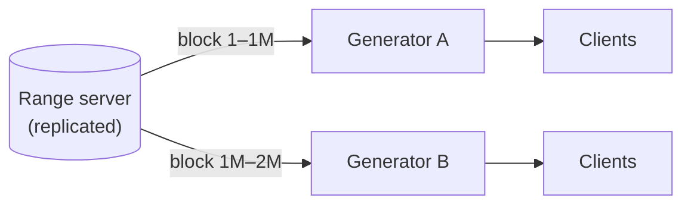
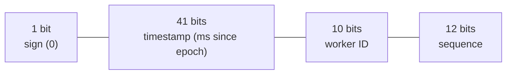
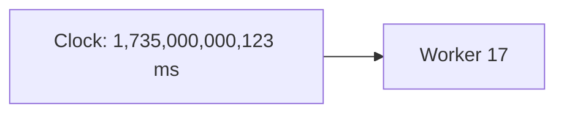
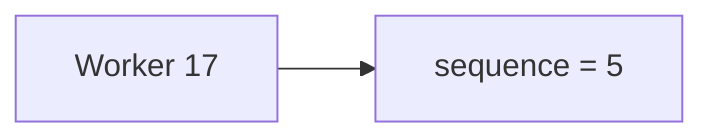
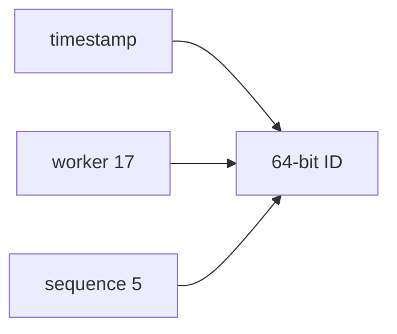

Let's evaluate candidate designs for our ID generator against the requirements: unique, 64-bit, roughly time-ordered, scalable and highly available.

## Option 1: UUIDs

Each server generates a random 128-bit **universally unique identifier** locally. Collisions are astronomically unlikely.

```text
f47ac10b-58cc-4372-a567-0e02b2c3d479      (version 4: random)
0192f1a4-7b3c-7d1e-9f0a-2c3d4e5f6a7b      (version 7: time-ordered prefix)
```

- ✅ No coordination; infinitely scalable and available.
- ❌ 128 bits, not 64. Random UUIDs are **not time-ordered**, hurting index locality and sorting. Newer time-ordered formats — UUID version 7 and similar schemes such as ULID — put a millisecond timestamp in the high bits and fix sorting, but still use 128 bits.

## Option 2: Database auto-increment with offsets

Run `k` database servers; server `i` generates `i, i + k, i + 2k, …`. With two servers, one produces odd numbers and the other even numbers.

- ✅ Numeric and simple.
- ❌ Adding or removing servers changes `k` and is painful. IDs from different servers are not time-ordered relative to each other. Each database is a bottleneck and potential point of failure, and every ID costs a database write.

## Option 3: Range allocation

A central **range server** hands out blocks of IDs — say, 1,000,000 at a time — to generator servers. Each generator mints IDs locally from its block and requests a new block when it runs low.



- ✅ 64-bit, unique, very fast (a local counter increment), and the range server is contacted rarely.
- ✅ Range server can be made highly available with replication and consensus. It only needs to store one number: the next unallocated block.
- ❌ IDs are not time-ordered across generators; a crashed generator wastes the rest of its block (acceptable given 64-bit capacity).

Generators should request the next block when the current one is, say, 80% used, so a slow range server never stalls ID generation.

## Option 4: Time-based composite IDs (Snowflake-style)

Split the 64 bits into fields so each generator produces unique, time-ordered IDs independently:



- **Timestamp (41 bits):** milliseconds since a custom epoch — enough for about 69 years.
- **Worker ID (10 bits):** up to 1,024 generators, each assigned a unique ID (for example, by a coordination service).
- **Sequence (12 bits):** a counter that resets every millisecond, allowing 4,096 IDs per millisecond per worker.

<Slides title="Generating a time-based ID">
<Slide caption="1. The worker reads the current time in milliseconds.">



</Slide>
<Slide caption="2. If this is the same millisecond as the previous ID, it increments the sequence; otherwise it resets the sequence to 0.">



</Slide>
<Slide caption="3. It shifts and combines timestamp, worker ID and sequence into one 64-bit integer.">



</Slide>
</Slides>

### The generator in code

```python
EPOCH_MS = 1_704_067_200_000        # custom epoch: 2024-01-01T00:00:00Z

class SnowflakeGenerator:
    def __init__(self, worker_id: int):
        assert 0 <= worker_id < 1024
        self.worker_id = worker_id
        self.last_ms = -1
        self.sequence = 0

    def next_id(self) -> int:
        now = current_time_ms()
        if now < self.last_ms:                      # clock moved backwards
            now = self.wait_until(self.last_ms)     # or raise an error
        if now == self.last_ms:
            self.sequence = (self.sequence + 1) & 0xFFF   # 12 bits
            if self.sequence == 0:                  # 4,096 IDs used this ms
                now = self.wait_until(self.last_ms + 1)
        else:
            self.sequence = 0
        self.last_ms = now
        return ((now - EPOCH_MS) << 22) | (self.worker_id << 12) | self.sequence
```

Because the timestamp occupies the highest bits, comparing two IDs numerically compares their creation times first — the IDs sort by time.

### Assessing the design

- ✅ 64-bit, unique, roughly time-ordered, generated locally with no network call.
- ✅ Throughput: 4,096 per millisecond per worker — over 4 million per second per worker.
- ❌ Depends on clocks. If a server's clock **moves backwards** (for example, after an NTP correction), it could produce duplicate IDs. Generators must detect this and wait or refuse to generate until the clock catches up. Configuring NTP to slew (gradually adjust) the clock rather than step it avoids most rollbacks.
- ❌ Worker IDs must be assigned uniquely and must not be reused while old IDs might still be generated.

### Assigning worker IDs

Options, from simplest to most robust:

- **Static configuration** — each host gets a fixed ID in its config. Error-prone with autoscaling.
- **Derived from the environment** — for example, from a stateful set's ordinal. Works in orchestrated clusters with stable identities.
- **Leased from a coordination service** — at startup, a worker creates an ephemeral entry such as `/workers/17` in ZooKeeper or etcd. The entry disappears if the worker dies, and the ID is not reused until a safety period has passed.

### Variations on the layout

The bit split is a design choice, not a standard:

| Variation | Layout idea | Why |
| --- | --- | --- |
| More workers | 39-bit timestamp in 10 ms units, 16-bit worker, 8-bit sequence | Large fleets with modest per-worker rates |
| Shard-embedded ID | Timestamp, **logical shard ID**, sequence generated inside the database | The shard can be read from the ID, so no lookup is needed to route queries |
| Data-center bits | 5 bits data center + 5 bits worker | Uniqueness managed per data center |

The shard-embedded approach, used by some large photo-sharing services, generates IDs in a database function on each logical shard. Any service can then extract the shard from an ID and go straight to the right database.

## Comparison

| Design | 64-bit | Time-ordered | Coordination on hot path | Main risk |
| --- | --- | --- | --- | --- |
| UUID v4 | ✗ | ✗ | None | Size, index locality |
| UUID v7 / ULID | ✗ | ✓ | None | Size |
| DB offsets | ✓ | ✗ | Database write | Bottleneck, resharding |
| Range server | ✓ | ✗ | Rare | Range server availability |
| Time-based | ✓ | ✓ | None | Clock skew, worker ID assignment |

<Callout type="interview">
For most interview problems, a Snowflake-style time-based ID is a strong default. Mention its layout, its throughput, and how you handle clock rollback — that covers the typical follow-up questions.
</Callout>

<Ponder question="Time-based IDs expose creation time — anyone can decode when a post was made. When is that a problem, and what could you do?">
It is a problem when creation time or volume is sensitive — for example, revealing when an account was created, or letting competitors estimate order volumes from successive IDs. For internal use, keep time-based IDs. For public exposure, map them through a reversible keyed permutation (a small block cipher over 64 bits) to produce opaque public IDs, or use random public identifiers stored alongside the internal ID.
</Ponder>

<KeyTakeaways>
- UUIDs need no coordination but are 128-bit; version 4 is random, while version 7 and ULIDs are time-ordered.
- Database offsets are simple but scale poorly and are not time-ordered.
- Range allocation is fast and scalable but not time-ordered across generators.
- Time-based composite IDs combine timestamp, worker ID and sequence into sortable 64-bit IDs generated locally.
- Time-based schemes must guard against clock rollback and assign worker IDs uniquely, ideally via leases.
- Bit layouts are flexible; embedding a shard ID lets services route queries straight from the ID.
</KeyTakeaways>
