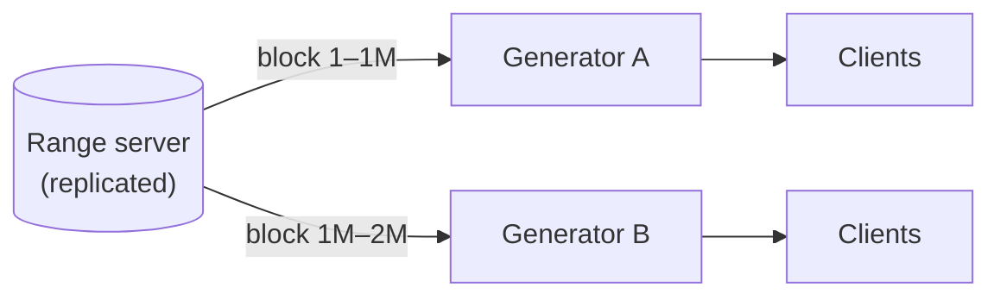
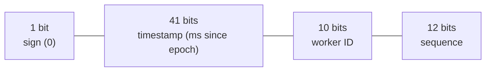
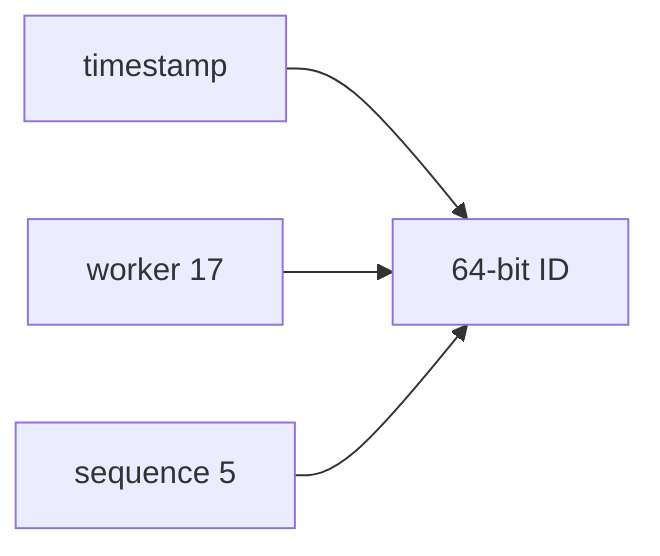

Let's evaluate candidate designs for our ID generator against the requirements: unique, 64-bit, roughly time-ordered, scalable and highly available.

## Option 1: UUIDs

Each server generates a random 128-bit **universally unique identifier** locally. Collisions are astronomically unlikely.

- ✅ No coordination; infinitely scalable and available.
- ❌ 128 bits, not 64. Random UUIDs are **not time-ordered**, hurting index locality and sorting. (Newer time-ordered UUID versions address sorting but still use 128 bits.)

## Option 2: Database auto-increment with offsets

Run `k` database servers; server `i` generates `i, i + k, i + 2k, …`. With two servers, one produces odd numbers and the other even numbers.

- ✅ Numeric and simple.
- ❌ Adding or removing servers changes `k` and is painful. IDs from different servers are not time-ordered relative to each other. Each database is a bottleneck and potential point of failure.

## Option 3: Range allocation

A central **range server** hands out blocks of IDs — say, 1,000,000 at a time — to generator servers. Each generator mints IDs locally from its block and requests a new block when it runs low.

- ✅ 64-bit, unique, very fast (a local counter increment), and the range server is contacted rarely.
- ✅ Range server can be made highly available with replication and consensus.
- ❌ IDs are not time-ordered across generators; a crashed generator wastes the rest of its block (acceptable given 64-bit capacity).

## Option 4: Time-based composite IDs (Snowflake-style)

Split the 64 bits into fields so each generator produces unique, time-ordered IDs independently:

- **Timestamp (41 bits):** milliseconds since a custom epoch — enough for about 69 years.
- **Worker ID (10 bits):** up to 1,024 generators, each assigned a unique ID (for example, by a coordination service).
- **Sequence (12 bits):** a counter that resets every millisecond, allowing 4,096 IDs per millisecond per worker.

<Slides title="Generating a time-based ID">
<Slide caption="1. The worker reads the current time in milliseconds.">

</Slide>
<Slide caption="2. If this is the same millisecond as the previous ID, it increments the sequence; otherwise it resets the sequence to 0.">

</Slide>
<Slide caption="3. It shifts and combines timestamp, worker ID and sequence into one 64-bit integer.">

</Slide>
</Slides>

- ✅ 64-bit, unique, roughly time-ordered, generated locally with no network call.
- ✅ Throughput: 4,096 per millisecond per worker — over 4 million per second per worker.
- ❌ Depends on clocks. If a server's clock **moves backwards** (for example, after an NTP correction), it could produce duplicate IDs. Generators must detect this and wait or refuse to generate until the clock catches up.
- ❌ Worker IDs must be assigned uniquely and must not be reused while old IDs might still be generated.

## Comparison

| Design | 64-bit | Time-ordered | Coordination on hot path | Main risk |
| --- | --- | --- | --- | --- |
| UUID | ✗ | ✗ (v4) | None | Size, index locality |
| DB offsets | ✓ | ✗ | Database write | Bottleneck, resharding |
| Range server | ✓ | ✗ | Rare | Range server availability |
| Time-based | ✓ | ✓ | None | Clock skew, worker ID assignment |

<Callout type="interview">
For most interview problems, a Snowflake-style time-based ID is a strong default. Mention its layout, its throughput, and how you handle clock rollback — that covers the typical follow-up questions.
</Callout>

<KeyTakeaways>
- UUIDs need no coordination but are 128-bit and usually not time-ordered.
- Database offsets are simple but scale poorly and are not time-ordered.
- Range allocation is fast and scalable but not time-ordered across generators.
- Time-based composite IDs combine timestamp, worker ID and sequence into sortable 64-bit IDs.
- Time-based schemes must guard against clock rollback and unique worker ID assignment.
</KeyTakeaways>
