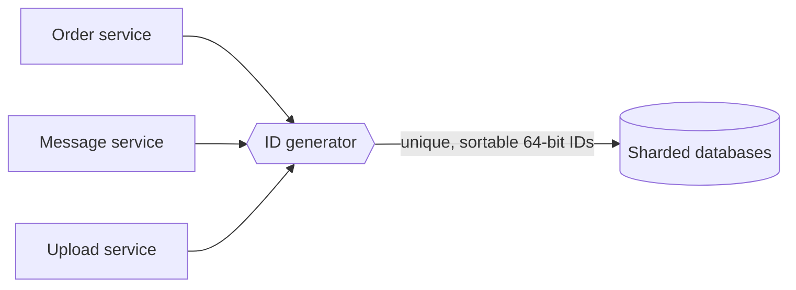

Every entity in a large system needs an identifier: users, orders, messages, uploaded photos, log events. In a single database, an auto-incrementing primary key does the job. At scale, with data spread across many database shards and services creating millions of records per second, generating identifiers becomes a design problem of its own. The component that solves it is often called a **sequencer**.

## Why IDs are harder at scale

- **Uniqueness across machines.** Two shards each auto-incrementing from 1 will produce duplicate IDs.
- **Throughput.** A service might need to mint over a million IDs per second across the fleet.
- **Availability.** If ID generation stops, nothing new can be created — the sequencer must never be a single point of failure.
- **Ordering.** Many features rely on sorting by ID: showing the newest messages first, paginating a feed, merging event streams. IDs that roughly follow creation time are enormously useful.
- **Opacity.** Sequential IDs leak business information: a competitor who creates an order on Monday and another on Friday can compute how many orders you took that week. Public-facing IDs should not reveal volumes.

## Where unique IDs show up

| Entity | Why its ID matters |
| --- | --- |
| Tweets, posts, messages | Sorting by ID gives reverse-chronological order for free |
| Orders and payments | Must be unique forever; often used as idempotency keys |
| Uploaded files | Name objects in blob storage without collisions |
| Log and trace events | Correlate events across services |
| Database rows across shards | Primary keys must not collide when shards merge or split |

## Requirements

### Functional

- Generate an identifier that is **unique** across the entire system, forever.
- IDs should be **numeric** and fit in **64 bits**, so they index efficiently in databases and are compact to store and transmit.
- IDs should be **roughly time-ordered**: an ID generated later should usually be larger.

### Non-functional

- **Scalability** — generate at least one billion IDs per day (over 11,000 per second on average) with room for peaks far higher.
- **Availability** — keep generating IDs even when some servers fail.
- **Low latency** — generating an ID should not require a network round trip on the hot path, if possible.



## API

The interface is tiny, which is part of what makes it easy to scale:

```text
nextId()            -> int64
nextIds(count)      -> [int64]       // batch, to amortize any network cost
parseId(id)         -> { timestamp, workerId, sequence }   // for debugging
```

The generator can be a **library** embedded in each service (no network hop at all) or a small **service** that others call. Libraries are faster; a service centralizes configuration such as worker IDs. Many designs combine both: a library that generates IDs locally, configured once at startup by a coordination service.

## Why 64 bits?

A 64-bit integer can represent about 1.8 × 10^19 values. At a billion IDs per day, that would take about 50 billion years to exhaust — capacity is not a concern. The challenge is dividing that space so that independent generators never collide while keeping IDs sortable by time.

64 bits also matter in practice: they fit in a single machine register and database `BIGINT` column, compare in one instruction, and are half the size of a 128-bit UUID. Across billions of rows and every index and foreign key that references them, those savings add up to terabytes.

<Callout type="note">
Sortable IDs are not only convenient; they also make B-tree indexes efficient. Random IDs insert into random index pages, while time-ordered IDs append near the end of the index, improving write performance and cache locality.
</Callout>

## Estimating the load

```text
1 billion IDs/day ÷ 86,400 s     ≈ 11,600 IDs/s average
Peak factor 10×                  ≈ 116,000 IDs/s
One generator at 4,096 IDs/ms    ≈ 4 million IDs/s (time-based design)
```

A single time-based generator could in principle handle the whole load, but we need several for availability and to avoid a network hop from every service. The design question is therefore not raw throughput but **how independent generators avoid colliding** without talking to each other on every request.

<Ponder question="Why not simply let each service use a random 64-bit number as an ID?">
Random 64-bit IDs are unique only probabilistically. By the birthday bound, collisions become likely after roughly 2³² ≈ 4 billion IDs — a number a large system reaches in days. They are also not time-ordered, which hurts index locality and forces a separate timestamp for sorting. 128-bit random IDs avoid collisions but double the size and still do not sort.
</Ponder>

## Roadmap

The next lesson evaluates several designs — UUIDs, database auto-increment with offsets, a central range allocator and a time-based scheme — against these requirements. The lesson after that looks at a subtler goal: IDs that capture **causality** across machines whose clocks disagree.

<KeyTakeaways>
- A sequencer generates unique identifiers for entities across a distributed system.
- Auto-increment keys break when data is spread across shards, and sequential public IDs leak business volumes.
- Requirements: globally unique, 64-bit numeric, roughly time-ordered, highly available and scalable.
- The API is tiny; generators can be embedded libraries or a service.
- Time-ordered 64-bit IDs simplify sorting and pagination and improve index performance and storage size.
- The core challenge is avoiding collisions between independent generators without coordination on every request.
</KeyTakeaways>
