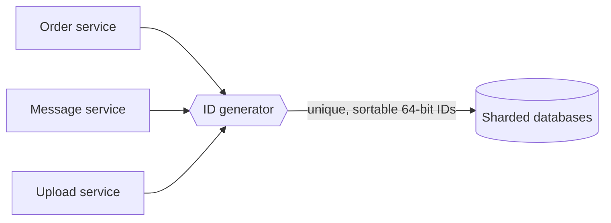

Every entity in a large system needs an identifier: users, orders, messages, uploaded photos, log events. In a single database, an auto-incrementing primary key does the job. At scale, with data spread across many database shards and services creating millions of records per second, generating identifiers becomes a design problem of its own. The component that solves it is often called a **sequencer**.

## Why IDs are harder at scale

- **Uniqueness across machines.** Two shards each auto-incrementing from 1 will produce duplicate IDs.
- **Throughput.** A service might need to mint over a million IDs per second across the fleet.
- **Availability.** If ID generation stops, nothing new can be created — the sequencer must never be a single point of failure.
- **Ordering.** Many features rely on sorting by ID: showing the newest messages first, paginating a feed, merging event streams. IDs that roughly follow creation time are enormously useful.

## Requirements

### Functional

- Generate an identifier that is **unique** across the entire system, forever.
- IDs should be **numeric** and fit in **64 bits**, so they index efficiently in databases and are compact to store and transmit.
- IDs should be **roughly time-ordered**: an ID generated later should usually be larger.

### Non-functional

- **Scalability** — generate at least one billion IDs per day (over 11,000 per second on average) with room for peaks far higher.
- **Availability** — keep generating IDs even when some servers fail.
- **Low latency** — generating an ID should not require a network round trip on the hot path, if possible.

## Why 64 bits?

A 64-bit integer can represent about 1.8 × 10^19 values. At a billion IDs per day, that would take about 50 billion years to exhaust — capacity is not a concern. The challenge is dividing that space so that independent generators never collide while keeping IDs sortable by time.

<Callout type="note">
Sortable IDs are not only convenient; they also make B-tree indexes efficient. Random IDs insert into random index pages, while time-ordered IDs append near the end of the index, improving write performance and cache locality.
</Callout>

## Roadmap

The next lesson evaluates several designs — UUIDs, database auto-increment with offsets, a central range allocator and a time-based scheme — against these requirements. The lesson after that looks at a subtler goal: IDs that capture **causality** across machines whose clocks disagree.

<KeyTakeaways>
- A sequencer generates unique identifiers for entities across a distributed system.
- Auto-increment keys break when data is spread across shards.
- Requirements: globally unique, 64-bit numeric, roughly time-ordered, highly available and scalable.
- Time-ordered IDs simplify sorting and pagination and improve index performance.
</KeyTakeaways>
