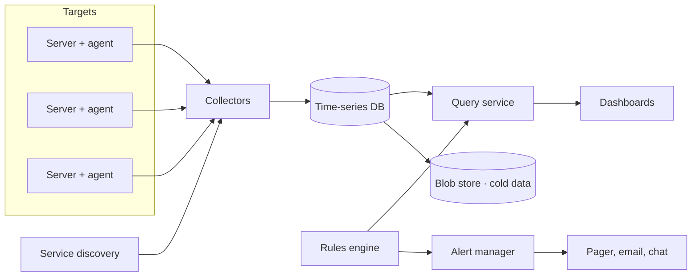
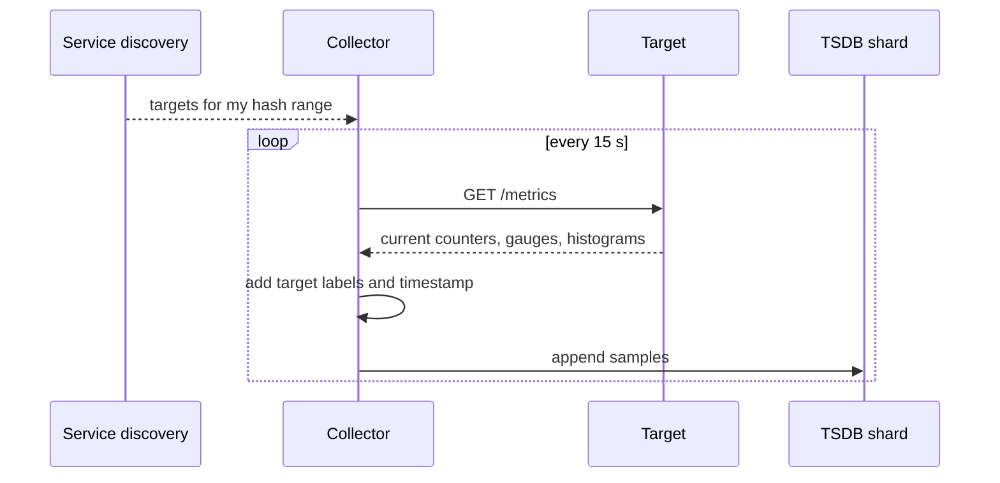
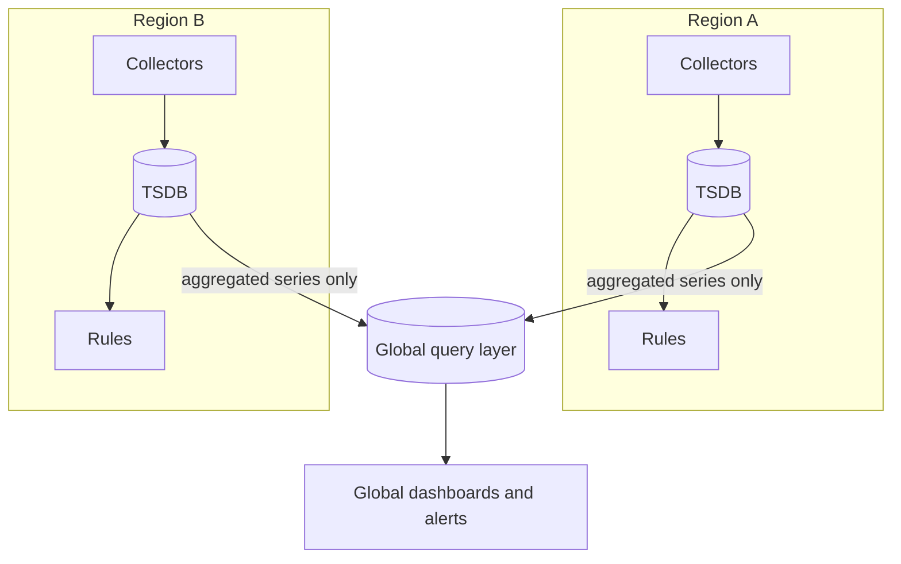

Let's design a system that monitors server-side health across a large fleet. We start with the high-level components and the flow of data from servers to dashboards and alerts.

## High-level components



- **Agents** run on each server, gathering OS metrics and exposing application metrics. They are lightweight so they do not disturb the workload.
- **Service discovery** tells collectors which targets exist, since servers come and go constantly.
- **Collectors** pull (scrape) metrics from targets or receive pushed metrics, then write them to storage.
- **Time-series database** stores points compactly and serves range queries.
- **Query service** evaluates expressions such as "p99 latency of checkout in eu-west over the last hour."
- **Rules engine** periodically evaluates alert conditions.
- **Alert manager** deduplicates, groups and routes alerts to the right on-call team, and supports silencing during maintenance.
- **Dashboards** visualize the data.
- **Cold storage** in a blob store holds downsampled historical data cheaply.

## Interfaces

Each target exposes its current metric values in a simple text format:

```text
GET /metrics
# TYPE http_requests_total counter
http_requests_total{endpoint="/checkout",status="200"} 1827361
http_requests_total{endpoint="/checkout",status="500"} 213
# TYPE http_request_duration_seconds histogram
http_request_duration_seconds_bucket{endpoint="/checkout",le="0.1"} 1790012
http_request_duration_seconds_bucket{endpoint="/checkout",le="0.5"} 1826104
http_request_duration_seconds_bucket{endpoint="/checkout",le="+Inf"} 1827574
```

The query service offers range queries to dashboards and the rules engine:

```text
GET /api/v1/query_range?query=<expression>&start=<t0>&end=<t1>&step=30s
  -> [{ labels: {...}, points: [[t, v], ...] }, ...]
```

## Data flow

1. Service discovery lists all targets and their labels.
2. Collectors scrape each target every 10–15 seconds.
3. Samples are written to the time-series database, sharded by metric and labels.
4. The rules engine queries recent data on a schedule, say every 30 seconds.
5. When a condition holds for a configured duration, the alert manager notifies the on-call engineer.



## Designing for scale

A single collector and database cannot handle millions of points per second. We scale horizontally:

- **Shard collectors** by target: each collector is responsible for a subset of servers, assigned by consistent hashing so assignments stay stable as collectors are added.
- **Shard the time-series database** by series (metric name plus labels). Writes spread across shards; queries fan out and merge results.
- **Replicate** each shard so a node failure does not lose data or blind the dashboards.
- **Pre-aggregate** at collectors where possible, summing per-host counters into per-service totals to reduce stored series.

With 5 million samples per second, if one collector can handle about 500,000 samples per second, we need about 10 collectors, or 20 with headroom and redundancy. If one TSDB node ingests 1 million samples per second and holds 5 million active series in memory, we need at least 10 shards, each replicated twice.

## Monitoring across regions

Large companies run the monitoring stack **per region**, close to the targets, so that scraping never crosses regions and each region keeps working if another fails. A **global layer** then provides a fleet-wide view:



Regions forward only aggregated series (per-service totals rather than per-host data) to the global layer, keeping cross-region traffic small. Alerts that concern one region are evaluated in that region, so they keep working during network problems between regions.

## Handling failures

- If a collector fails, service discovery reassigns its targets to other collectors.
- If a target fails, scrapes return errors; an `up` metric drops to 0, which itself triggers an alert.
- Collectors buffer data locally if the database is briefly unavailable.
- Collectors can run in **redundant pairs** that scrape the same targets; the TSDB or query layer deduplicates the samples. This doubles collection cost but removes gaps when a collector dies.

<Callout type="note">
Monitoring should favor **availability over consistency**. Missing a few samples or showing slightly delayed data is acceptable; losing the ability to alert is not.
</Callout>

<Ponder question="A developer adds a metric label containing the full request URL, including query strings. A few hours later the TSDB runs out of memory. What happened, and how do you protect the system?">
Each unique URL created a new time series — a **cardinality explosion** — and every active series costs memory in the TSDB's index and head block. Protect the system with per-target and per-metric series limits at the collector (dropping or rejecting samples above the limit), alerts on series growth, review of new metrics, and guidance to use route templates such as `/users/:id` rather than raw URLs.
</Ponder>

<KeyTakeaways>
- Agents, service discovery, collectors, a time-series database, a query service, rules and an alert manager form the core design.
- Targets expose metrics in a simple text format; collectors scrape them and write samples to the TSDB.
- The rules engine evaluates alert conditions; the alert manager deduplicates and routes notifications.
- Scale by sharding collectors and the TSDB, replicating shards and pre-aggregating; size shards from the ingest rate and active series.
- Run monitoring per region with a global layer of aggregated series.
- Favor availability: it is better to lose a few samples than to lose alerting, and guard against cardinality explosions.
</KeyTakeaways>
