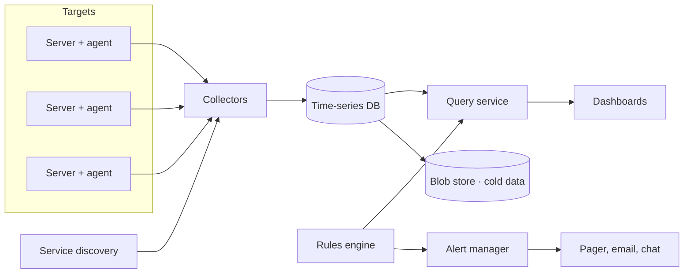

Let's design a system that monitors server-side health across a large fleet. We start with the high-level components and the flow of data from servers to dashboards and alerts.

## High-level components

- **Agents** run on each server, gathering OS metrics and exposing application metrics. They are lightweight so they do not disturb the workload.
- **Service discovery** tells collectors which targets exist, since servers come and go constantly.
- **Collectors** pull (scrape) metrics from targets or receive pushed metrics, then write them to storage.
- **Time-series database** stores points compactly and serves range queries.
- **Query service** evaluates expressions such as “p99 latency of checkout in eu-west over the last hour.”
- **Rules engine** periodically evaluates alert conditions.
- **Alert manager** deduplicates, groups and routes alerts to the right on-call team, and supports silencing during maintenance.
- **Dashboards** visualize the data.
- **Cold storage** in a blob store holds downsampled historical data cheaply.

## Data flow

1. Service discovery lists all targets and their labels.
2. Collectors scrape each target every 10–15 seconds.
3. Samples are written to the time-series database, sharded by metric and labels.
4. The rules engine queries recent data on a schedule, say every 30 seconds.
5. When a condition holds for a configured duration, the alert manager notifies the on-call engineer.

## Designing for scale

A single collector and database cannot handle millions of points per second. We scale horizontally:

- **Shard collectors** by target: each collector is responsible for a subset of servers, assigned by consistent hashing so assignments stay stable as collectors are added.
- **Shard the time-series database** by series (metric name plus labels). Writes spread across shards; queries fan out and merge results.
- **Replicate** each shard so a node failure does not lose data or blind the dashboards.
- **Pre-aggregate** at collectors where possible, summing per-host counters into per-service totals to reduce stored series.

## Handling failures

- If a collector fails, service discovery reassigns its targets to other collectors.
- If a target fails, scrapes return errors; an `up` metric drops to 0, which itself triggers an alert.
- Collectors buffer data locally if the database is briefly unavailable.

<Callout type="note">
Monitoring should favor **availability over consistency**. Missing a few samples or showing slightly delayed data is acceptable; losing the ability to alert is not.
</Callout>

<KeyTakeaways>
- Agents, service discovery, collectors, a time-series database, a query service, rules and an alert manager form the core design.
- Collectors scrape targets found via service discovery and write samples to the TSDB.
- The rules engine evaluates alert conditions; the alert manager deduplicates and routes notifications.
- Scale by sharding collectors and the TSDB, replicating shards and pre-aggregating.
- Favor availability: it is better to lose a few samples than to lose alerting.
</KeyTakeaways>
