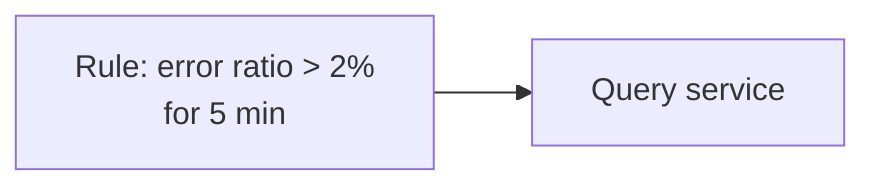
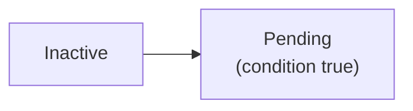
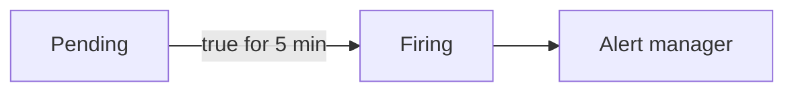
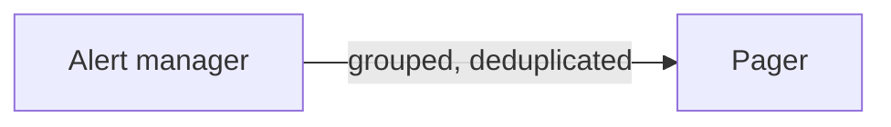

With the high-level architecture in place, let's look more closely at how metrics are stored and how alerts are evaluated reliably.

## Storing time series efficiently

A time-series database organizes data around **series** (a metric name plus a unique label set) and **time blocks**:

- Incoming samples are appended to an in-memory **head block** and a write-ahead log for durability.
- Every couple of hours, the head block is compressed and written to disk as an immutable block.
- Older blocks are merged (compacted) and eventually downsampled and moved to cheap blob storage.

Compression is remarkably effective. Timestamps arrive at regular intervals, so storing the *difference of differences* often needs only a bit or two. Values change slowly, so XOR-ing each value with the previous one leaves mostly zero bits. Together these reduce samples from 16 bytes to around 1–2 bytes.

An **inverted index** maps each label value to the series that contain it, so a query such as `service="checkout" AND status="500"` quickly finds the matching series.

## Querying

Queries select series by labels, restrict them to a time range and apply functions:

```text
rate(http_requests_total{service="checkout", status=~"5.."}[5m])
  / rate(http_requests_total{service="checkout"}[5m])
```

This computes the checkout error ratio over the last five minutes. The query service fans out to the relevant shards, fetches the blocks covering the range, computes per-shard partial results and merges them. Frequently used expensive queries can be precomputed as **recording rules**, which store their results as new series.

## Alert evaluation

<Slides title="From metric to page">
<Slide caption="1. The rules engine evaluates each rule every 30 seconds, e.g. error ratio above 2%.">



</Slide>
<Slide caption="2. The first time the condition is true, the alert enters a pending state.">



</Slide>
<Slide caption="3. If it stays true for the configured duration, it fires and is sent to the alert manager.">



</Slide>
<Slide caption="4. The alert manager groups related alerts and pages the on-call engineer once.">



</Slide>
</Slides>

The “for” duration prevents flapping alerts from brief spikes. Grouping ensures that when a database fails and fifty services start erroring, the on-call engineer receives one grouped notification rather than fifty.

## Making alerting highly available

Alerting is the most critical function; it must work during outages:

- Run **multiple replicas** of the rules engine. Each evaluates the same rules independently, and the alert manager **deduplicates** their output.
- Run the alert manager as a small cluster whose members share notification state via gossip, so a page is sent once even if one instance fails.
- Use a **dead man's switch**: an alert that always fires. If the external paging service stops receiving it, the monitoring pipeline itself is broken and someone is notified.
- Deploy monitoring in **separate failure domains** from the systems it watches — ideally with a cross-region watcher.

<Callout type="tip">
Alert on **SLO burn rate** — how quickly the error budget is being consumed — rather than raw thresholds. A fast burn pages immediately; a slow burn creates a ticket. This catches real user impact while reducing noise.
</Callout>

<KeyTakeaways>
- TSDBs append samples to an in-memory head block with a WAL, then persist compressed immutable blocks.
- Delta-of-delta and XOR encoding compress samples to about 1–2 bytes.
- An inverted index on labels enables fast series selection; recording rules precompute expensive queries.
- Alerts move from pending to firing after a sustained condition and are grouped and deduplicated.
- Replicated rule evaluation, clustered alert managers and a dead man's switch keep alerting available.
</KeyTakeaways>
