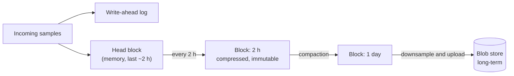
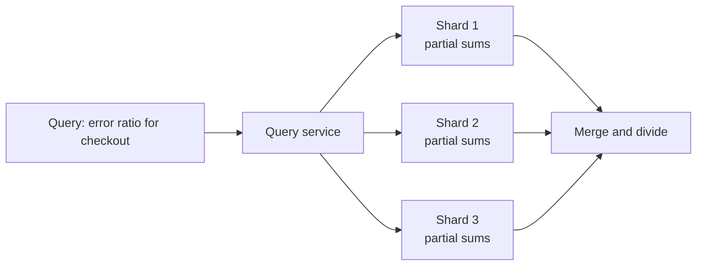
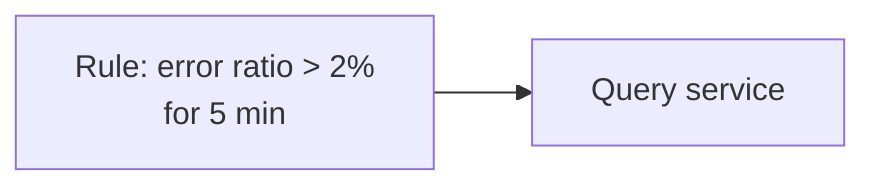
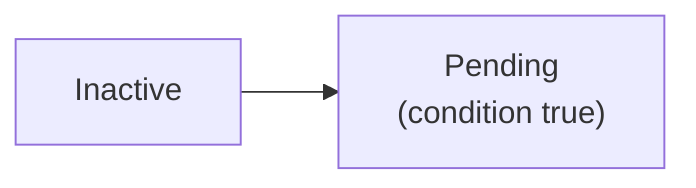
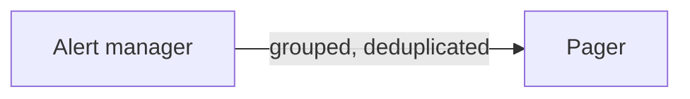

With the high-level architecture in place, let's look more closely at how metrics are stored and how alerts are evaluated reliably.

## Storing time series efficiently

A time-series database organizes data around **series** (a metric name plus a unique label set) and **time blocks**:

- Incoming samples are appended to an in-memory **head block** and a write-ahead log for durability.
- Every couple of hours, the head block is compressed and written to disk as an immutable block.
- Older blocks are merged (compacted) and eventually downsampled and moved to cheap blob storage.



### Compression, worked through

Compression is remarkably effective. Consider a series scraped every 10 seconds:

| Timestamp | Delta | Delta of delta |
| --- | --- | --- |
| 12:00:00 | — | — |
| 12:00:10 | 10 | — |
| 12:00:20 | 10 | 0 |
| 12:00:30 | 10 | 0 |
| 12:00:41 | 11 | 1 |

Because scrapes are regular, the *difference of differences* is almost always 0, which can be encoded in a single bit; small jitters take a few bits. Values change slowly too: a gauge reading 72.5, 72.5, 72.6 shares its sign, exponent and most of its mantissa bits with the previous value, so XOR-ing each value with the previous one leaves mostly zero bits, which are stored as short run lengths. Together these reduce samples from 16 bytes to around **1–2 bytes**, which is why a single node can keep hours of data for millions of series in memory.

### Finding series quickly

An **inverted index** maps each label value to the series that contain it, so a query such as `service="checkout" AND status="500"` quickly finds the matching series.

```text
service="checkout"  -> [s1, s4, s9, s12, ...]
status="500"        -> [s4, s7, s12, ...]
intersection        -> [s4, s12]
```

This is the same structure search engines use for words and documents, applied to labels and series.

## Querying

Queries select series by labels, restrict them to a time range and apply functions:

```text
sum(rate(http_requests_total{service="checkout", status=~"5.."}[5m]))
  / sum(rate(http_requests_total{service="checkout"}[5m]))
```

This computes the checkout error ratio over the last five minutes. The query service fans out to the relevant shards, fetches the blocks covering the range, computes per-shard partial results and merges them. Frequently used expensive queries can be precomputed as **recording rules**, which store their results as new series.



Sums and counts merge exactly, which is why systems push aggregation down to shards. Percentiles are computed from merged histogram buckets rather than merged percentiles.

## Alert evaluation

<Slides title="From metric to page">
<Slide caption="1. The rules engine evaluates each rule every 30 seconds, e.g. error ratio above 2%.">



</Slide>
<Slide caption="2. The first time the condition is true, the alert enters a pending state.">



</Slide>
<Slide caption="3. If it stays true for the configured duration, it fires and is sent to the alert manager.">


</Slide>
<Slide caption="4. The alert manager groups related alerts and pages the on-call engineer once.">



</Slide>
</Slides>

The "for" duration prevents flapping alerts from brief spikes. Grouping ensures that when a database fails and fifty services start erroring, the on-call engineer receives one grouped notification rather than fifty. **Inhibition** rules go further: if the "database down" alert is firing, suppress the dependent "high error rate" alerts from services that use it.

An alert rule, written as configuration:

```yaml
- alert: CheckoutErrorBudgetFastBurn
  expr: |
    (sum(rate(http_requests_total{service="checkout",status=~"5.."}[1h]))
      / sum(rate(http_requests_total{service="checkout"}[1h]))) > 14.4 * 0.001
    and
    (sum(rate(http_requests_total{service="checkout",status=~"5.."}[5m]))
      / sum(rate(http_requests_total{service="checkout"}[5m]))) > 14.4 * 0.001
  for: 2m
  labels: { severity: page, team: payments }
  annotations:
    runbook: https://runbooks.example.com/checkout-errors
```

The long window proves the problem is significant; the short window proves it is still happening, so the alert resolves quickly once the problem is fixed.

## Making alerting highly available

Alerting is the most critical function; it must work during outages:

- Run **multiple replicas** of the rules engine. Each evaluates the same rules independently, and the alert manager **deduplicates** their output.
- Run the alert manager as a small cluster whose members share notification state via gossip, so a page is sent once even if one instance fails.
- Use a **dead man's switch**: an alert that always fires. If the external paging service stops receiving it, the monitoring pipeline itself is broken and someone is notified.
- Deploy monitoring in **separate failure domains** from the systems it watches — ideally with a cross-region watcher.

<Callout type="tip">
Alert on **SLO burn rate** — how quickly the error budget is being consumed — rather than raw thresholds. A fast burn pages immediately; a slow burn creates a ticket. This catches real user impact while reducing noise.
</Callout>

<Ponder question="Two replicas of the rules engine both detect the same firing alert. Why doesn't the on-call engineer get paged twice?">
Both replicas send the alert, with identical labels, to the alert manager cluster. The alert manager identifies alerts by their label set, deduplicates them, and groups them with related alerts before notifying. Its members share which notifications have already been sent through gossip, so even if the replicas' alerts reach different alert manager instances, only one page goes out.
</Ponder>

<KeyTakeaways>
- TSDBs append samples to an in-memory head block with a WAL, then persist compressed immutable blocks that are compacted and eventually moved to blob storage.
- Delta-of-delta timestamps and XOR-encoded values compress samples to about 1–2 bytes.
- An inverted index on labels enables fast series selection; recording rules precompute expensive queries; sums and histogram buckets merge exactly across shards.
- Alerts move from pending to firing after a sustained condition and are grouped, deduplicated and inhibited.
- Burn-rate rules with long and short windows catch real impact and resolve quickly.
- Replicated rule evaluation, clustered alert managers and a dead man's switch keep alerting available.
</KeyTakeaways>
