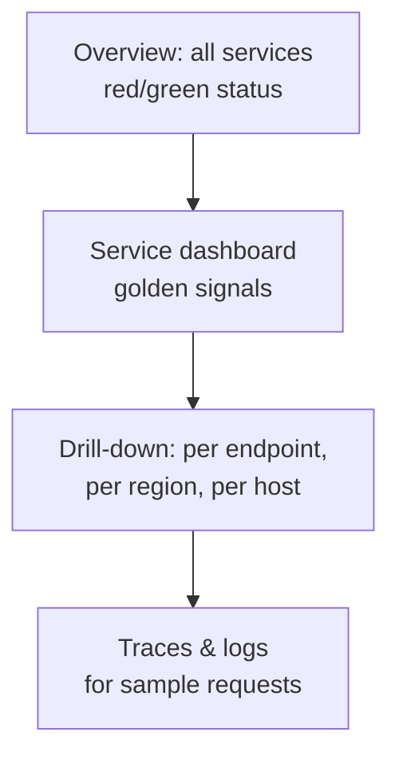

Collected metrics are only useful if people can understand them quickly. During an incident, an engineer has seconds to answer “what is broken, where, and since when?” Good visualization turns millions of data points into those answers.

## Dashboards with a purpose

Effective dashboards are organized around questions rather than around whatever metrics happen to exist:

- **Service overview dashboards** show the golden signals for one service: request rate, error rate, latency percentiles and saturation, with deployment markers overlaid.
- **Dependency dashboards** show the health of the databases, caches and downstream services a service relies on.
- **Fleet or capacity dashboards** show resource utilization trends for planning.
- **Business dashboards** show sign-ups, orders and revenue, which often reveal problems fastest.

This hierarchy supports a natural investigation flow: from a high-level overview, drill into the failing service, then into the specific endpoint, region or host, and finally into traces and logs for individual requests.

## Choosing the right visualization

| Question | Visualization |
| --- | --- |
| How does a value change over time? | Line chart (time series) |
| What is the latency distribution? | Heatmap or percentile lines (p50, p95, p99) |
| Which hosts or regions are unhealthy? | Status grid or table with color coding |
| What is the current value? | Single stat with sparkline |
| What share does each component take? | Stacked area chart |

<Callout type="warning">
Averages hide problems. A dashboard showing only average latency can look healthy while 5% of users suffer ten-second responses. Always show high percentiles, and consider heatmaps for latency.
</Callout>

## Making dashboards fast

Dashboards query many series over long time ranges, and they are often opened by many engineers at once during an incident — exactly when the system is under stress. Techniques to keep them fast include:

- **Recording rules** that precompute expensive aggregations.
- **Downsampled data** for long ranges: a 30-day chart does not need 10-second points.
- **Query result caching**, since many people view the same dashboard.
- **Limits** on series count and query duration to protect the query service from runaway queries.

## Annotations and context

Overlaying **events** on charts — deployments, configuration changes, feature flag flips, incidents — is one of the most valuable features of a dashboard. Most incidents are caused by changes, and seeing an error spike line up exactly with a deployment marker can cut diagnosis time from an hour to a minute.

## Beyond dashboards

- **Service maps** automatically draw dependencies between services from tracing data, colored by health.
- **Anomaly detection** highlights metrics that deviate from their usual seasonal pattern.
- **Status pages** communicate health to users and customers during incidents.

<KeyTakeaways>
- Organize dashboards around questions: overview, service, dependencies, capacity and business.
- Support drill-down from overview to service, endpoint, host and finally traces and logs.
- Show percentiles and distributions, not just averages.
- Keep dashboards fast with recording rules, downsampling, caching and query limits.
- Annotate charts with deployments and changes to speed up diagnosis.
</KeyTakeaways>
