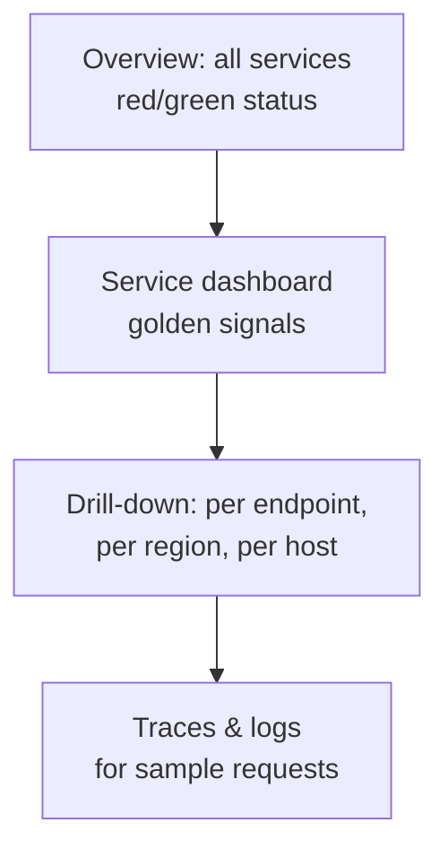
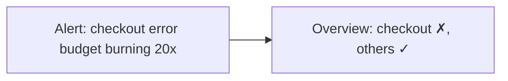
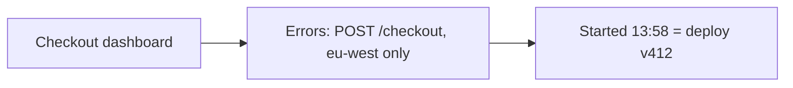
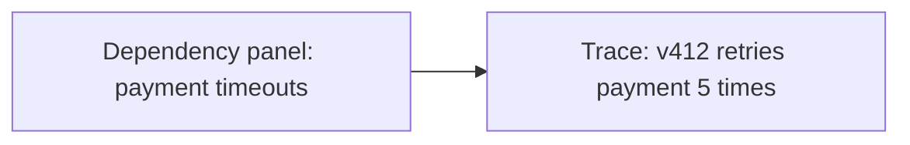
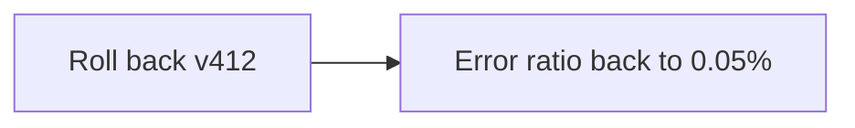

Collected metrics are only useful if people can understand them quickly. During an incident, an engineer has seconds to answer "what is broken, where, and since when?" Good visualization turns millions of data points into those answers.

## Dashboards with a purpose

Effective dashboards are organized around questions rather than around whatever metrics happen to exist:

- **Service overview dashboards** show the golden signals for one service: request rate, error rate, latency percentiles and saturation, with deployment markers overlaid.
- **Dependency dashboards** show the health of the databases, caches and downstream services a service relies on.
- **Fleet or capacity dashboards** show resource utilization trends for planning.
- **Business dashboards** show sign-ups, orders and revenue, which often reveal problems fastest.

This hierarchy supports a natural investigation flow: from a high-level overview, drill into the failing service, then into the specific endpoint, region or host, and finally into traces and logs for individual requests.

## Anatomy of a service dashboard

A consistent layout lets any engineer read any team's dashboard during an incident:

| Row | Panels |
| --- | --- |
| 1. Health at a glance | SLO status, error budget remaining, current error rate, current p99 |
| 2. Traffic | Requests per second by endpoint (stacked), by region |
| 3. Errors | Error ratio by endpoint and status code |
| 4. Latency | p50, p95 and p99 lines, plus a latency heatmap |
| 5. Saturation | CPU, memory, thread and connection pool usage, queue depth |
| 6. Dependencies | Latency and errors of calls to each downstream service |

Deployment and configuration-change annotations run across every panel.

## Choosing the right visualization

| Question | Visualization |
| --- | --- |
| How does a value change over time? | Line chart (time series) |
| What is the latency distribution? | Heatmap or percentile lines (p50, p95, p99) |
| Which hosts or regions are unhealthy? | Status grid or table with color coding |
| What is the current value? | Single stat with sparkline |
| What share does each component take? | Stacked area chart |

A **latency heatmap** plots time on the x-axis, latency buckets on the y-axis, and the number of requests in each bucket as color intensity. It reveals patterns that percentile lines hide — for example, two distinct bands showing that requests either hit a cache (fast) or miss it (slow), or a new band appearing after a deployment.

<Callout type="warning">
Averages hide problems. A dashboard showing only average latency can look healthy while 5% of users suffer ten-second responses. Always show high percentiles, and consider heatmaps for latency.
</Callout>

## An incident, step by step

<Slides title="Diagnosing an incident with dashboards">
<Slide caption="1. 14:02 — A burn-rate alert pages the on-call engineer. The overview shows checkout red; everything else is green.">

</Slide>
<Slide caption="2. The checkout dashboard shows errors only on POST /checkout in eu-west, starting at 13:58 — right on a deployment annotation.">

</Slide>
<Slide caption="3. The dependency panel shows calls to the payment service timing out. Traces of failed requests show a new retry loop in v412.">

</Slide>
<Slide caption="4. The engineer rolls back v412 in eu-west. Within two minutes the error ratio returns to baseline, confirmed on the same dashboard.">

</Slide>
</Slides>

Detection took seconds, diagnosis about five minutes, and mitigation two — largely because the dashboards answered "where" and "since when" immediately and the deployment annotation pointed straight at the cause.

## Making dashboards fast

Dashboards query many series over long time ranges, and they are often opened by many engineers at once during an incident — exactly when the system is under stress. Techniques to keep them fast include:

- **Recording rules** that precompute expensive aggregations.
- **Downsampled data** for long ranges: a 30-day chart does not need 10-second points.
- **Query result caching**, since many people view the same dashboard.
- **Limits** on series count and query duration to protect the query service from runaway queries.

## Annotations and context

Overlaying **events** on charts — deployments, configuration changes, feature flag flips, incidents — is one of the most valuable features of a dashboard. Most incidents are caused by changes, and seeing an error spike line up exactly with a deployment marker can cut diagnosis time from an hour to a minute.

## Dashboards as code

Dashboards built by hand drift, break when metrics are renamed and cannot be reviewed. Many teams define dashboards in version-controlled files, generated from templates so that every service gets the same standard layout automatically. Changes go through code review like any other change, and a new service is observable from its first deployment.

## Beyond dashboards

- **Service maps** automatically draw dependencies between services from tracing data, colored by health.
- **Anomaly detection** highlights metrics that deviate from their usual seasonal pattern — useful for business metrics whose "normal" varies by hour and day of week.
- **Status pages** communicate health to users and customers during incidents.

<Ponder question="During a major incident, 200 engineers open the same dashboard, and the monitoring query service slows to a crawl. How would you prevent this?">
Cache query results for identical dashboard queries (most viewers request the same panels and time ranges), back expensive panels with precomputed recording rules, align query time ranges to step boundaries so cached results can be reused, rate-limit or queue ad-hoc heavy queries, and keep the alerting path on separate query capacity so a flood of dashboard traffic can never delay alerts.
</Ponder>

<KeyTakeaways>
- Organize dashboards around questions: overview, service, dependencies, capacity and business.
- Use a consistent service dashboard layout and support drill-down from overview to service, endpoint, host and finally traces and logs.
- Show percentiles and distributions, not just averages; heatmaps reveal patterns percentile lines hide.
- Keep dashboards fast with recording rules, downsampling, caching and query limits, and isolate alerting queries.
- Annotate charts with deployments and changes, and manage dashboards as code.
</KeyTakeaways>
