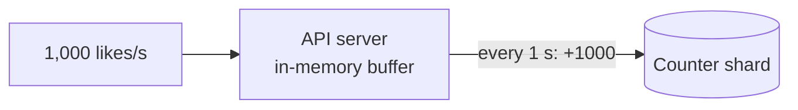

Let's refine the design: reducing write load further, keeping counts accurate through failures, handling reads at extreme scale and integrating with the rest of the platform.

## Batching increments

Even sharded, a million increments per minute means a million store writes. API servers can **batch** increments in memory for a short window — say, 1 second — and send a single `increment(counter#k, +347)` per counter per second.

This reduces write traffic by orders of magnitude. The risk: if the API server crashes, buffered increments are lost. Mitigations include short batching windows, writing increments to a **durable log** (a partitioned message stream) before acknowledging, and having consumers apply batched deltas to the counter store.

## Durable event-based counting

A robust variant makes the **event log** the source of truth:

1. Each like is written as an event to a partitioned log (durable, replicated).
2. Consumers aggregate events per counter in short windows and apply deltas to the counter store.
3. Consumers commit their log offsets only after applying deltas, and deltas are applied **idempotently** (for example, tagged with the log offset) so replays do not double count.

This gives durability and exactly-once counting semantics while still batching aggressively.

## Likes are not just numbers

A like counter must usually also answer “has *this user* liked this post?” to show a filled heart and prevent double-liking. That requires storing the **relationship** `(user, post)` — typically in a wide-column store partitioned by post or user. The flow becomes:

1. Insert `(user, post)` if it does not exist (idempotent).
2. Only if the insert created a new row, emit a `+1` increment.

Unlikes delete the row and emit `-1`. This keeps counts consistent with the underlying relationships.

## Reading at extreme scale

Viral content is read far more than it is liked: millions of feed views each display the like count. The read path uses layered caching:

- A **distributed cache** stores aggregated totals, refreshed by the aggregator.
- A short-lived **local cache** in each API server absorbs the hottest counters.
- The **CDN or client** may display rounded values (“1.2M”) that need only occasional refreshes.

## Reconciliation

Over time, small discrepancies can creep in — from lost batches, bugs or partial failures. A periodic **reconciliation job** recomputes totals from the source of truth (the relationship table or the event log) and corrects the counters. For most counters this runs rarely; for money-related or contractual counters, it runs frequently and results are audited.

<Callout type="interview">
A strong answer distinguishes three layers: the **source of truth** (relationships or event log), the **sharded counters** optimized for writes, and the **cached totals** optimized for reads — plus a reconciliation job tying them together.
</Callout>

<KeyTakeaways>
- Batching increments in memory or via a durable event log reduces store writes dramatically.
- Using a durable log with idempotent, offset-tagged deltas gives exactly-once counting.
- Like counts must stay consistent with (user, post) relationships; only new relationships increment.
- Layered caching serves counts to millions of readers cheaply.
- Periodic reconciliation from the source of truth corrects drift.
</KeyTakeaways>
