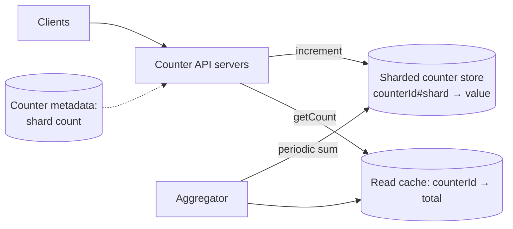
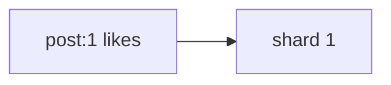
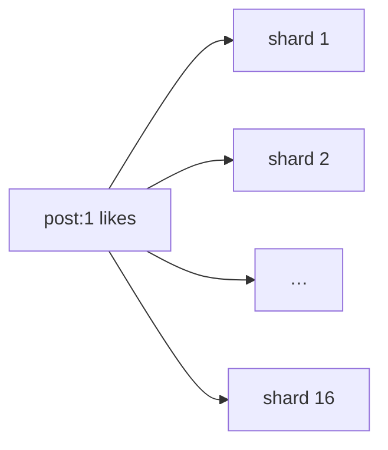
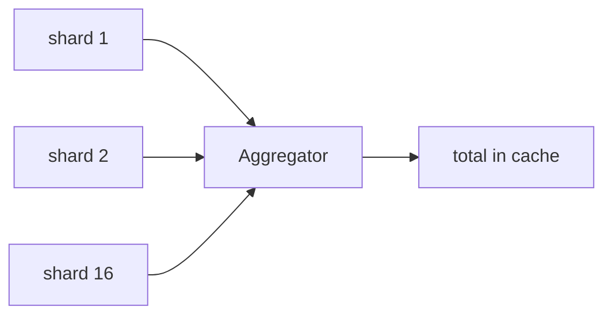
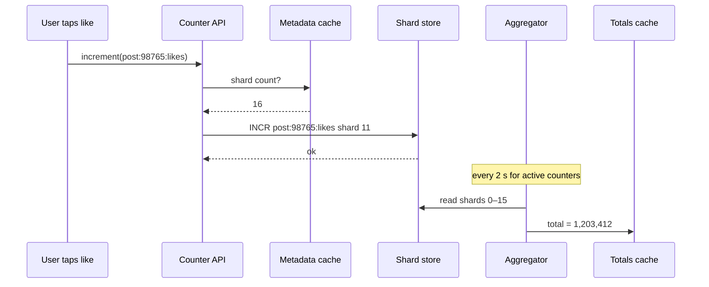

Let's design a counting service that the rest of the platform — posts, videos, profiles — can use for likes, views and follower counts.

## API

```text
createCounter(counterId, initialShards = 1)
increment(counterId, delta = 1)
getCount(counterId) -> value
```

The counter service hides sharding from its callers. Application teams simply call `increment("post:98765:likes")`.

## Architecture



### Write path

1. The API server looks up the counter's **shard count** (cached metadata).
2. It picks a shard — randomly, or by hashing the request ID — and increments `counterId#k`.
3. The store applies the increment atomically; each shard key may live on a different storage node.

### Read path

Summing N shards on every read would multiply read load. Instead:

- An **aggregator** periodically (for example, every few seconds) reads all shards of active counters, sums them and writes the total to a **read cache**.
- `getCount` returns the cached total — one fast lookup.

This makes reads cheap and writes contention-free, at the cost of the displayed count lagging by a few seconds.

## Starting small, scaling up

Most counters are cold: a typical post gets a handful of likes. Giving every counter 64 shards would waste storage and make aggregation expensive. Instead, counters start with **one shard** and grow when they get hot:

<Slides title="Dynamic shard scaling">
<Slide caption="1. A new post's like counter starts with a single shard.">



</Slide>
<Slide caption="2. The post goes viral; the service detects a high increment rate and raises the shard count to 16.">



</Slide>
<Slide caption="3. Writes spread across all shards; the aggregator sums them into the cached total.">



</Slide>
</Slides>

Increasing the shard count is safe: new increments start landing on new shards, and the aggregator sums all shards that exist. Decreasing it requires folding values from removed shards into remaining ones.

## Choosing the number of shards

The shard count trades write capacity against read and storage cost. If one shard can absorb roughly 1,000 increments per second, a counter receiving 20,000 increments per second needs at least 20 shards, plus headroom — say 32. The service can compute this automatically from the observed increment rate over the last minute, raising the count quickly when traffic surges and lowering it slowly after traffic subsides, to avoid oscillating back and forth.

## Storage choice

The counter store should support **atomic increments** at high throughput: an in-memory store with persistence, or a wide-column database with native counter types. Shard keys like `post:98765:likes#7` spread naturally across partitions via hashing.

## Data model

| Table | Key | Fields |
| --- | --- | --- |
| counter_metadata | counter_id | shard_count, created_at, last_rate, type (total or distinct) |
| counter_shards | (counter_id, shard_index) | value (atomically incremented) |
| counter_totals (cache) | counter_id | total, computed_at |



The aggregator only needs to visit **active** counters — those incremented recently — which it learns from a stream of "counter touched" events. Billions of cold counters are never aggregated until they change.

<Ponder question="Why pick a shard at random for each increment rather than hashing the user ID to a shard?">
Random choice spreads load evenly regardless of who is liking. Hashing by user would work too, and it has one advantage — a user's like and unlike land on the same shard — but it can create uneven load if a few heavy users dominate, and it adds nothing for correctness because the total is a sum over all shards anyway. Either is acceptable; random is the simpler default.
</Ponder>

<KeyTakeaways>
- The counter service exposes create, increment and getCount, hiding sharding from callers.
- Writes increment one randomly chosen shard; reads return a periodically aggregated, cached total.
- Counters start with one shard and scale up when they become hot.
- The store must support fast atomic increments; hashed shard keys spread load across nodes.
- The aggregator visits only recently active counters, so billions of cold counters cost nothing to maintain.
</KeyTakeaways>
