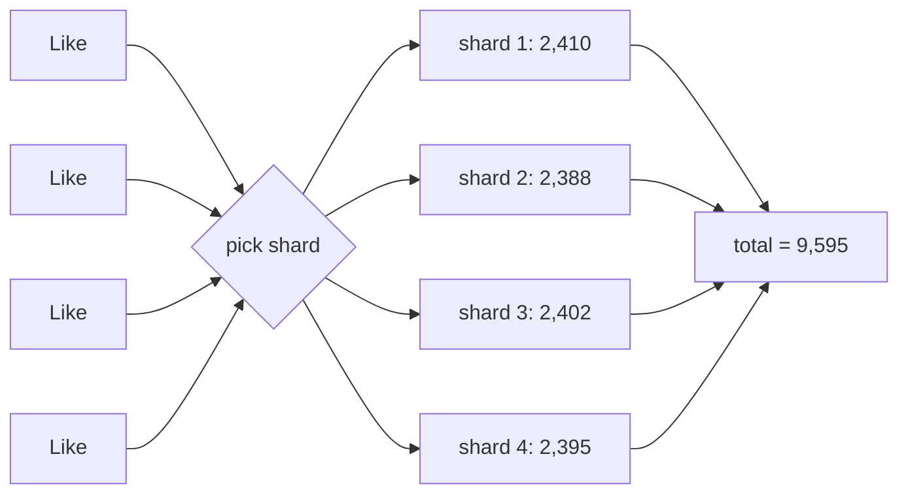

A celebrity posts a photo, and within a minute a million people tap “like.” Each tap must increment the photo's like count. If that count is a single row in a database, every increment contends for the same row lock, and the database can process only a few thousand updates per second on it. Requests pile up, latency soars and the database struggles — all because of one very **hot** value. **Sharded counters** solve this problem.

## Where hot counters appear

- Likes, views, shares and reactions on viral content.
- Follower counts of very popular accounts.
- Real-time vote tallies and live event metrics.
- Rate limits and quotas shared by many servers.
- Inventory counts during flash sales.

## The core idea

Instead of one counter, keep **N sub-counters** (shards). Each increment goes to one shard, chosen at random or by hashing. Reading the total means **summing** all shards.



With `N` shards, write contention per shard drops by a factor of `N`, and shards can live on different machines, multiplying total write throughput.

## Requirements

### Functional

- **Create** a counter for any entity (post, video, account).
- **Increment** (and sometimes decrement) the counter.
- **Read** the counter's current value.

### Non-functional

- **High write throughput** — sustain very high increment rates on a single counter.
- **Low latency** for both writes and reads.
- **Scalability** — billions of counters, most of them cold.
- **Availability** — counts should keep working during partial failures.
- **Eventual accuracy** — displayed counts may lag slightly, but must converge to the correct total without losing increments.

## Alternatives we will not use

Simply caching the counter in memory and writing to the database occasionally reduces load but risks losing increments on crashes. Using a strongly consistent distributed transaction per increment is safe but far too slow for hot counters. Sharding keeps increments durable while spreading them out, and it combines naturally with caching for reads.

<Callout type="note">
Most users cannot tell whether a post has 1,203,412 or 1,203,587 likes — displays often round to “1.2M.” This tolerance for approximate, slightly delayed counts is what makes sharded and cached counting practical.
</Callout>

## Why one row cannot keep up

When many transactions update the same row, each must wait for the previous one's lock to be released, so the row's throughput is roughly `1 / (time the lock is held)`. If an update holds the lock for 1 ms (including writing the log), the row tops out near **1,000 updates per second** — no matter how many cores or replicas the database has.

```text
Viral post: 1,000,000 likes in 60 s  ≈ 16,700 increments/s
Single row limit                    ≈ 1,000 increments/s
Shards needed (with 2× headroom)    ≈ 16,700 / 1,000 × 2 ≈ 32
```

With 32 shards spread across nodes, each shard receives about 500 increments per second — comfortably within limits.

## Counting distinct things

Some counters need **unique** counts — distinct viewers of a video, not total views. Storing every viewer ID to count them exactly costs memory proportional to the audience. Probabilistic sketches such as **HyperLogLog** estimate distinct counts with about 1% error using only a few kilobytes per counter, and sketches from different shards can be **merged** by combining their registers. For "1.2M unique viewers", a 1% error is invisible to users and saves gigabytes per popular video.

| Counter type | Example | Technique |
| --- | --- | --- |
| Total events | Likes, views, shares | Sharded integer counters |
| Distinct items | Unique viewers, unique voters | HyperLogLog sketches per shard, merged on read |
| Top items | Trending hashtags in the last hour | Count-min sketch plus a heap, or windowed counters |

<Ponder question="Why not keep the hot counter only in a single in-memory cache node, which can handle 100,000 increments per second?">
One cache node can absorb the write rate, but it becomes a single point of failure and a hot spot, and an in-memory value can be lost on a crash or restart, losing increments. It also does nothing for the next hundred viral posts that happen to hash to the same node. Sharding spreads both load and risk across nodes, and pairing shards with a durable source of truth prevents lost increments.
</Ponder>

<KeyTakeaways>
- A single hot counter creates heavy contention on one row or key.
- Sharded counters split a counter into N sub-counters; writes go to one shard and reads sum all shards.
- Sharding reduces per-shard contention and lets shards spread across machines.
- Requirements: high write throughput, low latency, massive scale and eventual accuracy.
- Contention caps a single row at roughly one update per lock hold time; shard count follows from the peak rate.
- Distinct counts use mergeable sketches such as HyperLogLog instead of exact sets.
</KeyTakeaways>
