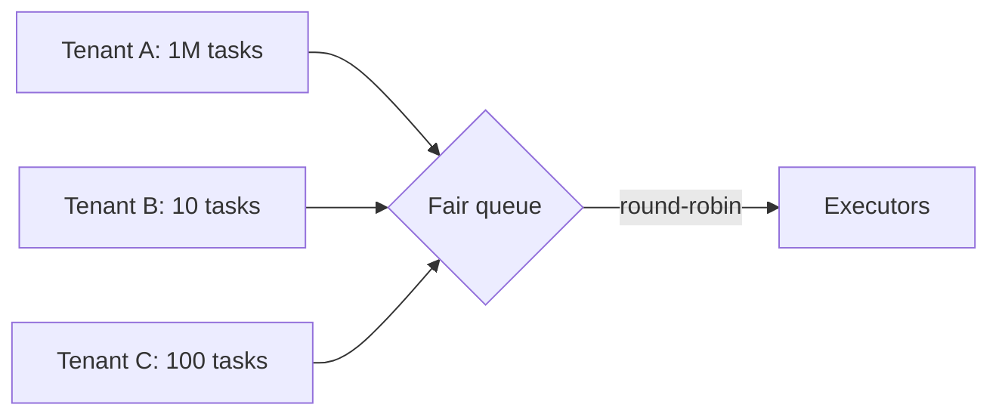

With the core design in place, let's examine the policies that determine how well the scheduler behaves under real-world pressure: prioritization, fairness, retries, resource management and exactly-once concerns.

## Prioritization

Not all tasks are equal. A password-reset email should not wait behind ten thousand nightly report jobs. Common approaches:

- **Separate queues per priority** with dedicated or weighted worker capacity — for example, 60% of executors pull from high priority first.
- **Preemption** of low-priority batch tasks when urgent tasks arrive, if tasks can be safely paused or restarted.
- **Deadlines**: tasks with approaching deadlines are promoted.

A risk is **starvation**: low-priority tasks may never run if high-priority work keeps arriving. Aging (gradually increasing the priority of waiting tasks) or reserved minimum capacity prevents it.

## Fairness between tenants

In a shared scheduler, one team submitting a million tasks could delay everyone else. Mitigations:

- **Per-tenant quotas** on concurrent running tasks and submission rate.
- **Fair queuing**: executors pull from tenants in round-robin or weighted order rather than strict arrival order.

## Retries and failure handling

- **Exponential backoff with jitter** avoids hammering a failing dependency and prevents synchronized retry storms.
- **Maximum attempts** and a **dead-letter state** stop poison tasks from retrying forever.
- **Distinguishing error types**: retry transient errors (timeouts, throttling) but not permanent ones (invalid input).
- **Timeouts** kill tasks that hang, freeing resources.

## Resource management and placement

Tasks declare their needs — CPU, memory, GPU, disk. The resource manager places tasks on workers with enough free capacity, packing small tasks efficiently (bin packing) while leaving room for large ones. Running tasks in **containers** with resource limits provides isolation: a memory-hungry task cannot crash its neighbors.

**Autoscaling** the worker pool based on queue depth keeps latency in check during spikes and saves cost during quiet periods. Low-priority batch work can run on cheaper **preemptible** capacity.

## Exactly-once concerns

At-least-once execution is the practical guarantee. To avoid harmful duplicates:

- Make task handlers **idempotent** (for example, check whether the report for date D already exists).
- Use **idempotency keys** when tasks call external systems, such as payment providers.
- Use **fencing tokens** — an increasing attempt number passed to the task — so downstream systems can reject writes from a stale, zombie attempt that was presumed dead.

## Dependencies between tasks

Some workloads are workflows: extract data, then transform it, then load it. A scheduler can support **DAGs** (directed acyclic graphs) of tasks, starting each task only when its dependencies succeed. Workflow engines add durable state for each step so that failures resume from the failed step.

<KeyTakeaways>
- Priority queues, preemption and deadlines ensure urgent tasks run promptly; aging prevents starvation.
- Per-tenant quotas and fair queuing prevent one tenant from monopolizing workers.
- Retries use exponential backoff with jitter, attempt limits and error classification.
- Resource-aware placement, containers and autoscaling provide efficiency and isolation.
- Idempotent handlers, idempotency keys and fencing tokens make at-least-once execution safe.
</KeyTakeaways>
