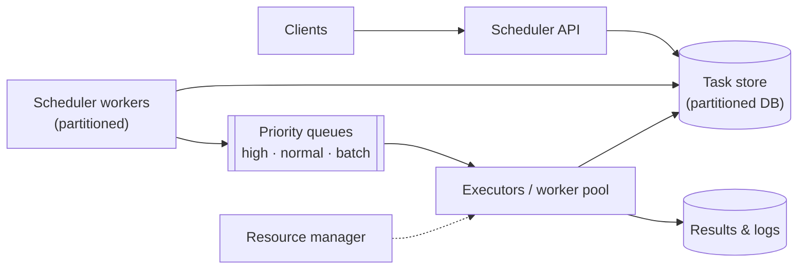
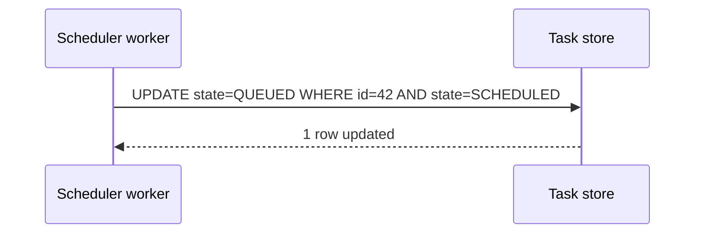
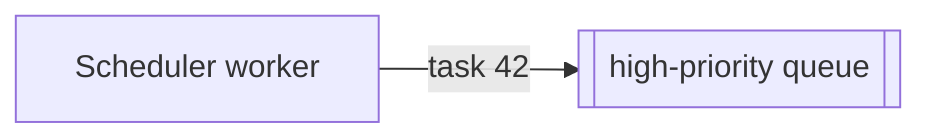
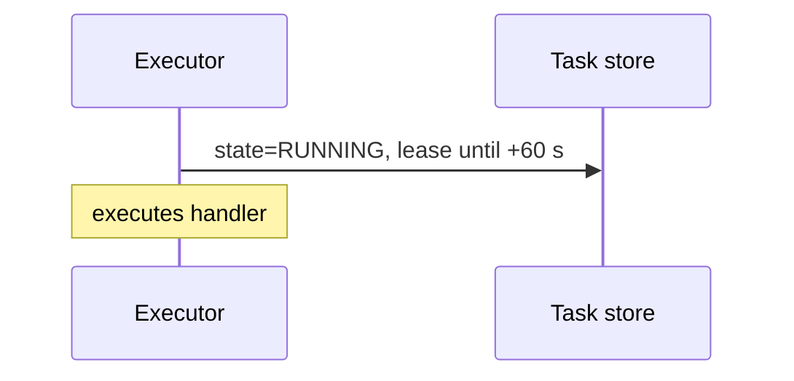
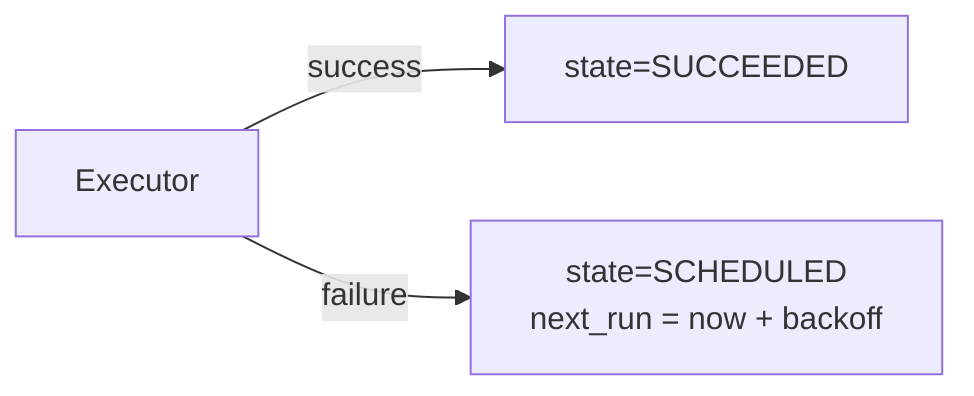
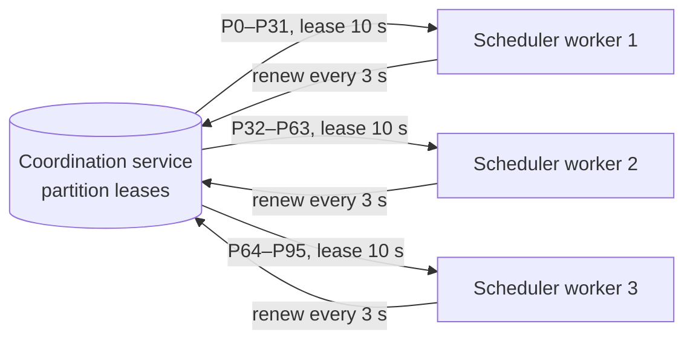
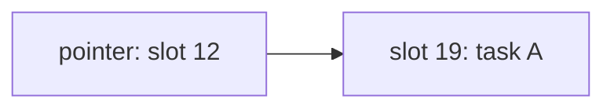
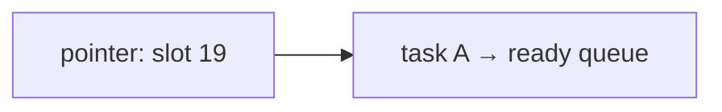
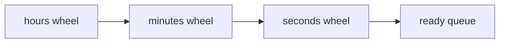

Let's design the scheduler's components and follow a task from submission to completion.

## Components



- **Scheduler API** — validates and authenticates submissions, applies quotas and writes tasks to the task store.
- **Task store** — a durable, partitioned database holding each task's spec, state, next run time and attempt history. It is the source of truth.
- **Scheduler workers** — each owns a subset of task-store partitions; they find tasks whose run time has arrived and enqueue them.
- **Priority queues** — durable queues separating urgent tasks from normal and batch work.
- **Executors** — workers that pull tasks from queues, run them in isolated environments (such as containers) and report results.
- **Resource manager** — tracks worker capacity and places resource-heavy tasks (for example, GPU jobs) on suitable machines.

## Finding due tasks efficiently

Scanning all tasks to see which are due would be slow. Instead, the task store keeps an index on `next_run_time`, partitioned by task ID:

```text
SELECT task_id FROM tasks
WHERE partition = :p AND state = 'SCHEDULED' AND next_run_time <= now()
ORDER BY next_run_time LIMIT 1000
```

Each scheduler worker polls only its own partitions every second or so. For recurring tasks, after enqueuing an occurrence, the worker computes and stores the **next** run time in the same transaction.

An alternative for delayed tasks is a **timing wheel** or time-bucketed queue: tasks are grouped by minute, and at each minute the corresponding bucket is moved to the ready queue.

## Execution flow

<Slides title="Running a task">
<Slide caption="1. A scheduler worker finds a due task and atomically moves it from Scheduled to Queued.">



</Slide>
<Slide caption="2. It enqueues the task into the queue for its priority.">



</Slide>
<Slide caption="3. An executor pulls the task, marks it Running with a lease, and runs it.">



</Slide>
<Slide caption="4. On success it records the result; on failure it schedules a retry with backoff.">



</Slide>
</Slides>

The **conditional update** in step 1 (only if still `SCHEDULED`) ensures that two scheduler workers cannot enqueue the same occurrence, even during partition reassignment.

## Leases and heartbeats

An executor holds a **lease** on a running task and extends it with periodic heartbeats. If the executor crashes, the lease expires, and a recovery process returns the task to `SCHEDULED` for retry. Long-running tasks heartbeat more often and may also **checkpoint** progress so that retries resume rather than restart.

## The task store schema

| Column | Purpose |
| --- | --- |
| task_id (partition key) | Unique ID; hashes to a partition |
| owner, priority, queue | Quotas, access control and routing |
| handler, payload, resources | What to run and what it needs |
| schedule, next_run_time | Cron expression for recurring tasks; next due time (indexed) |
| state, attempt, lease_expires_at, lease_owner | Current state machine position and executor lease |
| max_retries, timeout, idempotency_key | Policies |
| created_at, updated_at, version | Auditing and optimistic concurrency |

Attempt history lives in a separate, append-only table keyed by `(task_id, attempt)`, so the hot table stays small.

## Who owns which partition?

Each scheduler worker must poll a disjoint set of partitions, and a dead worker's partitions must be picked up quickly. Workers acquire **leases** on partitions from a coordination service:



If worker 2 stops renewing, its leases expire and the remaining workers claim P32–P63. Even if worker 2 was only paused and briefly believes it still owns them, the conditional `UPDATE … WHERE state = 'SCHEDULED'` prevents a double enqueue.

## Timing wheels for delayed tasks

For millions of short delays (retry in 30 seconds, expire in 5 minutes), polling the database is wasteful. A **hierarchical timing wheel** keeps delayed tasks in memory buckets:

<Slides title="A timing wheel with one-second slots">
<Slide caption="1. The wheel has 60 slots, one per second. A task due in 7 seconds goes into the slot 7 ahead of the current pointer.">



</Slide>
<Slide caption="2. Every second the pointer advances one slot and all tasks in that slot become ready.">



</Slide>
<Slide caption="3. Tasks due further out go into a coarser wheel (minutes or hours) and move down into the seconds wheel as their time approaches.">



</Slide>
</Slides>

Insertion and expiry are O(1). The durable task store remains the source of truth; the wheel is a fast in-memory index rebuilt from the store after a restart.

<Ponder question="An executor finishes a task, but its 'mark SUCCEEDED' write fails because the task store is briefly unavailable. The lease then expires. What happens, and why is that acceptable?">
The recovery process sees an expired lease on a RUNNING task and returns it to SCHEDULED, so another executor runs it again — a duplicate execution. That is the at-least-once contract: the scheduler prefers running a task twice to losing it. Idempotent handlers (or idempotency keys to external systems) make the second run harmless, and the attempt number acts as a fencing token so the first executor's late writes can be rejected.
</Ponder>

<KeyTakeaways>
- The API writes tasks to a durable, partitioned task store — the source of truth.
- Partitioned scheduler workers find due tasks using a next-run-time index and enqueue them.
- Priority queues separate urgent, normal and batch work; executors run tasks in isolation.
- Conditional state transitions prevent duplicate enqueuing.
- Leases with heartbeats detect crashed executors so tasks can be retried; checkpoints help long tasks.
- Workers lease partitions from a coordination service; timing wheels index short delays in memory.
</KeyTakeaways>
