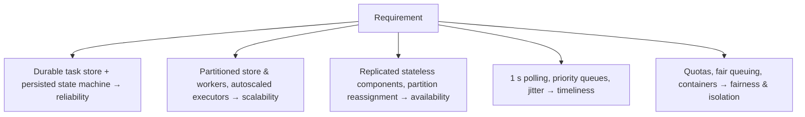

Let's evaluate our scheduler design against its requirements.

## Reliability

- Tasks are written to a **durable, replicated task store** before `submitTask` returns, so accepted tasks are never lost.
- Every state transition is persisted; after any crash, the system resumes from the stored state.
- **Leases** detect crashed executors, and **retries** with backoff re-run failed tasks, giving at-least-once execution.
- **Dead-letter** handling surfaces tasks that keep failing.

## Scalability

- The task store is **partitioned** by task ID, and scheduler workers each own a set of partitions, so both scale horizontally.
- **Queues** decouple scheduling from execution; the **executor pool** scales independently and can autoscale on queue depth.
- Throughput of 1,000+ task starts per second with 10–50× peaks is achievable by adding partitions, queue shards and executors.

## Availability

- The API and executors are stateless and replicated.
- If a scheduler worker dies, its partitions are **reassigned** (using a coordination service or lease-based ownership) to other workers within seconds.
- Queues and the task store are replicated across availability zones.

## Timeliness

- Scheduler workers poll every second, so tasks are enqueued within about a second of their due time.
- **Priority queues** and reserved capacity keep urgent tasks fast during heavy batch load.
- **Jitter** on recurring schedules flattens top-of-the-hour spikes.

## Fairness and isolation

- Per-tenant quotas and fair queuing prevent monopolization.
- Containers with resource limits isolate tasks from each other.

## Trade-offs

| Decision | Benefit | Cost |
| --- | --- | --- |
| At-least-once execution | Tasks never silently lost | Handlers must be idempotent |
| Polling for due tasks | Simple and robust | Up to ~1 s of scheduling delay; DB load |
| Priority queues | Urgent tasks run quickly | Risk of starvation without aging |
| Containers per task | Strong isolation | Startup overhead for tiny tasks |

## Monitoring the scheduler

Key metrics include queue depth per priority, scheduling delay (actual start time minus scheduled time), task success and failure rates, retry counts, and executor utilization. Alerting on **scheduling delay** catches capacity problems before users notice missed deadlines.

<KeyTakeaways>
- Durable storage of tasks and state transitions, plus leases and retries, provide reliability.
- Partitioning, queues and autoscaled executors provide scalability.
- Stateless replicated components and partition reassignment provide availability.
- Polling, priority queues and jitter keep tasks timely; quotas and containers provide isolation.
- Monitor scheduling delay, queue depth and failure rates.
</KeyTakeaways>
