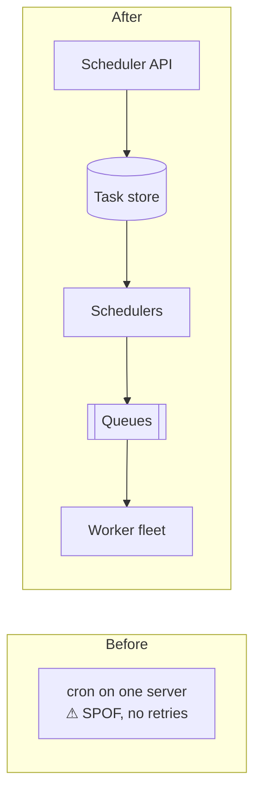

Large systems are full of work that must happen **later**, **periodically** or **in the background**: sending a reminder email tomorrow at 9 a.m., generating nightly reports, retrying a failed payment in an hour, transcoding uploaded videos, cleaning up expired sessions every ten minutes, or running a machine-learning training job. A **distributed task scheduler** accepts these tasks, decides when and where each should run, executes them reliably and reports their outcome.

## What counts as a task?

A task is a unit of work with:

- **Code or a reference** to what should run (a function name, container image or script).
- **Inputs** (parameters).
- **Timing** — run now, at a specific time, or on a recurring schedule such as “every day at 02:00.”
- **Resource needs** — CPU, memory, GPU.
- **Policies** — priority, retries, timeouts and deadlines.

## Why a single cron server is not enough

The classic approach is a `cron` daemon on one machine. It fails at scale:

- **Single point of failure.** If the machine is down at 02:00, the nightly job does not run.
- **Limited capacity.** One machine cannot run thousands of concurrent tasks.
- **No visibility or retries.** Failures are easy to miss, and there is no built-in retry or history.
- **Resource contention.** Heavy jobs interfere with each other.

## Requirements

### Functional

- **Submit** one-off, delayed and recurring tasks.
- **Execute** tasks on a pool of workers, respecting resource requirements.
- **Prioritize** urgent tasks over batch work.
- **Retry** failed tasks according to policy, and enforce timeouts.
- **Report** status and results; allow **cancellation**.

### Non-functional

- **Reliability:** every accepted task runs **at least once**; tasks are not lost when components fail.
- **Scalability:** millions of tasks per day and thousands of concurrent executions.
- **Availability:** submissions accepted and tasks dispatched even when some nodes fail.
- **Timeliness:** tasks start close to their scheduled time.
- **Fairness and isolation:** one tenant's burst of tasks should not starve others.

<Callout type="note">
Because tasks can run more than once (for example, if a worker dies after finishing but before reporting success), task code should be **idempotent** — the same requirement we saw with messaging queues.
</Callout>

<KeyTakeaways>
- A task scheduler runs deferred, periodic and background work reliably across a fleet.
- Tasks carry code, inputs, timing, resource needs and policies.
- Single-server cron is a single point of failure with no scalability, retries or visibility.
- Requirements emphasize at-least-once execution, scale, availability, timeliness and fairness.
- Task code should be idempotent because retries can cause duplicate execution.
</KeyTakeaways>
