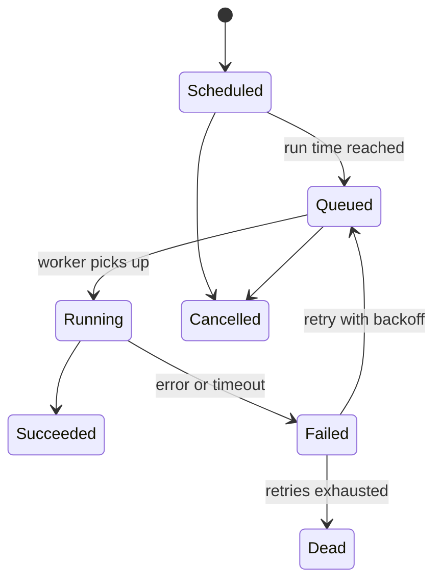

Let's refine the scheduler's requirements and estimate its scale.

## Task types

| Type | Example | Timing |
| --- | --- | --- |
| Immediate | Resize an uploaded image | As soon as resources allow |
| Delayed | Send a reminder in 24 hours | At a specific time |
| Recurring | Rebuild the search index nightly | Cron-like schedule |
| Long-running batch | Train a model for 6 hours | When resources are available |

## API

```text
submitTask(spec)                -> taskId
  spec = { handler, payload, runAt?, schedule?, priority,
           resources, maxRetries, timeout, idempotencyKey }
getStatus(taskId)               -> { state, attempts, result, error }
cancelTask(taskId)
listTasks(owner, filters)
```

Including an **idempotency key** in submissions lets clients safely retry `submitTask` without creating duplicate tasks.

## Task lifecycle



Tracking these states explicitly — in a durable store — is what allows the scheduler to recover after crashes and to show users accurate status.

## What the scheduler must store per task

For each task, the task store keeps its **specification** (handler, payload, resources, policies), its **current state**, the **next run time**, the **owner** (for quotas and access control) and an **attempt history** with start times, end times, errors and the executor that ran each attempt. The history is invaluable for debugging (“why did last night's report fail twice before succeeding?”) and for computing reliability metrics per task type. Old history is archived after a retention period to keep the hot store small.

Recurring tasks store their **schedule expression** and the time of their last occurrence, so that after an outage the scheduler can decide whether to run missed occurrences (catch up) or skip them — a policy each task declares, since a missed hourly metrics job might be skipped while a missed billing run must not be.

## Non-functional targets

- **Durability:** once `submitTask` returns, the task must not be lost.
- **At-least-once execution** with configurable retries and exponential backoff.
- **Scheduling precision:** tasks start within a few seconds of their `runAt` time under normal load.
- **Throughput:** assume 100 million task executions per day.
- **Isolation:** per-tenant quotas so no team can monopolize workers.

## Capacity estimate

```text
100 million tasks/day ÷ 10^5 s ≈ 1,000 task starts per second (average)
Peak (e.g. top of the hour, when many recurring tasks fire) could be 10–50× higher
Average task duration 30 s → ~30,000 concurrently running tasks on average
If a worker slot runs 1 task at a time and a machine has 16 slots → ~2,000 machines
Task metadata ~1 KB × 100M/day ≈ 100 GB/day of state (retained for 30 days ≈ 3 TB)
```

The **top-of-the-hour spike** is a classic scheduler problem: thousands of recurring tasks scheduled for `00:00` fire simultaneously. Designs mitigate it by adding **jitter** to recurring schedules where exact timing does not matter, and by queuing tasks by priority.

## Sizing the moving parts

```text
Task store writes:  each task changes state ~4 times (scheduled, queued, running, done)
                    1,000 starts/s × 4 ≈ 4,000 writes/s average, 40,000+ at hourly peaks
Partitions:         at ~2,000 writes/s per partition leader → 20–32 partitions with headroom
Queue throughput:   1,000–50,000 enqueues/s → a partitioned queue, sharded by priority
Scheduler workers:  each polls a few partitions every second → a handful of workers suffice
```

The executors dominate cost (thousands of machines); the control plane — API, store and scheduler workers — is comparatively small, but it must be highly available because every task depends on it.

## Non-goals

To keep the design focused, we do not build a general workflow language, a data-processing engine or a container orchestrator. The scheduler decides *when* and *where* tasks run and tracks their state; it delegates actual execution environments to an existing cluster manager and leaves multi-step workflows to a layer built on top (discussed in the considerations lesson).

<Ponder question="A client calls submitTask, the request times out, and the client retries. Without an idempotency key, what could go wrong for a 'charge subscription' task?">
The first request may have been stored even though the response was lost, so the retry creates a second task and the customer could be charged twice. With an idempotency key such as `charge-sub-881-2026-09`, the API recognizes the retry, returns the original task ID and creates nothing new.
</Ponder>

<Callout type="tip">
In an interview, discussing the task state machine and how each transition is persisted demonstrates that you understand how the scheduler survives failures.
</Callout>

<KeyTakeaways>
- Schedulers handle immediate, delayed, recurring and long-running batch tasks.
- The API supports submission with policies, status queries, cancellation and idempotency keys.
- An explicit, durably stored task state machine enables recovery and accurate status.
- Targets: durability, at-least-once execution, scheduling precision, high throughput and isolation.
- Recurring tasks cause top-of-the-hour spikes; jitter and prioritization mitigate them.
</KeyTakeaways>
