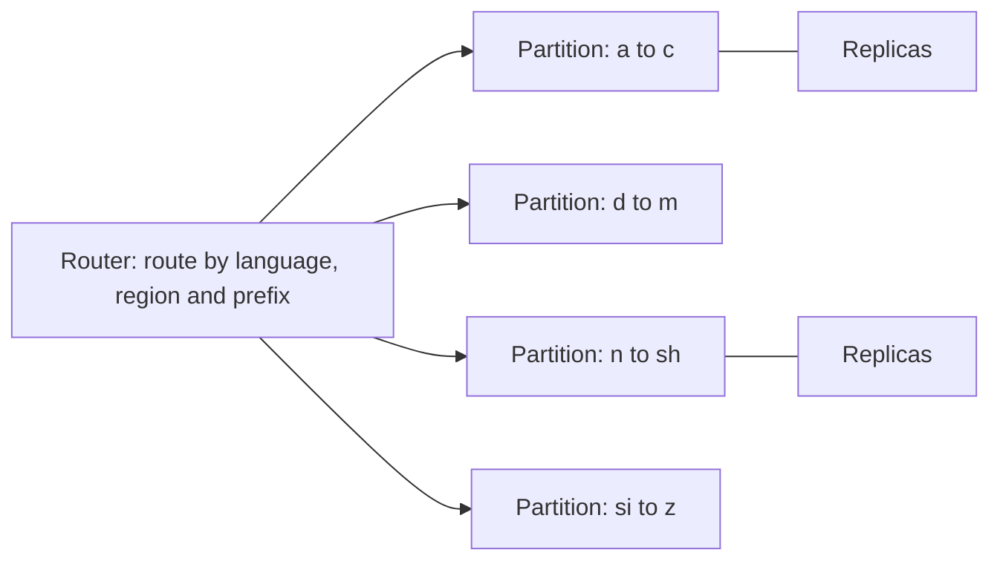

This lesson covers partitioning, updates, trending topics, personalization and spelling tolerance.

## Partitioning when data grows

A single trie of tens of gigabytes fits on one large machine, so full replication is the simplest design. When it no longer fits, for example with many languages and regions or with longer tails, the data must be partitioned.

**Partition by language and region first.** A user searching in Japanese never needs the English trie. Separate tries per language and region are naturally smaller and can be placed on different server pools.

**Partition by prefix range next.** Within a large trie, split by the first characters: one partition for prefixes starting with "a" to "c", another for "d" to "f", and so on. A request is routed by its prefix, and each partition holds a complete sub-trie. The difficulty is **skew**: far more queries start with "s" than with "x". Partition boundaries should be chosen by measured traffic and data size, not by the alphabet, so "s" may be split into "sa" to "sh" and "si" to "sz".

Each partition is replicated, and hot partitions get more replicas.

## Updating suggestions

Full rebuilds happen on a schedule, such as hourly or daily. The pipeline:

1. Aggregates the latest query counts into the decayed frequency table.
2. Builds new tries per partition in a batch job, in parallel.
3. Validates the output: size within expected bounds, no blocked terms, spot checks of known prefixes.
4. Publishes snapshots with a version number.
5. Rolls out gradually: a few servers load the new version first, and their error rates and latency are monitored before the rest follow.

Because snapshots are immutable and versioned, rolling back to the previous version is instant.

## Trending queries

A daily rebuild is too slow for breaking news. A **streaming pipeline** counts queries over the last few minutes and hour and detects those whose rate greatly exceeds their baseline. These trending queries form a small **trending trie**, rebuilt every few minutes. At request time, the server merges results from the main trie and the trending trie, boosting trending items above their long-term score.

## Personalization

Personalized suggestions, such as the user's own recent searches, cannot be cached across users, and storing everyone's history in the main trie is impossible. Instead:

- The client keeps a small list of the user's recent searches and matches them locally, or
- A separate history service returns the user's recent queries matching the prefix,

and the results are merged with the global suggestions, with recent personal queries placed first. This keeps the global path fully cacheable.

## Spelling tolerance

Users often mistype: "recieve" instead of "receive". Exact prefix matching finds nothing useful. Options include:

- **Precomputed corrections** for common misspelled prefixes, learned from logs where users typed one prefix and then searched a corrected query.
- **Fuzzy trie search** allowing an edit distance of one, exploring a few alternative branches. This is more expensive, so it runs only when the exact match yields too few suggestions.

## Latency budget

A typical breakdown for a 100 ms target:

| Stage | Budget |
| --- | --- |
| Client debounce | 50 ms or less |
| Network round trip | 20 to 50 ms |
| Load balancer and routing | 1 to 2 ms |
| Trie lookup and merge | under 1 ms |
| Rendering | a few ms |

Server work is tiny. Most of the budget goes to the network, which is why serving from edge regions and CDN caches matters more than optimizing the lookup itself.

<Ponder question="A partition for prefixes starting with 's' becomes overloaded while others are idle. What are your options?">
Split the range further by traffic ("sa"–"sh", "si"–"sz"), add more replicas to the hot partition, and cache its most popular prefixes at the CDN, where "s", "sp" and "sh" are almost certainly cached already. Because boundaries are chosen from measured traffic when snapshots are built, rebalancing is part of the regular rebuild rather than an emergency migration.
</Ponder>

<KeyTakeaways>
- Partition by language and region first, then by traffic-balanced prefix ranges, with more replicas for hot partitions.
- Versioned, validated snapshots roll out gradually and roll back instantly.
- A small trending trie, updated every few minutes from a stream, is merged with the main trie for freshness.
- Personal suggestions come from a separate source and are merged, keeping the global path cacheable.
- Most of the latency budget is network time, so edge serving and caching matter most.
</KeyTakeaways>
