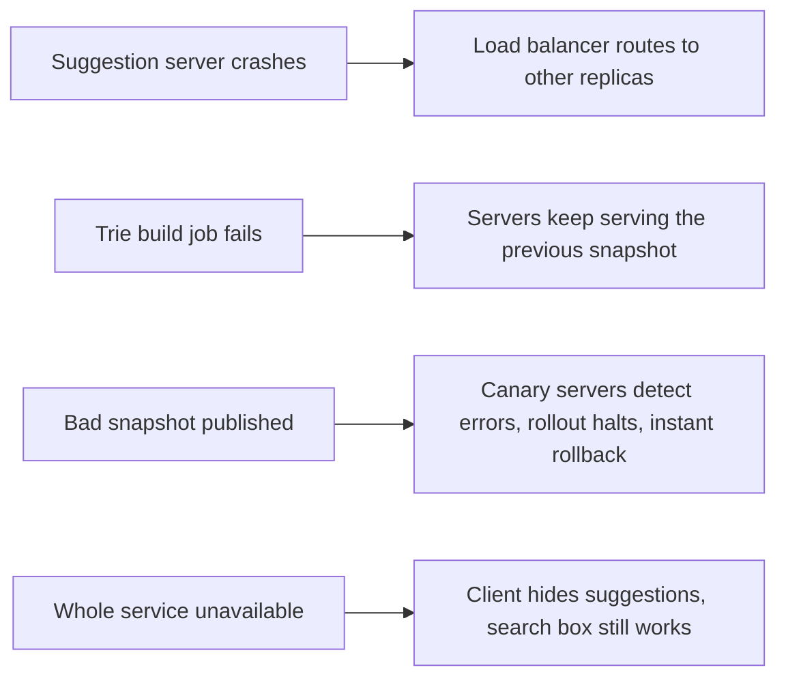

This lesson evaluates the typeahead design against its requirements, walks through failures and discusses the trade-offs.

## Requirements check

| Requirement | How the design meets it |
| --- | --- |
| Very low latency | In-memory tries with precomputed top-k lists answer in well under a millisecond; CDN and browser caches serve short and popular prefixes; servers are deployed close to users. |
| High availability | Stateless replicas behind load balancers; snapshots stored durably and loadable by any server; if the service fails, search itself still works. |
| Scalability | Full replication while data fits in memory, then partitioning by language, region and traffic-balanced prefix ranges. |
| Freshness | Decayed frequencies, scheduled rebuilds and a trending trie updated every few minutes. |
| Safety | Filters in the build pipeline plus a fast removal channel for immediate suppression. |

## Failure scenarios

Because the serving path depends only on a snapshot already loaded in memory, a failure anywhere in the pipeline leaves suggestions slightly stale but fully functional. That separation is the main reason the design is so robust.

## Trade-offs

**Freshness versus cost.** Rebuilding the whole trie every few minutes would keep suggestions fresh but waste compute; the trending trie delivers most of the freshness at a fraction of the cost.

**Memory versus latency.** Storing top-k lists at every node multiplies memory use, but it is what makes lookups fast for short prefixes. Limiting k to about 10 and storing references keeps it affordable.

**Replication versus partitioning.** Full replicas are simplest and avoid routing, but stop working when data outgrows memory. Partitioning adds a routing layer and the risk of hot partitions.

**Popularity versus quality.** Pure popularity can amplify misleading or harmful queries and create feedback loops, since suggested queries get searched more and become more popular. Filters, quality signals such as click-through and damping the weight of queries that were selected from suggestions reduce this effect.

**Privacy.** Queries are personal. Dropping rare queries, aggregating before use and keeping personal history separate from the global model protect users.

## Measuring success

- **Latency percentiles** end to end, measured in the client.
- **Keystrokes saved** per search, which shows how much suggestions help.
- **Suggestion acceptance rate**: how often users pick a suggestion.
- **Downstream search success**: whether searches that started from suggestions end in clicks.

These metrics guide ranking changes, which are tested with A/B experiments.

<Callout type="tip">
A good one-line summary: "Typeahead is a read-only, in-memory prefix lookup fed by an offline aggregation pipeline, so failures in the pipeline only make suggestions stale, never unavailable."
</Callout>

<KeyTakeaways>
- The serving path meets latency and availability goals because it depends only on an in-memory snapshot.
- Pipeline failures and bad snapshots are contained by keeping old versions, canary rollouts and instant rollback.
- Key trade-offs are freshness versus rebuild cost, memory versus latency and replication versus partitioning.
- Popularity feedback loops and privacy require filtering, quality signals and separation of personal data.
- Success is measured by latency, keystrokes saved, acceptance rate and downstream search success.
</KeyTakeaways>
