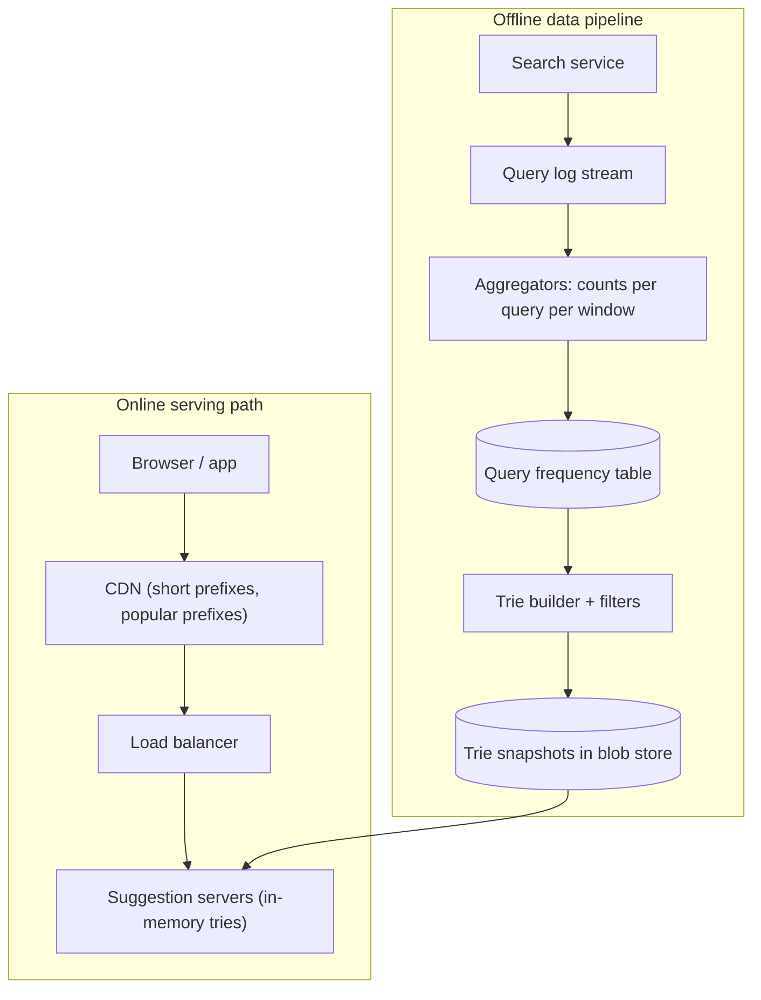
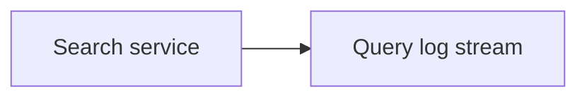
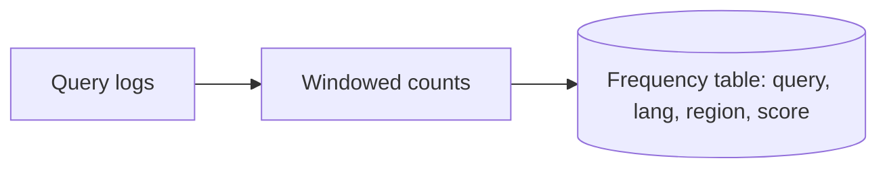
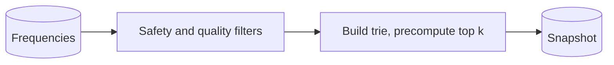
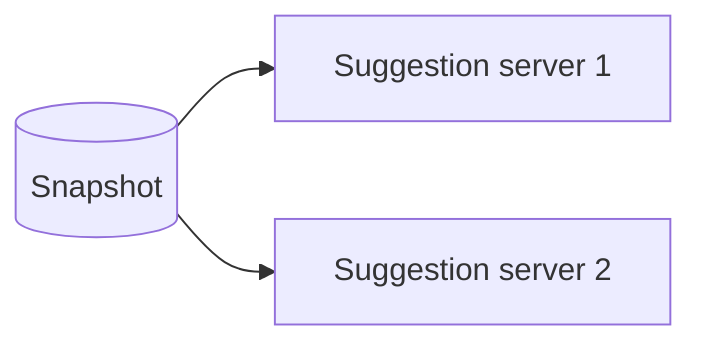

This lesson lays out the API and the two halves of the typeahead system: the serving path that answers prefix queries and the data pipeline that keeps suggestions current.

## API

```http
GET /v1/suggestions?prefix=how%20to%20b&lang=en&region=US&limit=8
    -> { prefix: "how to b", suggestions: ["how to boil eggs", "how to budget", ...] }
```

The request is a simple, idempotent GET, which makes it cacheable by the browser, intermediate proxies and the CDN when the response is not personalized.

## Architecture



### Online serving path

Suggestion servers load a **trie snapshot** into memory at start-up and whenever a new snapshot is published. For each request, the server walks the trie to the node for the prefix and returns the precomputed top suggestions stored at that node. No computation over the subtree happens at request time, so the lookup costs time proportional only to the prefix length.

Servers are stateless apart from the read-only snapshot, so they scale by adding replicas. A new snapshot is loaded in the background and swapped in atomically, so requests never see a half-built trie.

### Offline data pipeline

<Slides title="From searches to suggestions">
<Slide caption="1. Every submitted search is logged with its language, region and timestamp to a stream.">



</Slide>
<Slide caption="2. Aggregators count queries per time window and maintain decayed frequencies, weighting recent days more heavily.">



</Slide>
<Slide caption="3. The builder filters unsafe or rare queries, builds tries per language and region, and computes the top suggestions at every node.">



</Slide>
<Slide caption="4. Servers download the snapshot and swap it in atomically.">



</Slide>
</Slides>

**Frequency with decay.** Counting all-time frequency would let old queries dominate forever. Instead, scores decay over time, for example by multiplying by a factor such as 0.9 each day and adding the day's count, so recent popularity weighs more.

**Filtering.** Queries appearing only a handful of times are dropped: they add little value and could leak private information, such as someone searching their own address. Blocklists and classifiers remove offensive or dangerous completions. A **fast removal** channel lets operators suppress a suggestion immediately, by pushing a small override list to servers without waiting for the next snapshot.

**Build frequency.** Rebuilding the full trie takes minutes to an hour, so it runs perhaps daily or hourly. For trending topics, a smaller, fast-updating **trending trie** built from the last hour of queries can be merged with the main trie's results at serving time.

## Caching

Short prefixes are requested constantly: every query starts with one of a few dozen characters. The responses for all one- and two-character prefixes can be precomputed and served from the CDN or even bundled into the client. Popular longer prefixes also have high cache hit rates at the CDN with a short time-to-live. The browser caches responses for the session, so backspacing is instant.

## Decayed frequency, worked through

With a daily decay factor of 0.9, each day's score is `score = 0.9 × previous score + today's count`:

| Day | "world cup schedule" count | Score | "tax deadline" count | Score |
| --- | --- | --- | --- | --- |
| 1 | 100,000 | 100,000 | 20,000 | 20,000 |
| 2 | 80,000 | 170,000 | 20,000 | 38,000 |
| 3 | 5,000 | 158,000 | 20,000 | 54,200 |
| 10 | 1,000 | ~70,000 | 20,000 | ~130,000 |

The burst of interest in the first query fades within about a week, while the steadily searched second query overtakes it. The decay factor controls how quickly suggestions "forget": 0.9 per day gives a memory of roughly ten days.

<Ponder question="Why drop queries that appear only a handful of times, even though they are legitimate searches?">
Two reasons. Rare queries add little value — few users would ever pick them — yet they bloat the trie. More importantly, they can leak private information: a query typed by one person (an address, a name with a medical condition) could be suggested to others. Requiring a minimum number of distinct users before a query becomes a suggestion is a simple, effective privacy safeguard.
</Ponder>

<KeyTakeaways>
- The API is a cacheable GET that returns the top suggestions for a prefix, language and region.
- Suggestion servers answer from an in-memory trie with precomputed top suggestions per node, swapped in atomically.
- An offline pipeline logs searches, aggregates decayed frequencies, filters unsafe or rare queries and builds trie snapshots.
- A small trending trie and a fast removal channel cover freshness and safety between full rebuilds.
- CDN and browser caching absorb short and popular prefixes.
- Exponentially decayed scores let recent popularity dominate while old bursts fade.
</KeyTakeaways>
